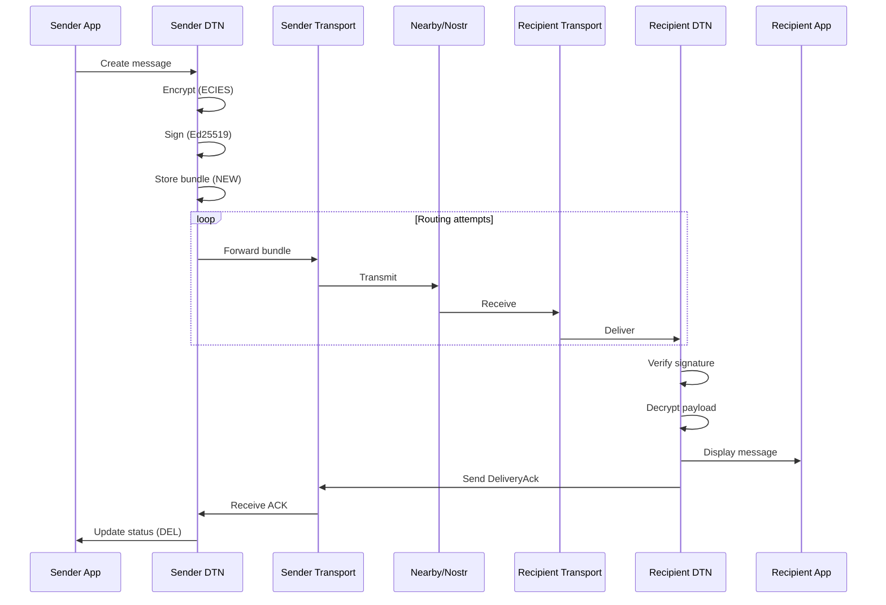
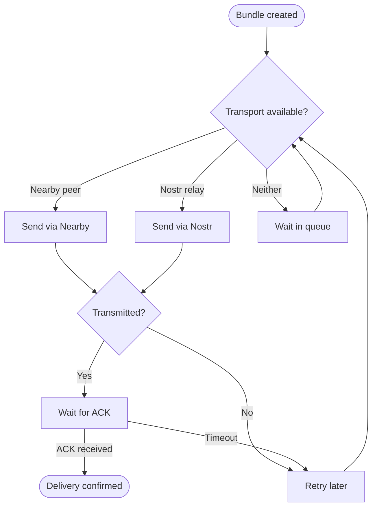
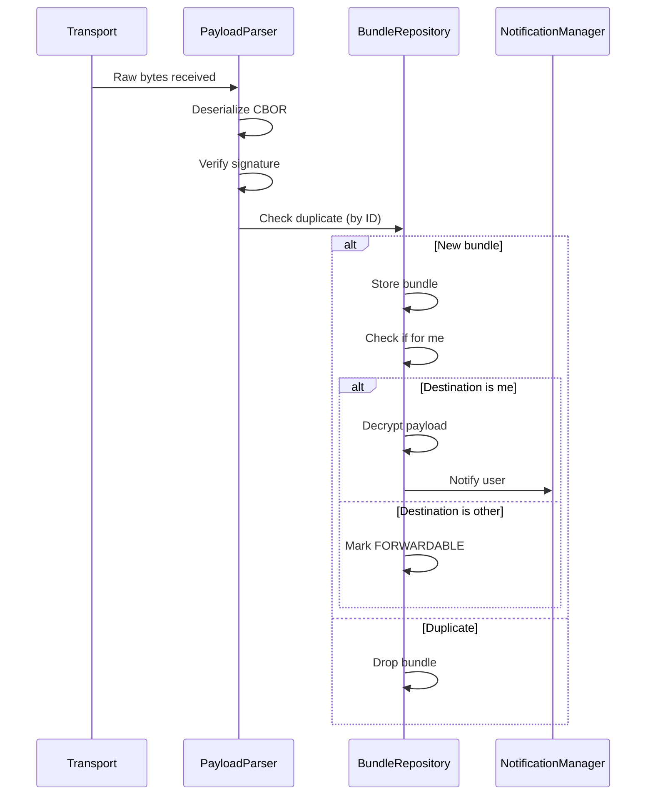
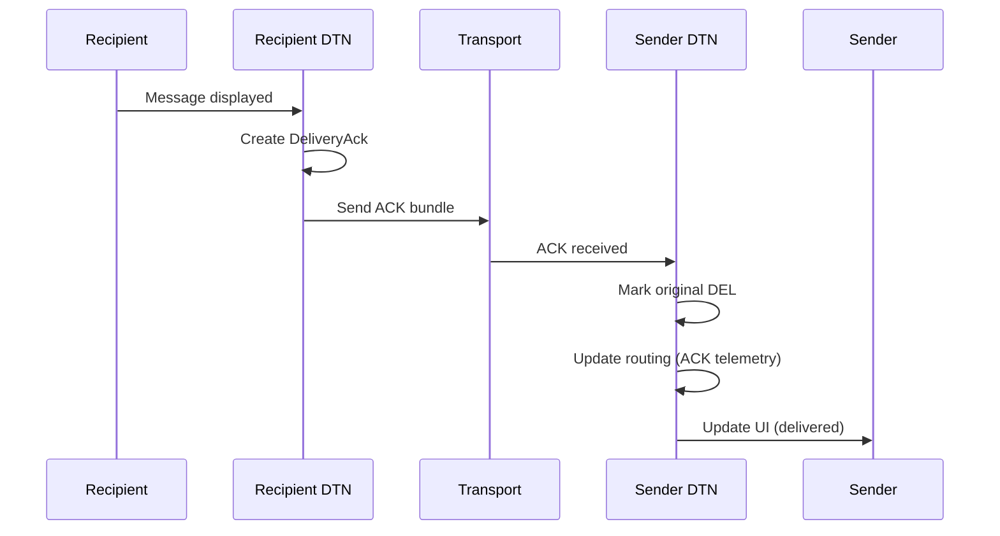
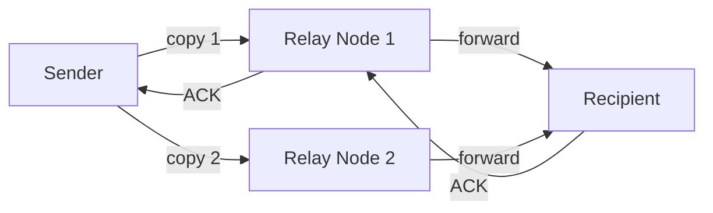

# End-to-End Message Flow

This page shows how messages flow through Mycel from sender to recipient.

## DM Delivery Flow



## Layer Responsibilities

| Layer | Sender Side | Recipient Side |
|-------|-------------|----------------|
| **App** | User types message | Display in conversation |
| **DTN** | Encrypt, sign, store | Verify, decrypt, store |
| **Transport** | Select path, transmit | Receive, forward up |

## Detailed Steps

### 1. Message Creation

```
App Layer:
  User → ChatViewModel → DmUseCase

DTN Layer:
  BundleRepository.createDmBundle()
    1. Generate bundle ID
    2. Encrypt payload (DmCrypto)
    3. Sign header (DeviceKeys)
    4. Store with status=NEW
```

### 2. Routing Decision



### 3. Transport Selection

The routing facade evaluates all available transports:

| Transport | When Used | Priority |
|-----------|-----------|----------|
| Nearby | Peer is connected (XFER/DRAIN state) | High |
| Nostr | Relay is connected, recipient online | Medium |
| Store | No transport available | Fallback |

### 4. Bundle Transmission

**Via Nearby:**
```
SessionRegistry → check XFER/DRAIN state
OutgoingWorker → serialize bundle
NearbyConnections → send payload
WireProtocol → frame with length prefix
```

**Via Nostr:**
```
RelayPool → get connected relays
GiftWrap → encrypt for relay blindness
NostrEvent → create wrapped event
RelayConnection → publish to relays
```

### 5. Bundle Reception



### 6. Delivery Confirmation



## Multi-Hop Delivery

When sender and recipient aren't directly connected:



**Copy Budget Management:**
- Initial budget: 3 copies (configurable)
- Each forward decrements budget
- When budget = 1, node waits for direct delivery

## Timing

| Phase | Typical Time | Maximum |
|-------|--------------|---------|
| Create & encrypt | < 50ms | 100ms |
| Nearby transfer | 100-500ms | 2s |
| Nostr publish | 200ms-2s | 5s |
| ACK return | Same as forward | - |
| Total (direct) | < 1s | 5s |
| Total (multi-hop) | Minutes to days | TTL (7 days default) |

## Error Handling

| Error | Recovery |
|-------|----------|
| Transport disconnected | Retry with backoff |
| Signature invalid | Drop bundle |
| Duplicate received | Ignore |
| TTL expired | Remove bundle |
| Decryption failed | Store but mark error |

---

**See Also:** [Bundle Lifecycle](../bundles/lifecycle.md) | [Routing Overview](../routing/overview.md)
