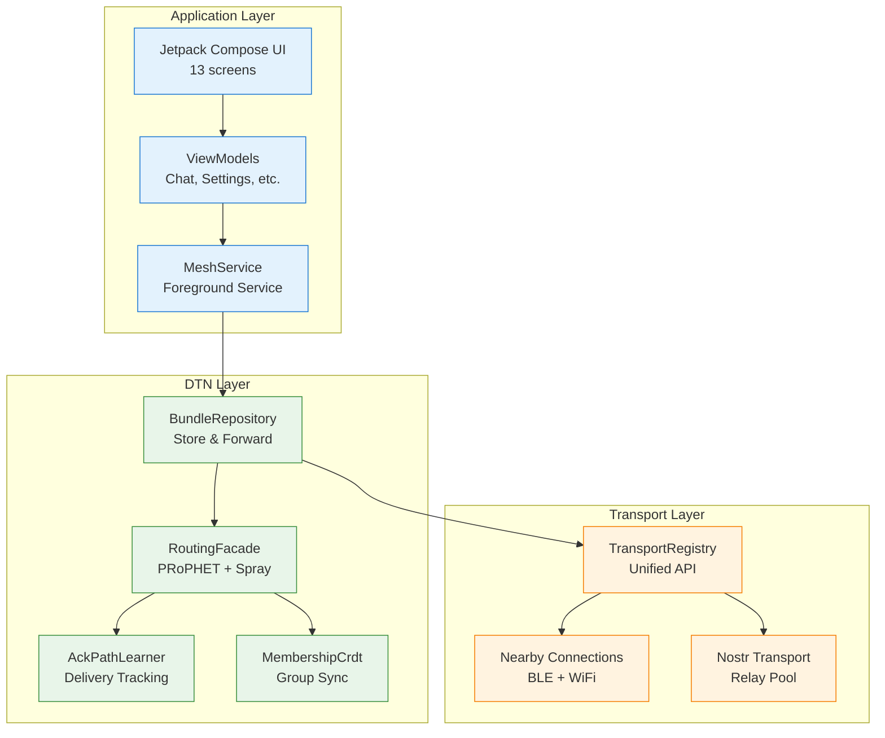
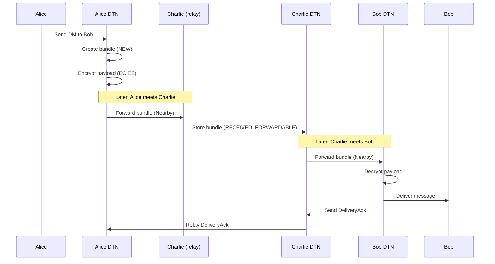

# Architecture Overview

Mycel uses a three-layer architecture that separates concerns between user interface, message handling, and physical transport.

## Three-Layer Stack

## Layer Responsibilities

### Application Layer

| Component | Purpose | Source |
|-----------|---------|--------|
| **UI Screens** | Jetpack Compose screens for chat, contacts, settings | `feature/ui/src/.../screens/` |
| **ViewModels** | State management, UI logic | `feature/ui/src/.../viewmodels/` |
| **MeshService** | Foreground service, wake locks, lifecycle | `app/src/.../service/MeshService.kt` |

The Application layer is purely UI-focused. It never handles raw bundles or transport connections directly.

### DTN Layer

| Component | Purpose | Source |
|-----------|---------|--------|
| **BundleRepository** | Bundle storage, status tracking, TTL management | `core/dtn/.../BundleRepository.kt` |
| **RoutingFacade** | PRoPHET + Spray-and-Wait routing decisions | `core/nearby/.../RoutingFacade.kt` |
| **AckPathLearner** | ACK processing, route improvement | `core/nearby/.../AckPathLearner.kt` |
| **MembershipCrdt** | 2P-Set CRDT for group membership sync | `core/dtn/.../MembershipCrdt.kt` |

The DTN layer handles message storage, routing decisions, and delivery tracking. It is transport-agnostic.

### Transport Layer

| Component | Purpose | Source |
|-----------|---------|--------|
| **TransportRegistry** | Unified API for all transports | `core/transport/.../TransportRegistry.kt` |
| **Nearby Connections** | BLE + WiFi Direct via Google Play Services | `core/nearby/` |
| **Nostr Transport** | WebSocket relay pool with NIP-17/44 encryption | `core/transport/.../nostr/` |

The Transport layer handles physical message delivery. Multiple transports form one unified network.

## Key Design Principles

### 1. Transport Agnosticism
The DTN layer does not know or care which transport delivered a bundle. All transports look the same to the routing layer.

### 2. Store and Forward
Every node stores received bundles locally and forwards them opportunistically. There is no requirement for end-to-end connectivity.

### 3. Peer Equality
All nodes are equal. There are no designated servers, coordinators, or privileged nodes.

### 4. Local-First
All operations work offline. Network connectivity improves delivery speed but is never required.

## Data Flow Example

A DM from Alice to Bob when they're not directly connected:

## Source Files

| File | Purpose | Lines |
|------|---------|-------|
| `core/dtn/src/.../BundleRepository.kt` | Bundle persistence and status | ~1800 |
| `core/nearby/src/.../RoutingFacade.kt` | Routing algorithm implementation | ~700 |
| `core/nearby/src/.../NearbyCore.kt` | Nearby transport core | ~3500 |
| `core/transport/src/.../NostrTransportAdapter.kt` | Nostr relay pool | ~400 |
| `app/src/.../service/MeshService.kt` | Foreground service | ~300 |

---

**Next:** [Transports - Nearby](../transports/nearby.md) | [Routing Overview](../routing/overview.md)
