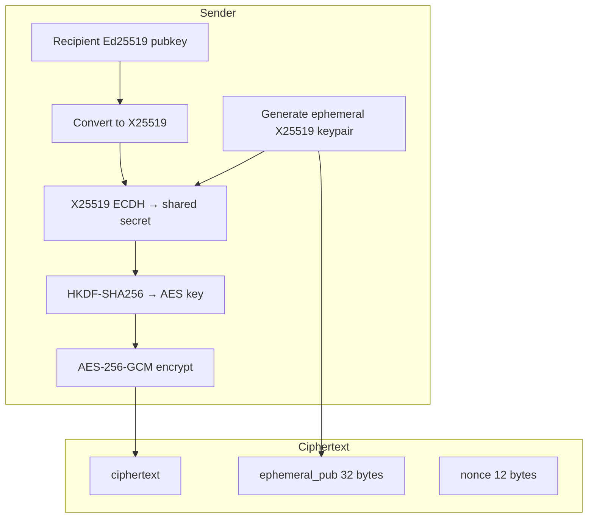
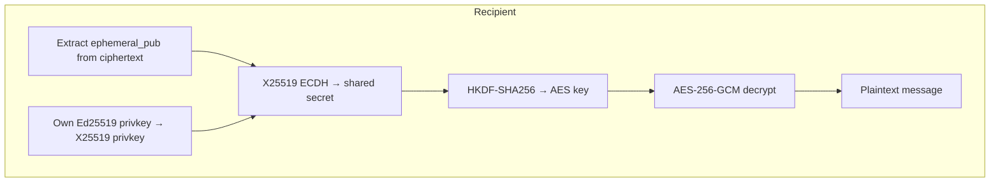
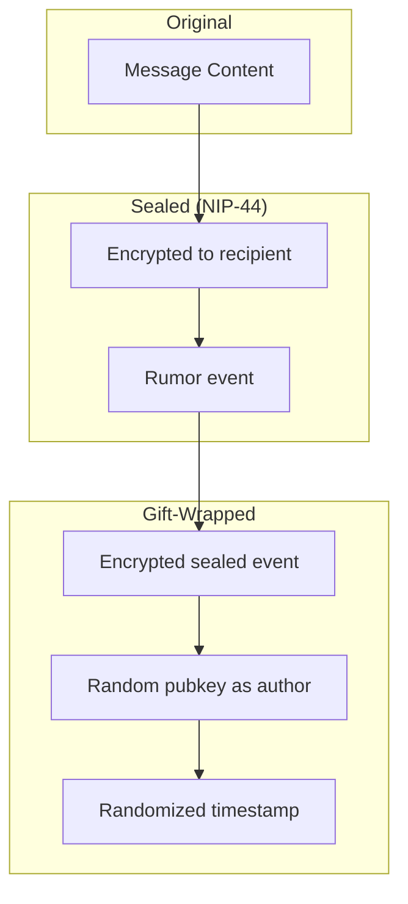

# Encryption

All message content in Mycel is end-to-end encrypted. Relay nodes cannot read message contents.

## Overview

| Destination Type | Encryption Scheme |
|------------------|-------------------|
| Direct Message (DM) | ECIES: X25519 + HKDF + AES-256-GCM |
| Group Message | AES-256-GCM with shared group key |
| Channel Broadcast | AES-256-GCM with channel key |
| Group Invite | ECIES: X25519 + XChaCha20-Poly1305 |

## DM Encryption (ECIES)

Direct messages use Elliptic Curve Integrated Encryption Scheme.

**Source:** `core/dtn/src/main/kotlin/com/meshlablite/core/dtn/crypto/DmCrypto.kt`

### Encryption Flow



### Algorithm Steps

1. **Key Conversion:** Recipient's Ed25519 public key → X25519 public key
2. **Ephemeral Key:** Generate random X25519 keypair
3. **ECDH:** Compute shared secret using ephemeral private + recipient public
4. **KDF:** HKDF-SHA256 with info="DmEncryption" → 32-byte AES key
5. **Encrypt:** AES-256-GCM with random 12-byte nonce
6. **Package:** ciphertext + ephemeral_pub + nonce

### Decryption Flow



### Code Example

```kotlin
// Encryption (simplified from DmCrypto.kt)
fun encryptDm(plaintext: ByteArray, recipientPubKey: ByteArray): EncryptedPayload {
    val recipientX25519 = Ed25519.toX25519Public(recipientPubKey)
    val ephemeral = X25519.generateKeyPair()

    val sharedSecret = X25519.computeSharedSecret(
        ephemeral.privateKey,
        recipientX25519
    )

    val aesKey = HKDF.derive(
        ikm = sharedSecret,
        info = "DmEncryption".toByteArray(),
        length = 32
    )

    val nonce = SecureRandom().generateSeed(12)
    val ciphertext = AesGcm.encrypt(plaintext, aesKey, nonce)

    return EncryptedPayload(
        ciphertext = ciphertext,
        ephemeralPub = ephemeral.publicKey,
        nonce = nonce
    )
}
```

## Group Message Encryption

Group messages use symmetric encryption with a shared group key.

### Group Key Distribution

1. Group creator generates 32-byte random group key
2. Key is encrypted per-member using ECIES (GroupInviteMsg)
3. All members have the same symmetric key

### Encryption

```kotlin
fun encryptGroupMessage(
    plaintext: ByteArray,
    groupKey: ByteArray
): EncryptedPayload {
    val nonce = SecureRandom().generateSeed(12)
    val ciphertext = AesGcm.encrypt(plaintext, groupKey, nonce)

    return EncryptedPayload(
        ciphertext = ciphertext,
        nonce = nonce
        // No ephemeral key needed - symmetric encryption
    )
}
```

### GroupUpdateMsg Format

```kotlin
data class GroupUpdateMsg(
    val encryptedPayload: ByteArray, // AES-GCM encrypted
    val nonce: ByteArray             // 12 bytes
)
```

## Group Invite Encryption

Group invites use ECIES with XChaCha20-Poly1305 for the symmetric cipher.

**Source:** `core/dtn/src/main/kotlin/com/meshlablite/core/dtn/ControlMsg.kt:429-471`

### GroupInviteMsg Format

```kotlin
data class GroupInviteMsg(
    val encryptedPayload: ByteArray, // XChaCha20-Poly1305 encrypted
    val ephemeralPubKey: ByteArray,  // X25519 (32 bytes)
    val nonce: ByteArray             // XChaCha20 nonce (24 bytes)
)
```

### Encrypted Payload Contents

The encrypted payload contains:
- Group ID
- Group display name
- Group symmetric key (32 bytes)
- Admin public key
- Invite timestamp

## Nostr Transport Encryption (Gift-Wrap)

When messages traverse Nostr relays, additional encryption prevents relay metadata correlation.

**Protocol:** NIP-17 (Gift-Wrap) + NIP-44 (Versioned Encryption)

### Gift-Wrap Layers



### Properties

| Property | Benefit |
|----------|---------|
| Random author pubkey | Hides sender identity from relays |
| Randomized timestamp | Prevents timing correlation |
| Double encryption | Recipient identity hidden from relays |

## Security Properties

### Forward Secrecy
- Ephemeral keys ensure past messages cannot be decrypted if long-term key is compromised
- Each DM uses a unique ephemeral keypair

### Relay Blindness
- Nostr relays only see encrypted gift-wrapped events
- Cannot correlate sender/recipient
- Cannot read message contents

### Authentication
- All bundles are signed with Ed25519
- Signature covers header + payload hash
- Prevents tampering and forgery

## What's NOT Implemented

Some advanced security features are intentionally not implemented due to DTN constraints:

| Feature | Reason Not Used |
|---------|-----------------|
| Double Ratchet | Requires synchronized sessions (impossible in DTN) |
| One-time prekeys | Cannot enforce single-use without server |
| Per-message key advancement | Messages arrive out of order |

## Source Files

| File | Purpose |
|------|---------|
| `core/dtn/src/.../crypto/DmCrypto.kt` | DM encryption/decryption |
| `core/dtn/src/.../crypto/GroupInviteCrypto.kt` | Group invite ECIES |
| `core/transport/src/.../nostr/GiftWrapModels.kt` | NIP-17 gift-wrap |
| `core/dtn/src/.../ControlMsg.kt` | GroupInviteMsg, GroupUpdateMsg |

---

**Next:** [Bundle Structure](structure.md) | [Message Types](message-types.md)
