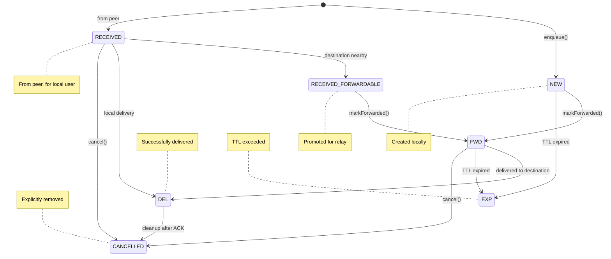
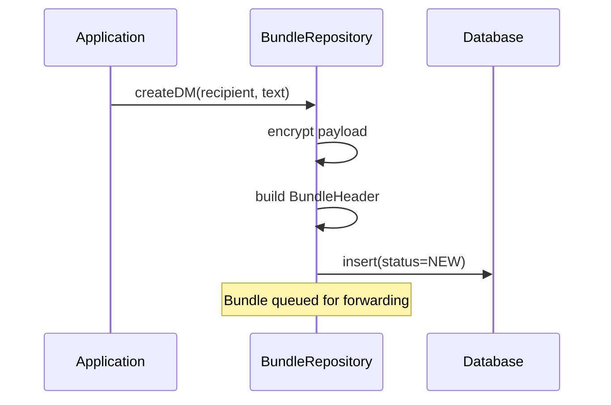
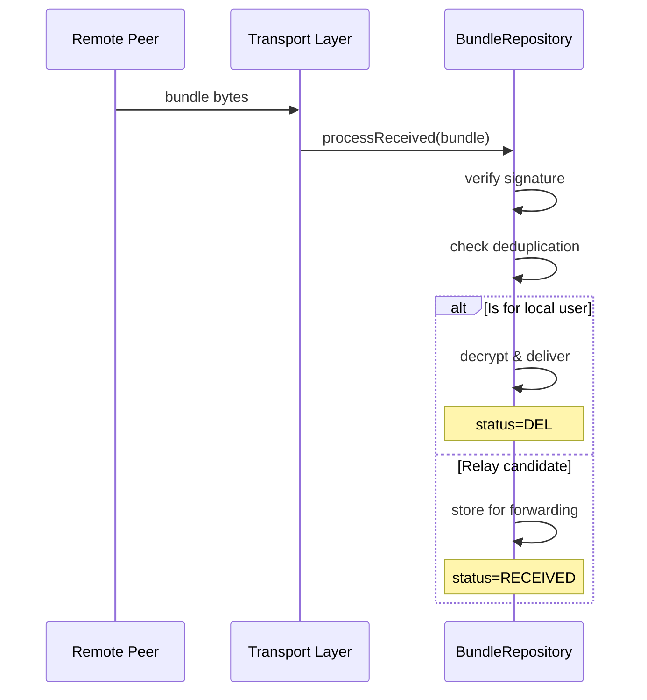
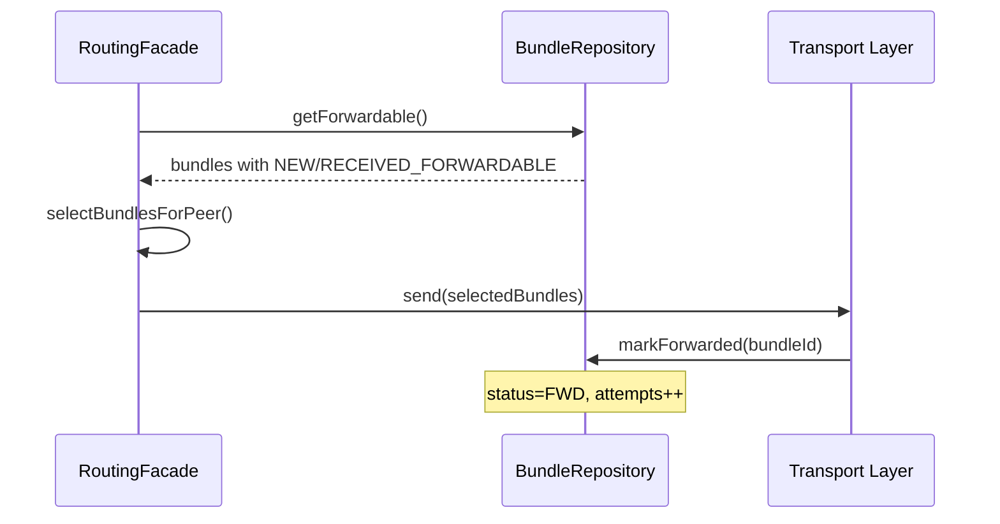
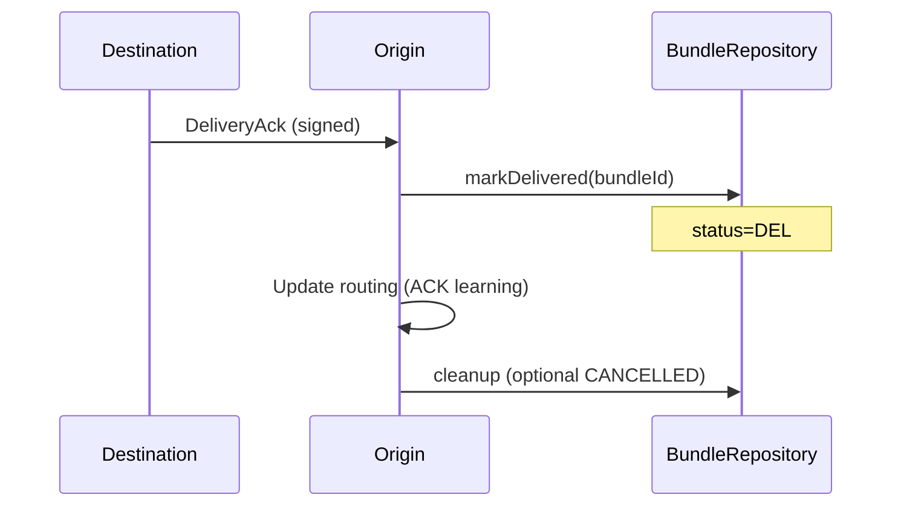

# Bundle Lifecycle

Bundles transition through multiple states from creation to delivery or expiration.

## State Machine

## State Descriptions

### NEW
- **Entry:** When locally-created bundles are enqueued
- **Meaning:** Bundle created by this device, queued for forwarding
- **Next States:** FWD (forwarding), EXP (expired)

### RECEIVED
- **Entry:** When bundle arrives from peer
- **Meaning:** Bundle accepted from network, stored locally
- **Next States:**
  - DEL if this device is the destination
  - RECEIVED_FORWARDABLE if destination is nearby
  - CANCELLED if explicitly removed

### RECEIVED_FORWARDABLE
- **Entry:** When destination peer is detected
- **Meaning:** Received bundle promoted for relay toward destination
- **Next States:** FWD (forwarding)

### FWD (Forwarding)
- **Entry:** When forwarding attempt begins
- **Meaning:** Bundle currently being sent to peers
- **Next States:** DEL (delivered), EXP (expired), CANCELLED

### DEL (Delivered)
- **Entry:** When delivery confirmed
- **Meaning:** Successfully delivered to final destination
- **Terminal:** Yes (but may transition to CANCELLED for cleanup)

### EXP (Expired)
- **Entry:** During periodic cleanup
- **Meaning:** TTL exceeded, bundle no longer valid
- **Terminal:** Yes

### ERR (Error)
- **Entry:** Processing failure
- **Meaning:** Unrecoverable error during handling
- **Terminal:** Yes
- **Note:** Rarely used in practice

### CANCELLED
- **Entry:** On delivery cancel or operator action
- **Meaning:** Explicitly removed from network
- **Terminal:** Yes

## Transition Triggers

### Creation Path

### Reception Path

### Forwarding Path

### Delivery Confirmation

## TTL and Expiration

Bundles have a time-to-live (TTL) after which they expire.

### Default TTLs

| Message Type | TTL | Rationale |
|--------------|-----|-----------|
| DM (text) | 7 days | Important, wait for delivery |
| DM (media) | 3 days | Larger, less critical |
| Group message | 4 hours | Time-sensitive context |
| Channel broadcast | 4 hours | Ephemeral content |
| Control (ACK) | 24 hours | Routing feedback |

### Expiration Check

Expiration runs periodically (every 5 minutes) to clean up stale bundles. Expired bundles have their payloads deleted and status set to EXP.

## Copy Budget Lifecycle

Each bundle has a copy budget for Spray-and-Wait routing.

**Initial Budget by Priority:**

| Priority | Copy Budget |
|----------|-------------|
| CRITICAL | 8 |
| NORMAL | 3 |
| BULK | 2 |

Each successful forward consumes one copy. The budget decrements with each forward, and the attempt counter increments.

## Cleanup

### ACK-Triggered Cleanup

When a DeliveryAck is received:
1. Mark bundle as DEL
2. Send DeliveryCancel to network
3. Other nodes receiving cancel → CANCELLED

### Storage Cleanup

When a bundle is cleaned up, its status is set to CANCELLED and its payload file is deleted from storage.

### Database Cleanup

Periodic cleanup removes old terminal-state bundles:
- DEL older than 24 hours
- EXP older than 1 hour
- CANCELLED older than 1 hour

---

**Next:** [Bundle Structure](structure.md) | [Message Types](message-types.md)
