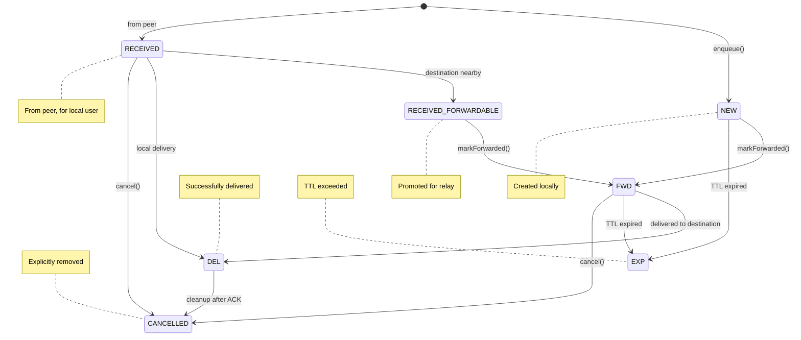
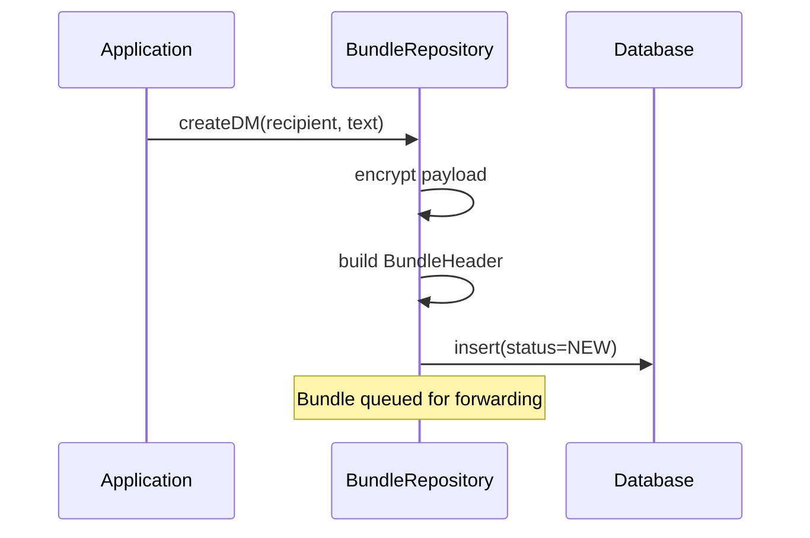
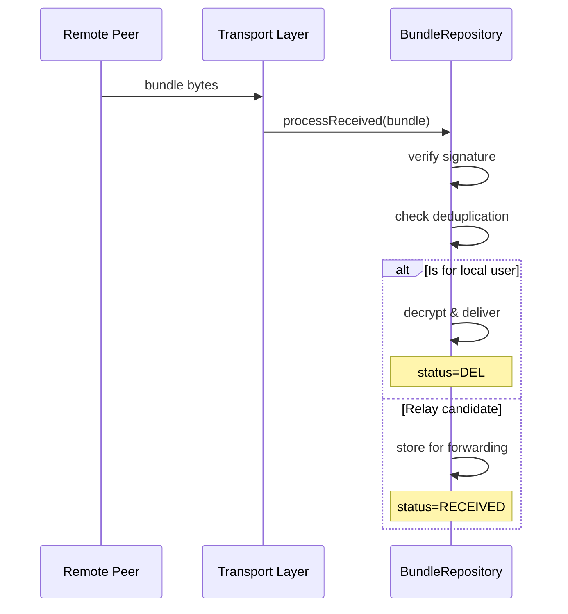
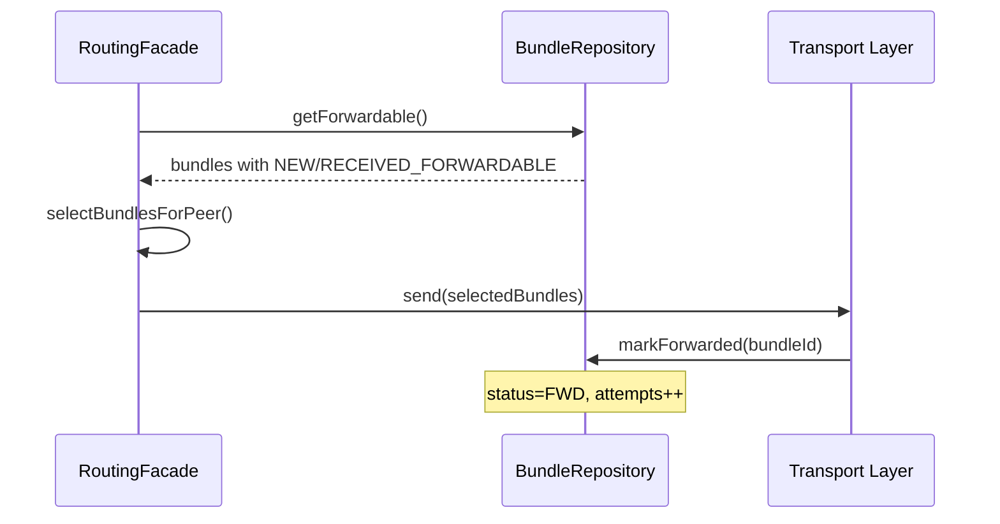
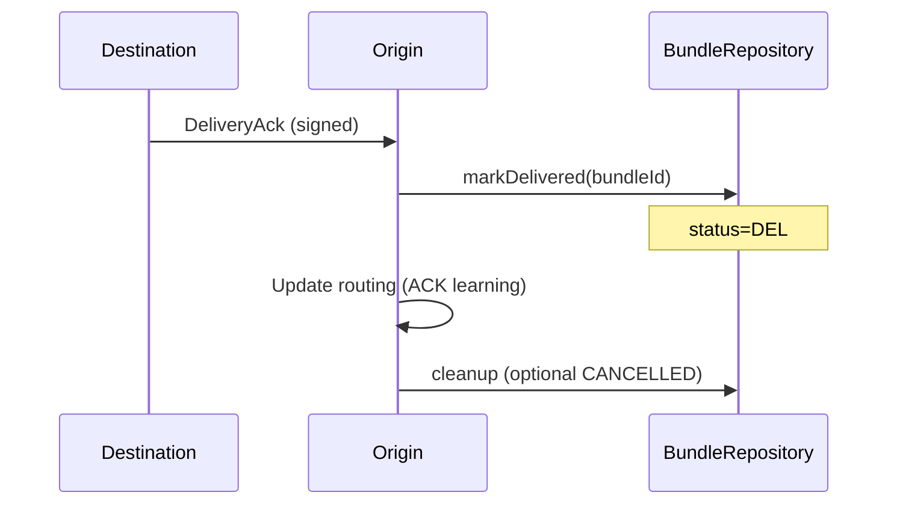

# Bundle Lifecycle

Bundles transition through multiple states from creation to delivery or expiration.

## State Machine



**Source:** `core/dtn/src/main/kotlin/com/meshlablite/core/dtn/persistence/BundleEntity.kt:95-104`

## State Descriptions

### NEW
- **Entry:** `BundleRepository.enqueue()` for locally-created bundles
- **Meaning:** Bundle created by this device, queued for forwarding
- **Next States:** FWD (forwarding), EXP (expired)
- **Source:** `BundleRepository.kt:254-273`

### RECEIVED
- **Entry:** `processReceived()` when bundle arrives from peer
- **Meaning:** Bundle accepted from network, stored locally
- **Next States:**
  - DEL if this device is the destination
  - RECEIVED_FORWARDABLE if destination is nearby
  - CANCELLED if explicitly removed
- **Source:** `BundleRepository.kt:622-653`

### RECEIVED_FORWARDABLE
- **Entry:** `promoteForForwarding()` when destination peer is detected
- **Meaning:** Received bundle promoted for relay toward destination
- **Next States:** FWD (forwarding)
- **Source:** `BundleRepository.kt:908-916`

### FWD (Forwarding)
- **Entry:** `markForwarded()` when forwarding attempt begins
- **Meaning:** Bundle currently being sent to peers
- **Next States:** DEL (delivered), EXP (expired), CANCELLED
- **Source:** `BundleRepository.kt:516-524`

### DEL (Delivered)
- **Entry:** `markDelivered()` when delivery confirmed
- **Meaning:** Successfully delivered to final destination
- **Terminal:** Yes (but may transition to CANCELLED for cleanup)
- **Source:** `BundleRepository.kt:535-573`

### EXP (Expired)
- **Entry:** `purgeExpired()` during periodic cleanup
- **Meaning:** TTL exceeded, bundle no longer valid
- **Terminal:** Yes
- **Source:** `BundleRepository.kt:702-724`

### ERR (Error)
- **Entry:** Processing failure
- **Meaning:** Unrecoverable error during handling
- **Terminal:** Yes
- **Note:** Rarely used in practice

### CANCELLED
- **Entry:** `handleDeliveryCancel()` or operator action
- **Meaning:** Explicitly removed from network
- **Terminal:** Yes
- **Source:** `BundleRepository.kt:1580-1634`

## Transition Triggers

### Creation Path



### Reception Path



### Forwarding Path



### Delivery Confirmation



## TTL and Expiration

Bundles have a time-to-live (TTL) after which they expire.

### Default TTLs

| Message Type | TTL | Rationale |
|--------------|-----|-----------|
| DM (text) | 7 days | Important, wait for delivery |
| DM (media) | 3 days | Larger, less critical |
| Group message | 4 hours | Time-sensitive context |
| Channel broadcast | 4 hours | Ephemeral content |
| Control (ACK) | 24 hours | Routing feedback |

### Expiration Check

```kotlin
// From BundleRepository.kt:702-724
fun purgeExpired() {
    val now = System.currentTimeMillis()
    val expired = db.findExpiredBundles(now)
    for (bundle in expired) {
        bundle.status = BundleStatus.EXP
        deletePayloadFile(bundle.id)
    }
}
```

Expiration runs periodically (every 5 minutes) to clean up stale bundles.

## Copy Budget Lifecycle

Each bundle has a copy budget for Spray-and-Wait routing.

```kotlin
// Initial budget based on priority
copyBudget = when (priority) {
    CRITICAL -> 8
    NORMAL -> 3
    BULK -> 2
}
```

Each successful forward consumes one copy:

```kotlin
fun markForwarded(bundleId: String, peerId: PeerId) {
    val bundle = db.find(bundleId)
    bundle.copyBudget = max(0, bundle.copyBudget - 1)
    bundle.attempts++
    bundle.status = FWD
}
```

## Cleanup

### ACK-Triggered Cleanup

When a DeliveryAck is received:
1. Mark bundle as DEL
2. Send DeliveryCancel to network
3. Other nodes receiving cancel → CANCELLED

### Storage Cleanup

```kotlin
// Payload file deletion
fun cleanupBundle(bundleId: String) {
    db.updateStatus(bundleId, CANCELLED)
    File(payloadDir, bundleId).delete()
}
```

### Database Cleanup

Periodic cleanup removes old terminal-state bundles:
- DEL older than 24 hours
- EXP older than 1 hour
- CANCELLED older than 1 hour

## Source Files

| File | Purpose | Key Lines |
|------|---------|-----------|
| `BundleEntity.kt` | Status enum | 95-104 |
| `BundleRepository.kt` | All transitions | Full file |
| `TransferOrchestrator.kt` | Forward triggering | 200-300 |

---

**Next:** [Bundle Structure](structure.md) | [Message Types](message-types.md)
