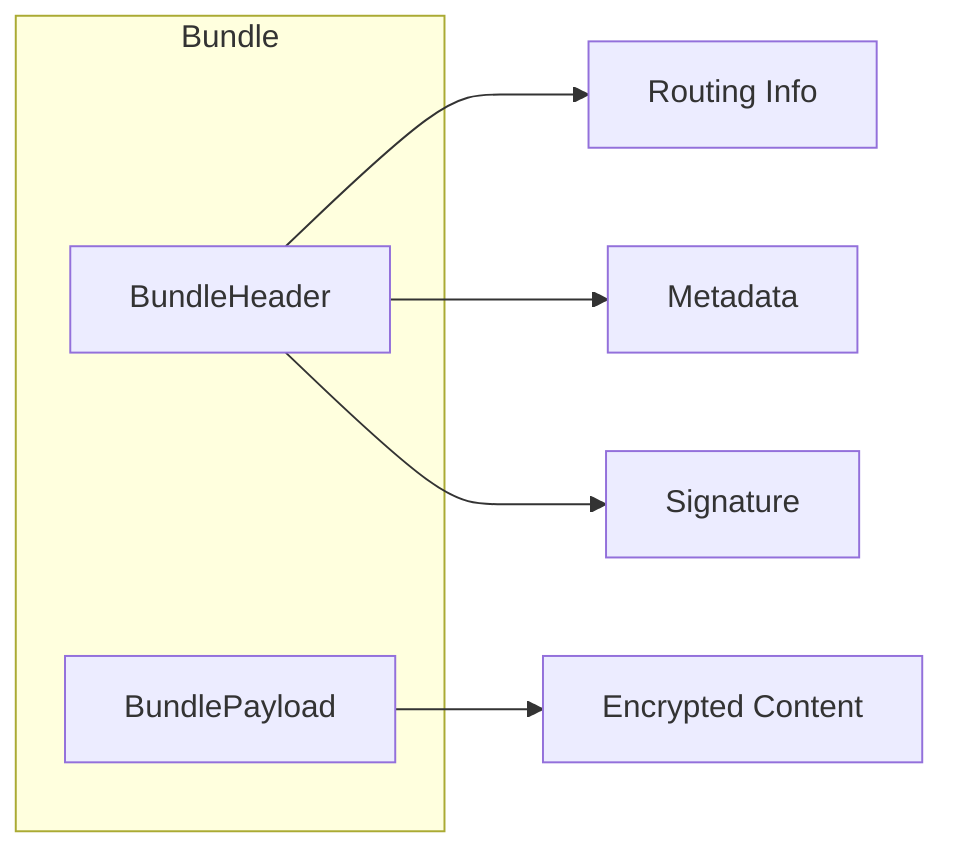
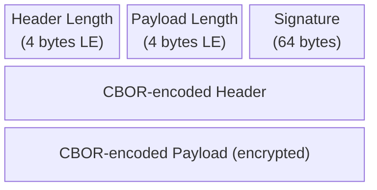

# Bundle Structure

Bundles are the fundamental unit of data in the DTN layer. Each bundle is a self-contained message with headers for routing and a payload containing the actual content.

## Overview

## BundleEntity

The database representation of a bundle.

### Core Fields

| Field | Type | Size | Description |
|-------|------|------|-------------|
| `id` | String | 32 bytes | SHA256 hash identifying the bundle |
| `srcPub` | ByteArray | 32 bytes | Sender's Ed25519 public key |
| `status` | BundleStatus | 1 byte | Current lifecycle state |
| `security` | BundleSecurity | 1 byte | SIGNED or LEGACY_UNSIGNED |
| `createdAt` | Long | 8 bytes | Creation timestamp (milliseconds) |
| `payloadHash` | String | 32 bytes | SHA256 of payload for integrity |

### Destination Fields

Bundles can be addressed in multiple ways:

| Field | Type | Purpose |
|-------|------|---------|
| `dstNode` | ByteArray? | Recipient device public key (specific device) |
| `dstUser` | ByteArray? | Recipient UID = SHA256(pubKey) (any device of user) |
| `dstTopic` | ByteArray? | Group/channel topic ID |
| `dstCluster` | ByteArray? | MycTagStar for geographic routing |

### Routing Fields

| Field | Type | Description |
|-------|------|-------------|
| `ttlSec` | Long | Time-to-live in seconds |
| `priority` | Int | 0=critical, 1=normal, 2=bulk |
| `copyBudget` | Int | Spray-and-Wait remaining copies |
| `attempts` | Int | Forward attempt count |
| `routePath` | List<String> | Past hop clusters (max 8) |
| `geoH3r5` | Long? | H3 resolution 5 cell hint |
| `geoH3r7` | Long? | H3 resolution 7 cell hint |

### TTL Values

| Message Type | Default TTL |
|--------------|-------------|
| DM (text) | 7 days (604800s) |
| DM (media) | 3 days (259200s) |
| Group message | 4 hours (14400s) |
| Channel broadcast | 4 hours (14400s) |
| Control (ACK) | 24 hours (86400s) |

## Bundle Status

| Status | Description | Terminal? |
|--------|-------------|-----------|
| `NEW` | Created locally, queued for forwarding | No |
| `RECEIVED` | Received from peer, stored locally | No |
| `RECEIVED_FORWARDABLE` | Promoted for relay to destination | No |
| `FWD` | Currently being forwarded | No |
| `DEL` | Successfully delivered | Yes |
| `EXP` | Expired (TTL exceeded) | Yes |
| `ERR` | Processing error | Yes |
| `CANCELLED` | Explicitly removed | Yes |

## Bundle Security

| Security | Description |
|----------|-------------|
| `SIGNED` | Ed25519 signature verified |
| `LEGACY_UNSIGNED` | Pre-signing legacy format |

## Priority Levels

| Priority | Value | Use Case |
|----------|-------|----------|
| CRITICAL | 0 | System control, ACKs |
| NORMAL | 1 | Text messages |
| BULK | 2 | Media, large files |

Higher priority bundles are forwarded first and have larger copy budgets.

## Payload Structure

The payload contains encrypted message content.

### BundlePayload Fields

| Field | Type | Description |
|-------|------|-------------|
| `ciphertext` | ByteArray | Encrypted message content |
| `ephemeralPub` | ByteArray? | ECIES ephemeral public key (DMs) |
| `nonce` | ByteArray | Encryption nonce |
| `msgType` | Int | Control message type (if applicable) |

### Encryption Schemes

| Destination | Encryption |
|-------------|------------|
| DM to user | ECIES: X25519 + HKDF + AES-256-GCM |
| Group message | AES-256-GCM with shared group key |
| Channel broadcast | AES-256-GCM with channel key |

See [Encryption](encryption.md) for details.

## Wire Format

Bundles are serialized using CBOR (Concise Binary Object Representation).

| Section | Size | Description |
|---------|------|-------------|
| Header Length | 4 bytes | Little-endian uint32 |
| Payload Length | 4 bytes | Little-endian uint32 |
| Signature | 64 bytes | Ed25519 signature |
| Header | Variable | CBOR-encoded BundleHeader |
| Payload | Variable | CBOR-encoded encrypted content |

## Bundle ID Calculation

The bundle ID is a **SHA-256 hash** of the CBOR-encoded header and payload concatenated together.

This ensures:

- Bundle ID is deterministic
- Any modification invalidates the ID
- Deduplication is reliable

## Size Limits

| Limit | Value | Purpose |
|-------|-------|---------|
| Max payload | 256 KB | Prevent memory exhaustion |
| Max header | 4 KB | Reasonable routing metadata |
| Max route path | 8 hops | Loop prevention |
| Max copy budget | 15 | Prevent flooding |

---

**Next:** [Bundle Lifecycle](lifecycle.md) | [Message Types](message-types.md)
