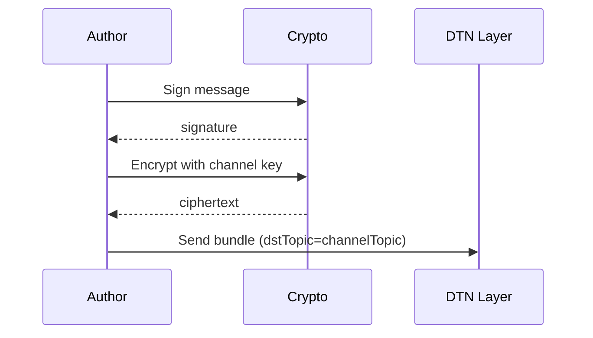
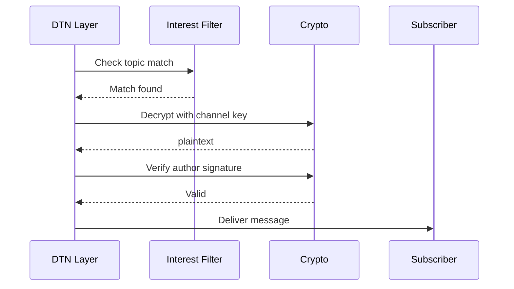

# Channels

Channels are read-only broadcast conversations where only authorized authors can post.

## Overview

| Property | Value |
|----------|-------|
| **Read Access** | Anyone can subscribe |
| **Write Access** | Authorized authors only |
| **Encryption** | AES-256-GCM with channel key |
| **Routing** | Topic-based (interest filter) |

## Conversation Types

| Type | Read | Write | Example |
|------|------|-------|---------|
| GROUP | Members only | Any member | Private chat groups |
| CHANNEL | Anyone | Authorized authors | News feeds, announcements |
| BROADCAST | All mesh | All mesh | Mesh-wide alerts |

## Channel Kinds

| Kind | Transport | Range | Status |
|------|-----------|-------|--------|
| `MESH_LOCAL` | Nearby only | Local mesh | Implemented |
| `GLOBAL` | Nostr relays | Global | Future |

## Channel Descriptor

Each channel has a descriptor containing:
- **id** - Channel identifier
- **kind** - MESH_LOCAL or GLOBAL
- **displayName** - Human-readable name
- **description** - Optional description
- **ownerUidHex** - Channel owner's UID
- **conversationType** - CHANNEL, GROUP, or BROADCAST
- **isPrivate** - Whether the channel is private

### Computed Properties

| Property | Derivation |
|----------|------------|
| `topicKey` | SHA256(channelId) - 32 bytes |
| `shortId` | base32(topicKey[:6]) - 10 chars |
| `isGroup` | conversationType == GROUP |
| `isChannel` | conversationType == CHANNEL |
| `isBroadcast` | conversationType == BROADCAST |

## Mesh Broadcast Channel

A special built-in channel for mesh-wide broadcasts.

### Characteristics

| Property | Value |
|----------|-------|
| Channel ID | `channel:mesh_local` |
| Kind | MESH_LOCAL |
| Encryption | None (plaintext) |
| Author verification | Signature check |

### Payload

Each broadcast contains:
- Message text
- Sender UID
- Sender display name
- Timestamp

## Channel vs Group Comparison

| Aspect | Channel | Group |
|--------|---------|-------|
| Write permission | Authorized authors | Any member |
| Membership | Subscribe (anyone) | Join (invite or public) |
| Key distribution | From owner | Via invite |
| Content encryption | Yes | Yes |
| Author signature | Required | Required |

## Subscription

Subscribing to a channel adds its topic to the interest filter. When bundles arrive with matching topics, they are delivered to subscribers.

## Message Flow

### Publishing (Author)

### Receiving (Subscriber)

## Author Verification

Only messages from authorized authors are accepted. Each channel maintains a list of authorized author UIDs, and incoming messages are verified against this list.

## TTL

| Message Type | TTL |
|--------------|-----|
| Channel broadcast | 4 hours (14400s) |

---

**Next:** [Private Groups](private-groups.md) | [Membership CRDT](membership-crdt.md)
