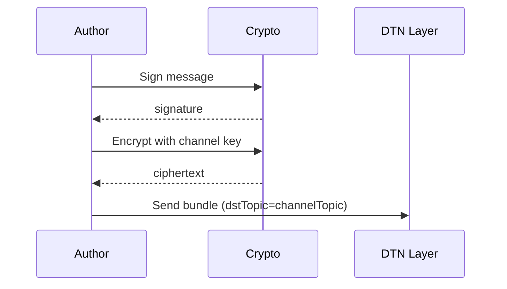
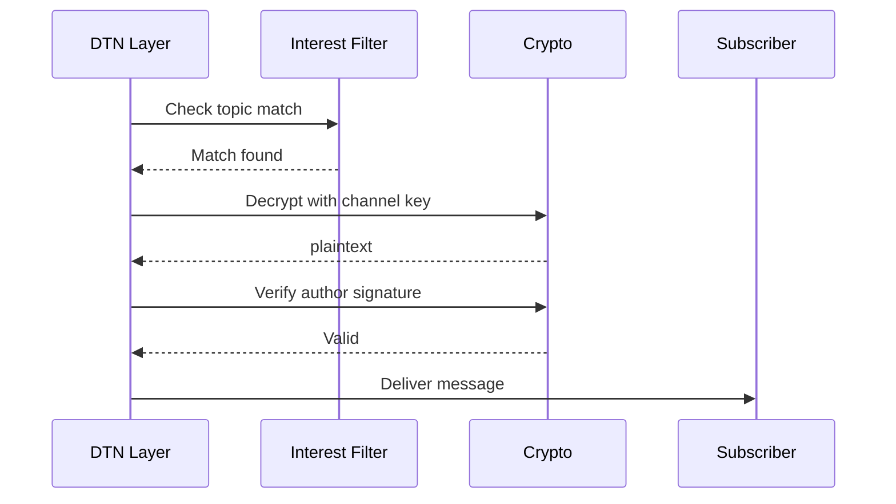

# Channels

Channels are read-only broadcast conversations where only authorized authors can post.

## Overview

**Source:** `core/dtn/src/main/kotlin/com/meshlablite/core/dtn/conversation/channel/`

| Property | Value |
|----------|-------|
| **Read Access** | Anyone can subscribe |
| **Write Access** | Authorized authors only |
| **Encryption** | AES-256-GCM with channel key |
| **Routing** | Topic-based (interest filter) |

## Conversation Types

**Source:** `core/dtn/src/main/kotlin/com/meshlablite/core/dtn/conversation/channel/ChannelDescriptor.kt:8-25`

```kotlin
enum class ConversationType {
    GROUP,     // Anyone who joins can post (public or private)
    CHANNEL,   // Only authorized authors can post
    BROADCAST  // Local mesh broadcast (special case)
}
```

| Type | Read | Write | Example |
|------|------|-------|---------|
| GROUP | Members only | Any member | Private chat groups |
| CHANNEL | Anyone | Authorized authors | News feeds, announcements |
| BROADCAST | All mesh | All mesh | Mesh-wide alerts |

## Channel Kinds

**Source:** `core/dtn/src/main/kotlin/com/meshlablite/core/dtn/conversation/channel/ChannelKind.kt:7-17`

```kotlin
enum class ChannelKind(val wireName: String) {
    MESH_LOCAL("mesh_local"),  // Local mesh, no WAN
    GLOBAL("global")           // WAN/relay backed (future)
}
```

| Kind | Transport | Range | Status |
|------|-----------|-------|--------|
| `MESH_LOCAL` | Nearby only | Local mesh | Implemented |
| `GLOBAL` | Nostr relays | Global | Future |

## Channel Descriptor

**Source:** `core/dtn/src/main/kotlin/com/meshlablite/core/dtn/conversation/channel/ChannelDescriptor.kt:38-76`

```kotlin
data class ChannelDescriptor(
    val id: ChannelId,
    val kind: ChannelKind,
    val displayName: String,
    val description: String? = null,
    val ownerUidHex: String? = null,
    val conversationType: ConversationType = ConversationType.CHANNEL,
    val isPrivate: Boolean = false
)
```

### Computed Properties

| Property | Derivation |
|----------|------------|
| `topicKey` | SHA256(channelId) - 32 bytes |
| `shortId` | base32(topicKey[:6]) - 10 chars |
| `isGroup` | conversationType == GROUP |
| `isChannel` | conversationType == CHANNEL |
| `isBroadcast` | conversationType == BROADCAST |

## Mesh Broadcast Channel

A special built-in channel for mesh-wide broadcasts.

**Source:** `core/dtn/src/main/kotlin/com/meshlablite/core/dtn/conversation/channel/mesh/`

### MeshBroadcastPayload

```kotlin
data class MeshBroadcastPayload(
    val text: String,
    val senderUidHex: String,
    val senderDisplayName: String?,
    val timestamp: Long
)
```

### Characteristics

| Property | Value |
|----------|-------|
| Channel ID | `channel:mesh_local` |
| Kind | MESH_LOCAL |
| Encryption | None (plaintext) |
| Author verification | Signature check |

## Channel vs Group Comparison

| Aspect | Channel | Group |
|--------|---------|-------|
| Write permission | Authorized authors | Any member |
| Membership | Subscribe (anyone) | Join (invite or public) |
| Key distribution | From owner | Via invite |
| Content encryption | Yes | Yes |
| Author signature | Required | Required |

## Subscription

Subscribing to a channel adds its topic to the interest filter.

**Source:** `core/dtn/src/main/kotlin/com/meshlablite/core/dtn/conversation/channel/ChannelSubscriptionStore.kt`

```kotlin
fun subscribe(channelId: ChannelId) {
    val topicKey = channelId.topicKey()
    interestFilter.add(topicKey)
    subscriptions.add(channelId)
}
```

## Message Flow

### Publishing (Author)



### Receiving (Subscriber)



## Author Verification

Only messages from authorized authors are accepted.

**Source:** `core/dtn/src/main/kotlin/com/meshlablite/core/dtn/conversation/channel/ChannelAuthorStore.kt`

```kotlin
fun isAuthorized(channelId: ChannelId, authorUidHex: String): Boolean {
    val channel = channels[channelId] ?: return false
    return channel.authorizedAuthors.contains(authorUidHex)
}
```

## TTL

**Source:** `core/dtn/src/main/kotlin/com/meshlablite/core/dtn/BundleRepository.kt:236`

| Message Type | TTL |
|--------------|-----|
| Channel broadcast | 4 hours (14400s) |

## Source Files

| File | Purpose |
|------|---------|
| `ChannelKind.kt` | Channel type enum (MESH_LOCAL, GLOBAL) |
| `ChannelDescriptor.kt` | Channel metadata |
| `ChannelId.kt` | Channel identifier |
| `ChannelSubscriptionStore.kt` | Subscription management |
| `ChannelAuthorStore.kt` | Author verification |
| `MeshBroadcastChannel.kt` | Mesh broadcast implementation |

---

**Next:** [Private Groups](private-groups.md) | [Membership CRDT](membership-crdt.md)
