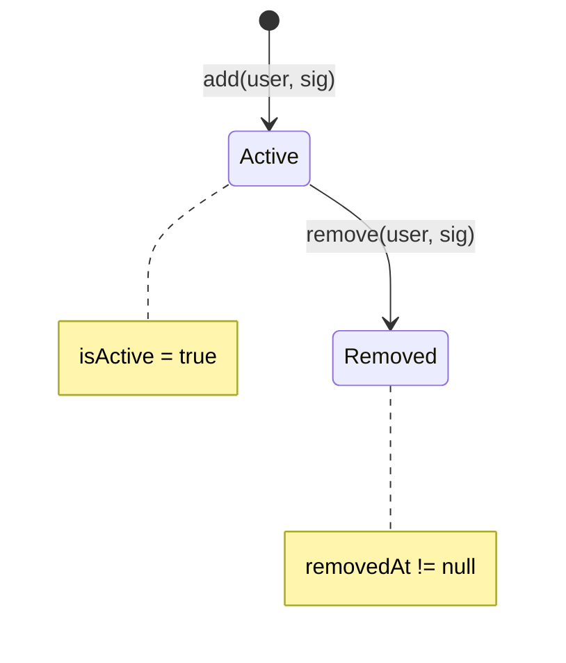
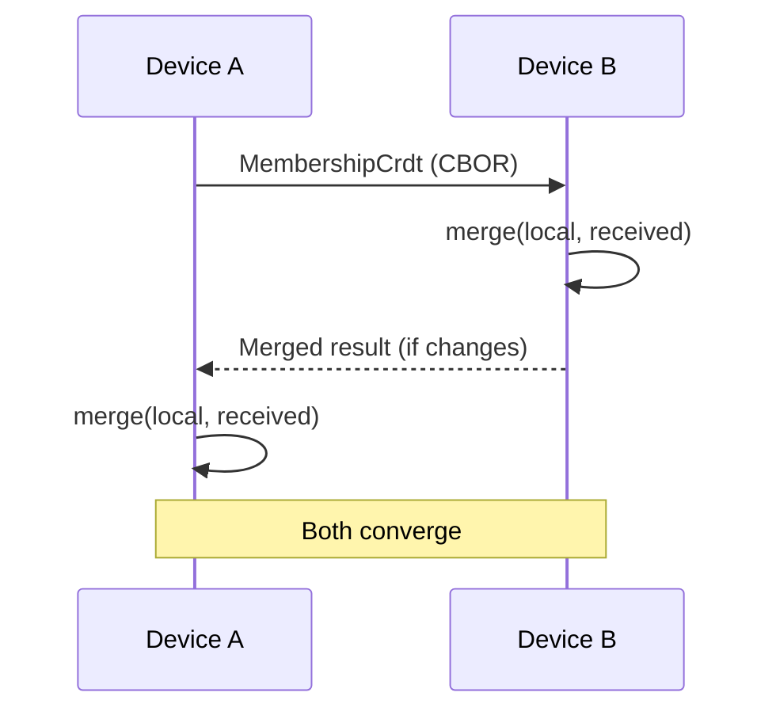

# Membership CRDT

Group membership is synchronized using a 2P-Set CRDT (Two-Phase Set with tombstones).

## Overview

| Property | Value |
|----------|-------|
| **Algorithm** | 2P-Set with tombstones |
| **Merge** | Removal wins, later timestamp wins |
| **Convergence** | Guaranteed eventual consistency |

## Data Structures

### MemberEntry

Each member entry contains:

| Field | Size | Description |
|-------|------|-------------|
| userId | 32 bytes | User's public key hash |
| addedAt | 8 bytes | Timestamp when added (ms) |
| addedBy | 32 bytes | Admin who added this member |
| addedSig | 64 bytes | Ed25519 signature of add operation |
| removedAt | 8 bytes | Null if active, timestamp if removed |
| removedBy | 32 bytes | Admin who removed (if applicable) |
| removedSig | 64 bytes | Signature of remove operation |

### MembershipCrdt

The CRDT structure contains:
- **groupId** - 32-byte group identifier
- **members** - Map of userIdHex → MemberEntry

## Merge Semantics

The merge operation follows 2P-Set rules:

| Scenario | Rule |
|----------|------|
| New member | Accept |
| Both removed | Later timestamp wins |
| One removed | Removal wins |
| Neither removed | Earlier add wins |

### Merge Algorithm

1. For each member in the remote state:
   - If unknown locally → accept the remote entry
   - If both have removal → keep the one with later timestamp
   - If remote has removal, local doesn't → removal wins
   - If local has removal, remote doesn't → removal wins
   - If neither removed → keep the earlier add timestamp

## State Diagram

## CRDT Properties

| Property | Guarantee |
|----------|-----------|
| **Commutativity** | merge(A, B) = merge(B, A) |
| **Associativity** | merge(merge(A, B), C) = merge(A, merge(B, C)) |
| **Idempotency** | merge(A, A) = A |
| **Convergence** | All replicas converge to same state |

## Active Membership

The CRDT provides queries for membership state:
- **getActiveMembers()** - Returns all members without removal tombstones
- **isMember(userIdHex)** - Checks if a user is currently active
- **isRemoved(userIdHex)** - Checks if a user has been removed
- **activeCount()** - Returns the number of active members

## Signature Verification

All add/remove operations require admin signature:

### Add Signature

Signs: `groupId || userId || addedAt || "ADD"`

### Remove Signature

Signs: `groupId || userId || removedAt || "REMOVE"`

## Sync Protocol

## Tombstone Semantics

Removed members are **never fully deleted** - they become tombstones.

**Why tombstones?**
- Prevents re-add from stale replicas
- Maintains causal history
- Ensures convergence across network partitions

## Serialization

The CRDT is serialized using CBOR (Concise Binary Object Representation) for efficient transmission over the mesh network.

## Example Merge Scenario

| Device | Before Merge |
|--------|--------------|
| A | Alice: added@100, active; Bob: added@200, active |
| B | Alice: added@100, active; Bob: added@200, removed@300; Carol: added@250, active |

| After Merge (A receives B's state) |
|-----------------------------------|
| Alice: added@100, active (unchanged) |
| Bob: added@200, removed@300 (removal wins) |
| Carol: added@250, active (new member) |

---

**Next:** [Private Groups](private-groups.md) | [Channels](channels.md)
