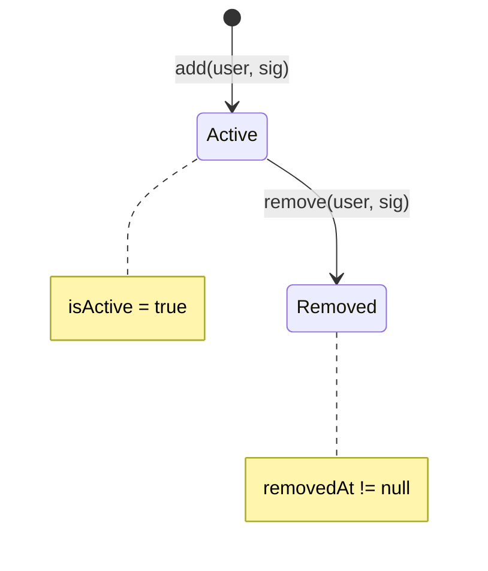
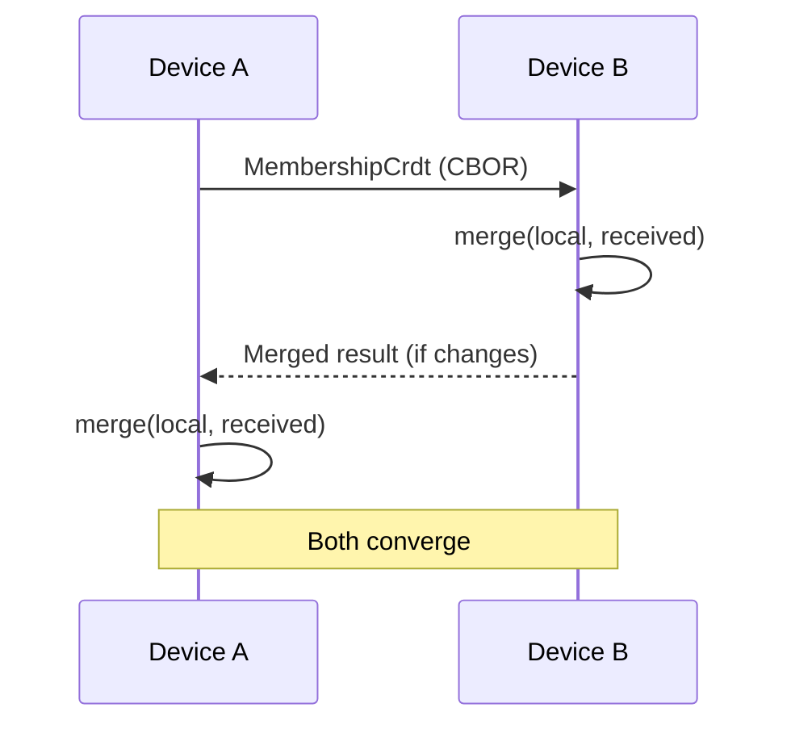

# Membership CRDT

Group membership is synchronized using a 2P-Set CRDT (Two-Phase Set with tombstones).

## Overview

**Source:** `core/dtn/src/main/kotlin/com/meshlablite/core/dtn/conversation/group/MembershipCrdt.kt`

| Property | Value |
|----------|-------|
| **Algorithm** | 2P-Set with tombstones |
| **Merge** | Removal wins, later timestamp wins |
| **Convergence** | Guaranteed eventual consistency |

## Data Structures

### MemberEntry

**Source:** `MembershipCrdt.kt:14-65`

```kotlin
data class MemberEntry(
    val userId: ByteArray,        // 32 bytes - User's public key hash
    val addedAt: Long,            // Timestamp when added (ms)
    val addedBy: ByteArray,       // 32 bytes - Admin who added
    val addedSig: ByteArray,      // 64 bytes - Ed25519 signature of add
    val removedAt: Long? = null,  // Null if active, timestamp if removed
    val removedBy: ByteArray? = null,  // Admin who removed
    val removedSig: ByteArray? = null  // Signature of remove
)
```

### MembershipCrdt

**Source:** `MembershipCrdt.kt:76-163`

```kotlin
data class MembershipCrdt(
    val groupId: ByteArray,                           // 32 bytes
    val members: Map<String, MemberEntry> = emptyMap() // Key: userIdHex
)
```

## Merge Semantics

**Source:** `MembershipCrdt.kt:88-119`

The merge operation follows 2P-Set rules:

```kotlin
fun merge(other: MembershipCrdt): MembershipCrdt {
    val merged = members.toMutableMap()

    for ((userIdHex, remoteEntry) in other.members) {
        val localEntry = merged[userIdHex]

        merged[userIdHex] = when {
            // New member we don't know about
            localEntry == null -> remoteEntry

            // Both have removal - keep later timestamp
            localEntry.removedAt != null && remoteEntry.removedAt != null ->
                if (remoteEntry.removedAt > localEntry.removedAt) remoteEntry
                else localEntry

            // Remote has removal, local doesn't - removal wins
            remoteEntry.removedAt != null -> remoteEntry

            // Local has removal, remote doesn't - removal wins
            localEntry.removedAt != null -> localEntry

            // Neither removed - keep earlier add timestamp
            else ->
                if (remoteEntry.addedAt < localEntry.addedAt) remoteEntry
                else localEntry
        }
    }

    return MembershipCrdt(groupId, merged)
}
```

### Merge Rules Summary

| Scenario | Rule |
|----------|------|
| New member | Accept |
| Both removed | Later timestamp wins |
| One removed | Removal wins |
| Neither removed | Earlier add wins |

## State Diagram



## CRDT Properties

| Property | Guarantee |
|----------|-----------|
| **Commutativity** | merge(A, B) = merge(B, A) |
| **Associativity** | merge(merge(A, B), C) = merge(A, merge(B, C)) |
| **Idempotency** | merge(A, A) = A |
| **Convergence** | All replicas converge to same state |

## Active Membership

**Source:** `MembershipCrdt.kt:124-137`

```kotlin
fun getActiveMembers(): List<MemberEntry> =
    members.values.filter { it.isActive }

fun isMember(userIdHex: String): Boolean =
    members[userIdHex]?.isActive == true

fun isRemoved(userIdHex: String): Boolean =
    members[userIdHex]?.isRemoved == true

fun activeCount(): Int =
    members.values.count { it.isActive }
```

## Signature Verification

All add/remove operations require admin signature:

### Add Signature

Signs: `groupId || userId || addedAt || "ADD"`

### Remove Signature

Signs: `groupId || userId || removedAt || "REMOVE"`

## Sync Protocol



## Tombstone Semantics

Removed members are **never fully deleted** - they become tombstones:

```kotlin
// Check if removed (has tombstone)
val entry = crdt.members["abc123"]
if (entry?.isRemoved == true) {
    // User was removed at entry.removedAt
    // by admin entry.removedBy
}
```

**Why tombstones?**
- Prevents re-add from stale replicas
- Maintains causal history
- Ensures convergence across network partitions

## Serialization

**Source:** `MembershipCrdt.kt:144-148`

```kotlin
fun toCbor(): ByteArray = Cbor.encodeToByteArray(this)

companion object {
    fun fromCbor(bytes: ByteArray): MembershipCrdt =
        Cbor.decodeFromByteArray(bytes)

    fun empty(groupId: ByteArray) =
        MembershipCrdt(groupId, emptyMap())
}
```

## Example Merge Scenario

```
Initial state on Device A:
  Alice: added@100, active
  Bob: added@200, active

Initial state on Device B:
  Alice: added@100, active
  Bob: added@200, removed@300
  Carol: added@250, active

After merge (A receives B's state):
  Alice: added@100, active        (unchanged)
  Bob: added@200, removed@300     (removal wins)
  Carol: added@250, active        (new member)
```

## Source Files

| File | Purpose |
|------|---------|
| `MembershipCrdt.kt` | CRDT implementation |
| `MembershipCrdtTest.kt` | Unit tests |
| `GroupStoreCrdtTest.kt` | Integration tests |
| `GroupStore.kt` | CRDT storage integration |

---

**Next:** [Private Groups](private-groups.md) | [Channels](channels.md)
