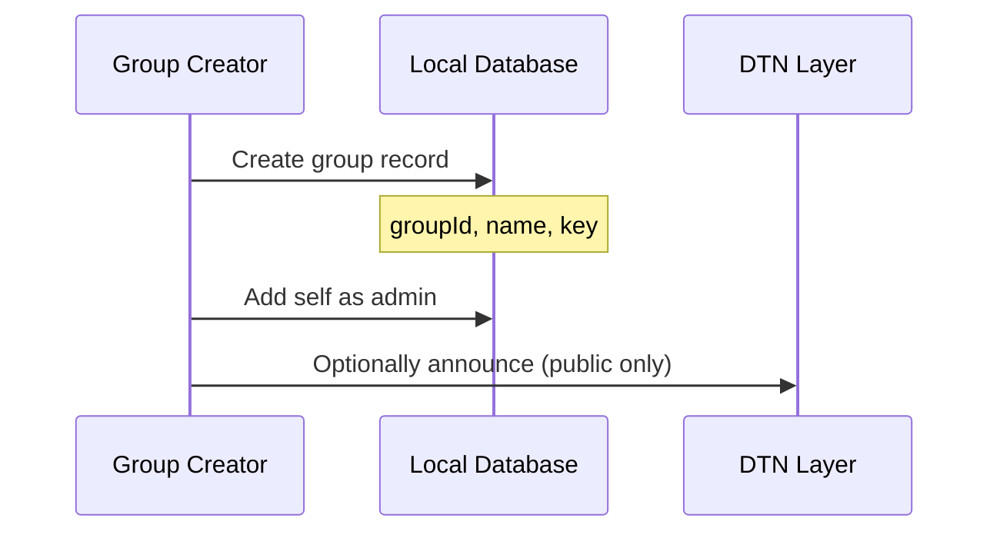
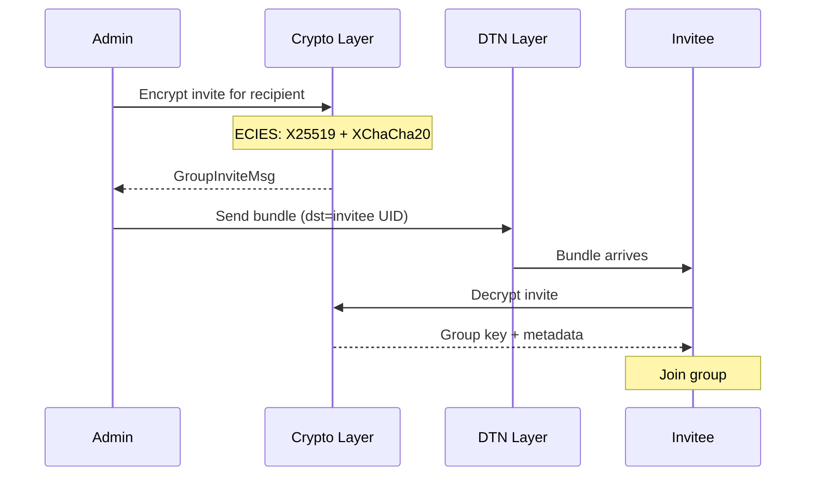
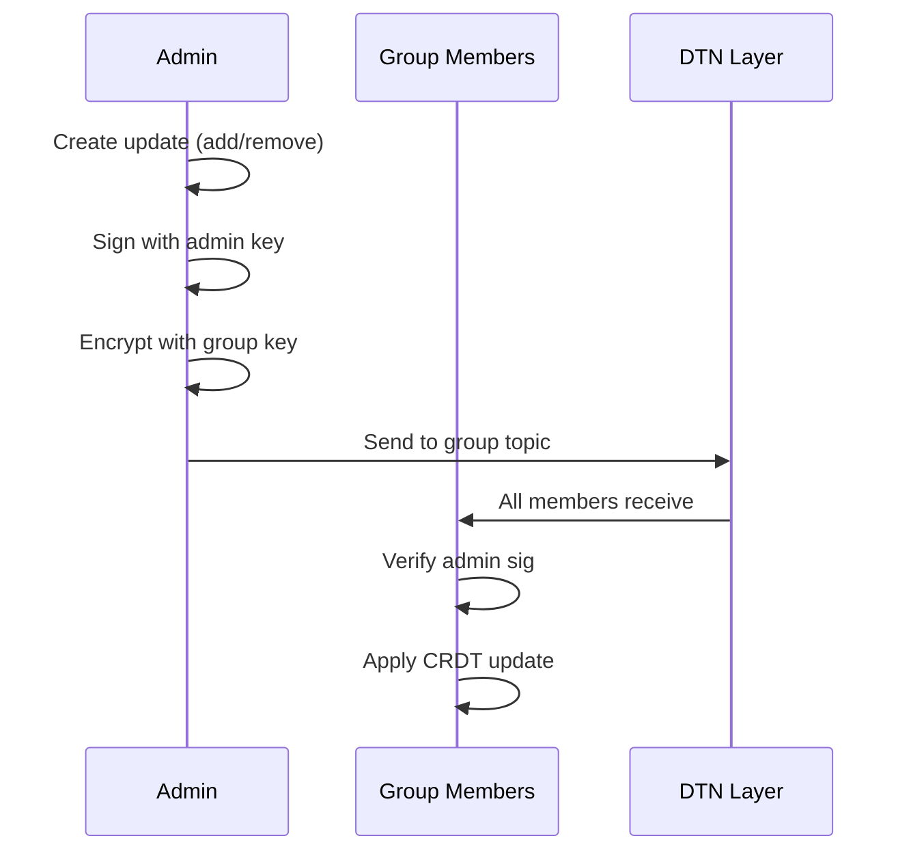

# Private Groups

Private groups enable encrypted group messaging with CRDT-synchronized membership.

## Overview

| Property | Value |
|----------|-------|
| **Encryption** | AES-256-GCM with shared group key |
| **Membership** | 2P-Set CRDT (add/remove) |
| **Invites** | ECIES-encrypted per-member |
| **Max members** | Soft limit ~100 (practical) |

## Group Creation



### Group Record

```kotlin
data class GroupRecord(
    val groupId: String,         // "group:unique-name"
    val shortId: String,         // 10-char hash for routing
    val displayName: String,     // Human-readable name
    val groupKey: ByteArray,     // AES-256 symmetric key (32 bytes)
    val adminPubKey: ByteArray,  // Creator's public key
    val createdAt: Long,         // Creation timestamp
    val isPublic: Boolean        // Public discovery enabled
)
```

## Group Key

Each group has a 32-byte AES-256 key for message encryption.

### Key Generation

```kotlin
fun createGroup(name: String): GroupRecord {
    val groupKey = SecureRandom().generateSeed(32)
    val groupId = "group:${name.lowercase().replace(" ", "-")}"
    val shortId = SHA256(groupId).take(10).base32()

    return GroupRecord(
        groupId = groupId,
        shortId = shortId,
        displayName = name,
        groupKey = groupKey,
        adminPubKey = localPubKey,
        createdAt = System.currentTimeMillis(),
        isPublic = false
    )
}
```

## Invitations

Inviting a member requires encrypting the group key to their public key.

### Invite Flow



### GroupInviteMsg

**Source:** `core/dtn/src/main/kotlin/com/meshlablite/core/dtn/ControlMsg.kt:429-471`

```kotlin
data class GroupInviteMsg(
    val encryptedPayload: ByteArray, // ECIES-encrypted invite
    val ephemeralPubKey: ByteArray,  // X25519 (32 bytes)
    val nonce: ByteArray             // XChaCha20 (24 bytes)
)
```

### Encrypted Payload Contents

```kotlin
data class GroupInvitePayload(
    val groupId: String,
    val displayName: String,
    val groupKey: ByteArray,     // The shared encryption key
    val adminPubKey: ByteArray,
    val invitedAt: Long
)
```

## Membership CRDT

Membership uses a 2P-Set CRDT (Two-Phase Set) for conflict-free synchronization.

**Source:** `core/dtn/src/main/kotlin/com/meshlablite/core/dtn/crdt/MembershipCrdt.kt`

### 2P-Set Structure

```kotlin
data class MembershipCrdt(
    val adds: Set<MemberEntry>,    // Members added
    val removes: Set<MemberEntry>  // Members removed (tombstones)
)

data class MemberEntry(
    val uid: ByteArray,      // Member UID
    val addedAt: Long,       // Timestamp
    val addedBy: ByteArray   // Admin who added
)
```

### Merge Operation

```kotlin
fun merge(local: MembershipCrdt, remote: MembershipCrdt): MembershipCrdt {
    return MembershipCrdt(
        adds = local.adds + remote.adds,       // Union of adds
        removes = local.removes + remote.removes // Union of removes
    )
}

fun activeMembers(crdt: MembershipCrdt): Set<ByteArray> {
    val addedUids = crdt.adds.map { it.uid }.toSet()
    val removedUids = crdt.removes.map { it.uid }.toSet()
    return addedUids - removedUids  // Remove trumps add
}
```

### Properties

| Property | Guarantee |
|----------|-----------|
| Commutativity | Order of merges doesn't matter |
| Associativity | Grouping of merges doesn't matter |
| Idempotency | Merging same state twice is safe |
| Convergence | All replicas converge to same state |

## Membership Updates

After initial invite, membership changes use GroupUpdateMsg.

### GroupUpdateMsg

**Source:** `core/dtn/src/main/kotlin/com/meshlablite/core/dtn/ControlMsg.kt:484-523`

```kotlin
data class GroupUpdateMsg(
    val encryptedPayload: ByteArray, // AES-GCM encrypted
    val nonce: ByteArray             // 12 bytes
)
```

The encrypted payload contains:

```kotlin
data class GroupUpdatePayload(
    val action: MembershipAction,  // ADD or REMOVE
    val targetUid: ByteArray,      // Member being added/removed
    val adminSig: ByteArray,       // Admin signature
    val timestamp: Long
)

enum class MembershipAction {
    ADD_MEMBER,
    REMOVE_MEMBER
}
```

### Update Flow



## Message Encryption

Group messages use the shared symmetric key.

```kotlin
fun encryptGroupMessage(
    plaintext: ByteArray,
    groupKey: ByteArray
): EncryptedPayload {
    val nonce = SecureRandom().generateSeed(12)
    val ciphertext = AesGcm.encrypt(plaintext, groupKey, nonce)

    return EncryptedPayload(
        ciphertext = ciphertext,
        nonce = nonce
    )
}
```

## Routing

Group messages are routed via interest-based filtering.

### Interest Filter

Members subscribe to the group topic:

```kotlin
val topicHash = SHA256(groupId.toByteArray())
interestFilter.add(topicHash)
```

### Bundle Addressing

```kotlin
val bundle = Bundle(
    dstTopic = topicHash,  // Group topic
    dstUser = null,        // Not specific user
    dstNode = null         // Not specific device
)
```

## Public vs Private Groups

| Aspect | Private | Public |
|--------|---------|--------|
| Discovery | Invite only | GroupAnnounceMsg broadcast |
| Join | Requires invite | Self-join via announcement |
| Key distribution | ECIES per-member | In announcement (less secure) |
| Visibility | Hidden | Listed in discovery |

## Security Considerations

### Forward Secrecy
- Not supported for groups (shared key)
- Compromise of key exposes all past messages

### Member Removal
- Remove from CRDT
- **Key is not rotated** (design decision)
- Removed member can still decrypt old messages

### Admin Authority
- Only admin can add/remove members
- Admin signatures verified before applying changes

## Source Files

| File | Purpose |
|------|---------|
| `core/dtn/src/.../crdt/MembershipCrdt.kt` | CRDT implementation |
| `core/dtn/src/.../ControlMsg.kt` | GroupInviteMsg, GroupUpdateMsg |
| `core/dtn/src/.../crypto/GroupInviteCrypto.kt` | Invite encryption |
| `core/dtn/src/.../BundleRepository.kt` | Message handling |

---

**Next:** [Channels](channels.md) | [Encryption](../bundles/encryption.md)
