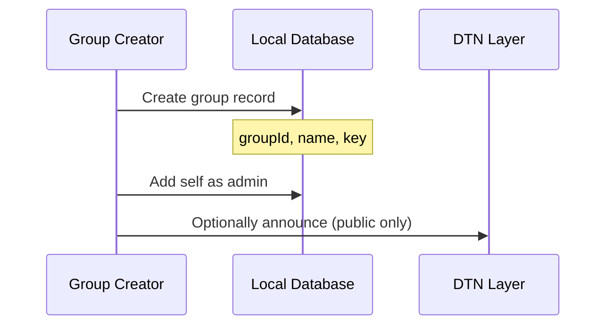
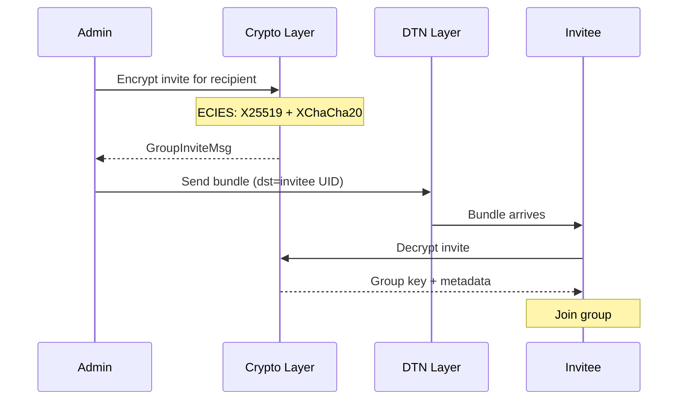
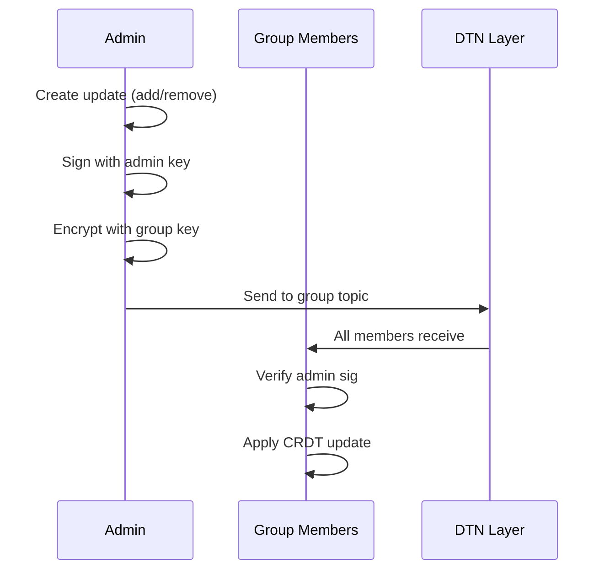

# Private Groups

Private groups enable encrypted group messaging with CRDT-synchronized membership.

## Overview

| Property | Value |
|----------|-------|
| **Encryption** | AES-256-GCM with shared group key |
| **Membership** | 2P-Set CRDT (add/remove) |
| **Invites** | ECIES-encrypted per-member |
| **Max members** | Soft limit ~100 (practical) |

## Group Creation

### Group Record

Each group record contains:
- **groupId** - Unique identifier (e.g., "group:team-chat")
- **shortId** - 10-character hash for routing
- **displayName** - Human-readable name
- **groupKey** - AES-256 symmetric key (32 bytes)
- **adminPubKey** - Creator's public key
- **createdAt** - Creation timestamp
- **isPublic** - Whether public discovery is enabled

## Group Key

Each group has a 32-byte AES-256 key for message encryption, generated using `SecureRandom`.

### Key Generation

When creating a group:
1. Generate 32 random bytes for the group key
2. Create group ID from the name
3. Compute short ID as base32 of first 6 bytes of SHA256(groupId)

## Invitations

Inviting a member requires encrypting the group key to their public key using ECIES with XChaCha20-Poly1305.

### Invite Flow

### GroupInviteMsg

| Field | Size | Description |
|-------|------|-------------|
| encryptedPayload | Variable | ECIES-encrypted invite |
| ephemeralPubKey | 32 bytes | X25519 ephemeral key |
| nonce | 24 bytes | XChaCha20 nonce |

### Encrypted Payload Contents

The invite payload contains:
- Group ID and display name
- The shared encryption key (32 bytes)
- Admin public key
- Invitation timestamp

## Membership CRDT

Membership uses a 2P-Set CRDT (Two-Phase Set) for conflict-free synchronization.

### 2P-Set Structure

- **adds** - Set of member entries that have been added
- **removes** - Set of member entries that have been removed (tombstones)

Each member entry contains:
- **uid** - Member's user ID
- **addedAt** - Timestamp of addition
- **addedBy** - Admin who added this member

### Merge Operation

To merge two CRDT states:
1. Union all entries from both `adds` sets
2. Union all entries from both `removes` sets
3. Active members = adds - removes (remove trumps add)

### Properties

| Property | Guarantee |
|----------|-----------|
| Commutativity | Order of merges doesn't matter |
| Associativity | Grouping of merges doesn't matter |
| Idempotency | Merging same state twice is safe |
| Convergence | All replicas converge to same state |

## Membership Updates

After initial invite, membership changes use GroupUpdateMsg.

### GroupUpdateMsg

| Field | Size | Description |
|-------|------|-------------|
| encryptedPayload | Variable | AES-GCM encrypted update |
| nonce | 12 bytes | AES-GCM nonce |

The encrypted payload contains:
- Action (ADD_MEMBER or REMOVE_MEMBER)
- Target user UID
- Admin signature
- Timestamp

### Update Flow

## Message Encryption

Group messages use the shared symmetric key with AES-256-GCM:
1. Generate random 12-byte nonce
2. Encrypt plaintext with group key and nonce
3. Send ciphertext + nonce in bundle

## Routing

Group messages are routed via interest-based filtering.

### Interest Filter

Members subscribe to the group topic (SHA256 of groupId). When a bundle arrives with a matching topic, it is delivered.

### Bundle Addressing

Group bundles use `dstTopic` instead of `dstUser` or `dstNode`, allowing them to reach all subscribers.

## Public vs Private Groups

| Aspect | Private | Public |
|--------|---------|--------|
| Discovery | Invite only | GroupAnnounceMsg broadcast |
| Join | Requires invite | Self-join via announcement |
| Key distribution | ECIES per-member | In announcement (less secure) |
| Visibility | Hidden | Listed in discovery |

## Security Considerations

### Forward Secrecy
- Not supported for groups (shared key)
- Compromise of key exposes all past messages

### Member Removal
- Remove from CRDT
- **Key is not rotated** (design decision)
- Removed member can still decrypt old messages

### Admin Authority
- Only admin can add/remove members
- Admin signatures verified before applying changes

---

**Next:** [Channels](channels.md) | [Encryption](../bundles/encryption.md)
