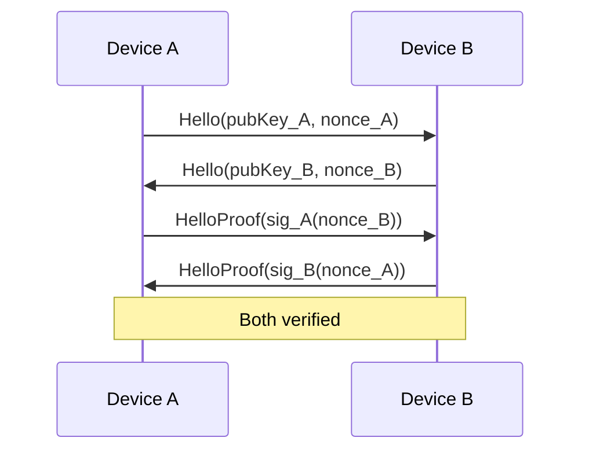
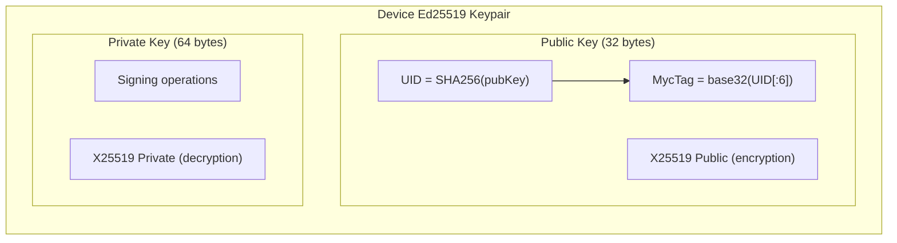

# Identity and Keys

Mycel uses Ed25519 for identity and signing, with X25519 derived keys for encryption.

## Key Types

| Key Type | Algorithm | Size | Purpose |
|----------|-----------|------|---------|
| Device Key | Ed25519 | 32 bytes | Device identity, bundle signing |
| User ID (UID) | SHA256 | 32 bytes | User identity = SHA256(pubKey) |
| Encryption Key | X25519 | 32 bytes | Derived from Ed25519 for ECDH |
| MycTag | Custom | 10 chars | Human-readable identity |

## Device Identity

Each device has a unique Ed25519 keypair generated on first launch.

**Source:** `core/dtn/src/main/kotlin/com/meshlablite/core/dtn/identity/DeviceKeys.kt`

### Key Generation

```kotlin
// From DeviceKeys.kt:221-247
fun generateDeviceKeys(): DeviceKeyPair {
    val seed = SecureRandom().generateSeed(32)
    val keyPair = Ed25519.generateKeyPair(seed)

    return DeviceKeyPair(
        publicKey = keyPair.publicKey,  // 32 bytes
        privateKey = keyPair.privateKey // 64 bytes (seed + public)
    )
}
```

### Key Storage

Keys are stored in Android's encrypted SharedPreferences:

| Storage | Contents |
|---------|----------|
| `device_keys` | Ed25519 keypair (hex-encoded) |
| `device_uid` | SHA256(publicKey) (hex-encoded) |

## User ID (UID)

The UID is a deterministic identifier derived from the public key.

```kotlin
fun computeUid(publicKey: ByteArray): ByteArray {
    require(publicKey.size == 32) { "Public key must be 32 bytes" }
    return MessageDigest.getInstance("SHA-256").digest(publicKey)
}
```

**Properties:**
- 32 bytes (64 hex characters)
- Deterministic: same pubkey → same UID
- Privacy: cannot reverse UID to get pubkey

## MycTag

Human-readable identity string for sharing.

**Format:** `myc:<10-character-hash>`

**Example:** `myc:AB3XK7QR2N`

### Generation

```kotlin
fun generateMycTag(uid: ByteArray): String {
    val hash = uid.take(6)  // First 6 bytes
    val encoded = base32Encode(hash).take(10)
    return "myc:$encoded"
}
```

### MycTagStar (Cluster Identity)

For geographic clustering, MycTagStar represents a group's identity:

```kotlin
fun computeMycTagStar(members: List<ByteArray>): ByteArray {
    val sorted = members.sortedBy { it.toHexString() }
    val combined = sorted.fold(ByteArray(0)) { acc, key -> acc + key }
    return MessageDigest.getInstance("SHA-256").digest(combined)
}
```

## Signing

All bundles are signed using Ed25519.

### Sign

```kotlin
fun signBundle(header: BundleHeader, payload: BundlePayload, privateKey: ByteArray): ByteArray {
    val message = header.toBytes() + payload.hash()
    return Ed25519.sign(message, privateKey)  // 64 bytes
}
```

### Verify

```kotlin
fun verifyBundle(bundle: Bundle): Boolean {
    val message = bundle.header.toBytes() + bundle.payload.hash()
    return Ed25519.verify(
        message,
        bundle.signature,
        bundle.header.srcPub
    )
}
```

## Key Derivation for Encryption

Ed25519 keys are converted to X25519 for ECDH encryption.

### Ed25519 → X25519

```kotlin
// Public key conversion
fun toX25519Public(ed25519Pub: ByteArray): ByteArray {
    // Uses curve point conversion
    return Ed25519.toX25519Public(ed25519Pub)
}

// Private key conversion
fun toX25519Private(ed25519Priv: ByteArray): ByteArray {
    // Uses scalar conversion
    return Ed25519.toX25519Private(ed25519Priv)
}
```

This allows the same keypair to be used for both signing and encryption.

## Identity Verification

### HelloProof

When devices connect via Nearby, they verify identity:

**Source:** `core/nearby/src/main/kotlin/com/meshlablite/core/nearby/peers/PeerDirectory.kt:10`

| State | Meaning |
|-------|---------|
| UNKNOWN | Not yet verified |
| VERIFIED | Signature check passed |
| FAILED | Signature check failed |

### Verification Flow



## Key Hierarchy



## Group Keys

Groups have a separate symmetric key for message encryption.

### Group Key Generation

```kotlin
fun generateGroupKey(): ByteArray {
    return SecureRandom().generateSeed(32)  // AES-256 key
}
```

### Group Key Distribution

1. Creator generates group key
2. Key encrypted per-member using ECIES
3. Sent via GroupInviteMsg to each member

See [Encryption](../bundles/encryption.md) for details.

## Security Considerations

### Key Protection
- Private keys never leave the device
- Stored in encrypted SharedPreferences
- No cloud backup of keys

### Key Rotation
- Currently not supported
- Device key is permanent for device lifetime
- Group key rotation requires new invites

### Recovery
- No key recovery mechanism
- Lost key = lost identity
- Must create new identity if device lost

## Source Files

| File | Purpose |
|------|---------|
| `core/dtn/src/.../identity/DeviceKeys.kt` | Key generation and storage |
| `core/dtn/src/.../identity/UidProvider.kt` | UID computation |
| `core/nearby/src/.../peers/PeerDirectory.kt` | Identity verification |
| `core/dtn/src/.../crypto/DmCrypto.kt` | Key conversion |

---

**Next:** [Bundle Structure](../bundles/structure.md) | [Encryption](../bundles/encryption.md)
