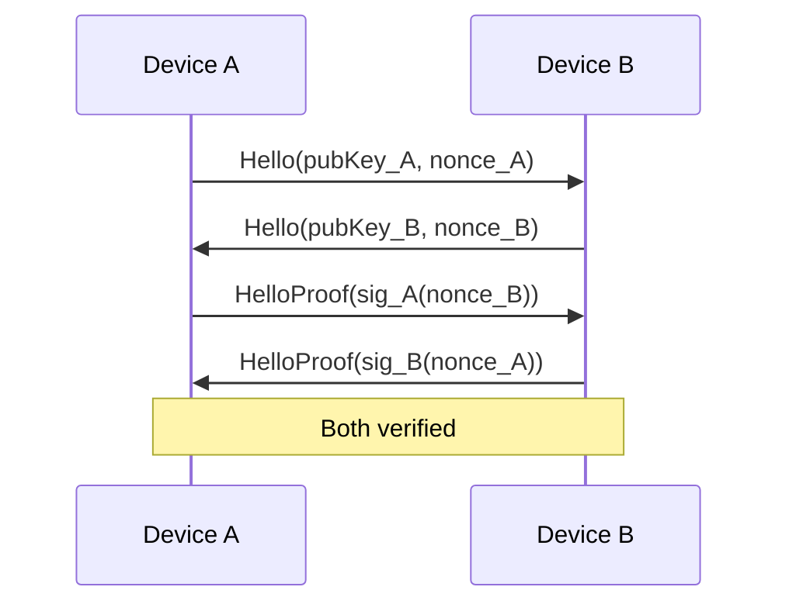
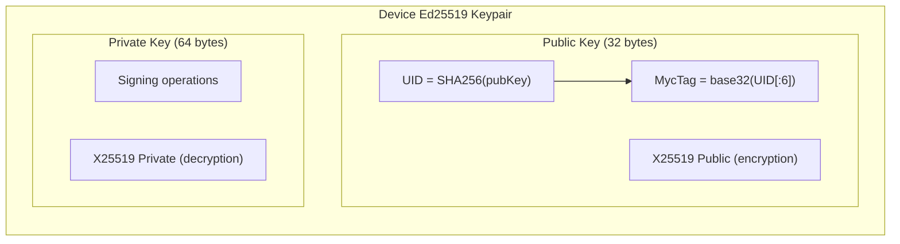

# Identity and Keys

Mycel uses Ed25519 for identity and signing, with X25519 derived keys for encryption.

## Key Types

| Key Type | Algorithm | Size | Purpose |
|----------|-----------|------|---------|
| Device Key | Ed25519 | 32 bytes | Device identity, bundle signing |
| User ID (UID) | SHA256 | 32 bytes | User identity = SHA256(pubKey) |
| Encryption Key | X25519 | 32 bytes | Derived from Ed25519 for ECDH |
| MycTag | Custom | 10 chars | Human-readable identity |

## Device Identity

Each device has a unique Ed25519 keypair generated on first launch.

### Key Generation

On first launch, a cryptographically secure 32-byte seed is generated using `SecureRandom`. This seed is used to create an Ed25519 keypair with a 32-byte public key and 64-byte private key (seed + public key concatenated).

### Key Storage

Keys are stored in Android's encrypted SharedPreferences:

| Storage | Contents |
|---------|----------|
| `device_keys` | Ed25519 keypair (hex-encoded) |
| `device_uid` | SHA256(publicKey) (hex-encoded) |

## User ID (UID)

The UID is a deterministic identifier derived from the public key by computing its SHA-256 hash.

**Properties:**
- 32 bytes (64 hex characters)
- Deterministic: same pubkey → same UID
- Privacy: cannot reverse UID to get pubkey

## MycTag

Human-readable identity string for sharing.

**Format:** `myc:<10-character-hash>`

**Example:** `myc:AB3XK7QR2N`

### Generation

The MycTag is generated by taking the first 6 bytes of the UID, encoding them as base32, and taking the first 10 characters. The prefix "myc:" is prepended.

### MycTagStar (Cluster Identity)

For geographic clustering, MycTagStar represents a group's identity. It is computed by sorting all member public keys, concatenating them, and hashing the result with SHA-256.

## Signing

All bundles are signed using Ed25519.

### Sign

The signature is created over the concatenation of the header bytes and the payload hash. The Ed25519 signature is 64 bytes.

### Verify

Verification checks that the signature over (header bytes + payload hash) is valid for the source public key in the bundle header.

## Key Derivation for Encryption

Ed25519 keys are converted to X25519 for ECDH encryption.

### Ed25519 → X25519

Public keys are converted using curve point conversion, and private keys using scalar conversion. This allows the same keypair to be used for both signing and encryption.

## Identity Verification

### HelloProof

When devices connect via Nearby, they verify identity:

| State | Meaning |
|-------|---------|
| UNKNOWN | Not yet verified |
| VERIFIED | Signature check passed |
| FAILED | Signature check failed |

### Verification Flow

## Key Hierarchy

## Group Keys

Groups have a separate symmetric key for message encryption.

### Group Key Generation

A 32-byte random key is generated using `SecureRandom` for use as an AES-256 symmetric key.

### Group Key Distribution

1. Creator generates group key
2. Key encrypted per-member using ECIES
3. Sent via GroupInviteMsg to each member

See [Encryption](../bundles/encryption.md) for details.

## Security Considerations

### Key Protection
- Private keys never leave the device
- Stored in encrypted SharedPreferences
- No cloud backup of keys

### Key Rotation
- Currently not supported
- Device key is permanent for device lifetime
- Group key rotation requires new invites

### Recovery
- No key recovery mechanism
- Lost key = lost identity
- Must create new identity if device lost

---

**Next:** [Bundle Structure](../bundles/structure.md) | [Encryption](../bundles/encryption.md)
