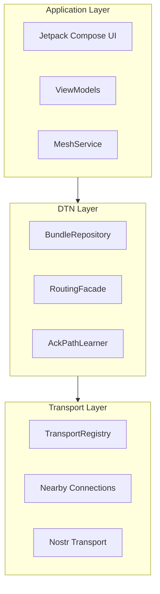

# Deep Dive: Mycel Technical Reference

This section provides comprehensive technical documentation for developers who want to understand Mycel's internals.

## Architecture Overview

Mycel is a **Delay-Tolerant Networking (DTN)** application designed for communication without reliable internet. Messages are stored locally and forwarded opportunistically when peers are encountered.

## Core Concepts

| Concept | Description | Deep Dive |
|---------|-------------|-----------|
| **Bundles** | Self-contained message units with headers, payload, and routing metadata | [Bundle Structure](bundles/structure.md) |
| **Routing** | PRoPHET probability routing + Spray-and-Wait copy control | [Routing Overview](routing/overview.md) |
| **Transports** | Unified abstraction over Nearby Connections and Nostr relays | [Transports](transports/nearby.md) |
| **Groups** | Private groups with CRDT-synchronized membership | [Groups](groups/private-groups.md) |
| **Encryption** | End-to-end encryption for DMs and groups | [Encryption](bundles/encryption.md) |

## Key Properties

### True DTN
- Messages can take **days** to deliver via human movement
- All nodes are equal peers (no central server)
- Store-and-forward at every hop

### Unified Transport
- Nearby Connections (BLE + WiFi) and Nostr relays form **one logical network**
- Users see no difference between transport methods
- Routing automatically selects the best available path

### End-to-End Security
- DMs encrypted with ECIES (X25519 + AES-256-GCM)
- Group messages encrypted with shared symmetric key
- Relaying nodes cannot read message contents

## Module Map

| Module | Purpose | Source |
|--------|---------|--------|
| `:app` | Main application, MeshService, UI wiring | `app/` |
| `:core:nearby` | Nearby Connections transport, session management | `core/nearby/` |
| `:core:dtn` | Bundle storage, routing logic, persistence | `core/dtn/` |
| `:core:transport` | Transport abstraction, Nostr implementation | `core/transport/` |
| `:feature:ui` | Jetpack Compose screens and ViewModels | `feature/ui/` |

## Section Index

### Architecture
- [System Overview](architecture/overview.md) - Three-layer architecture with module map
- [Message Flow](architecture/data-flow.md) - End-to-end delivery sequence

### Bundles
- [Bundle Structure](bundles/structure.md) - Header and payload fields
- [Bundle Lifecycle](bundles/lifecycle.md) - State machine: NEW → DEL
- [Message Types](bundles/message-types.md) - Control message reference
- [Encryption](bundles/encryption.md) - DM and group encryption

### Routing
- [Routing Overview](routing/overview.md) - Decision tree and algorithms
- [PRoPHET Algorithm](routing/prophet.md) - Probability-based routing
- [ACK Path Learning](routing/ack-learning.md) - Delivery confirmation routing

### Transports
- [Nearby Transport](transports/nearby.md) - Session FSM, handshake, transfer
- [Nostr Transport](transports/nostr.md) - Relay pool, gift-wrap encryption

### Groups
- [Private Groups](groups/private-groups.md) - Creation, invites, membership
- [Channels](groups/channels.md) - Read-only broadcast
- [CRDT Membership](groups/membership-crdt.md) - 2P-Set conflict resolution

---
