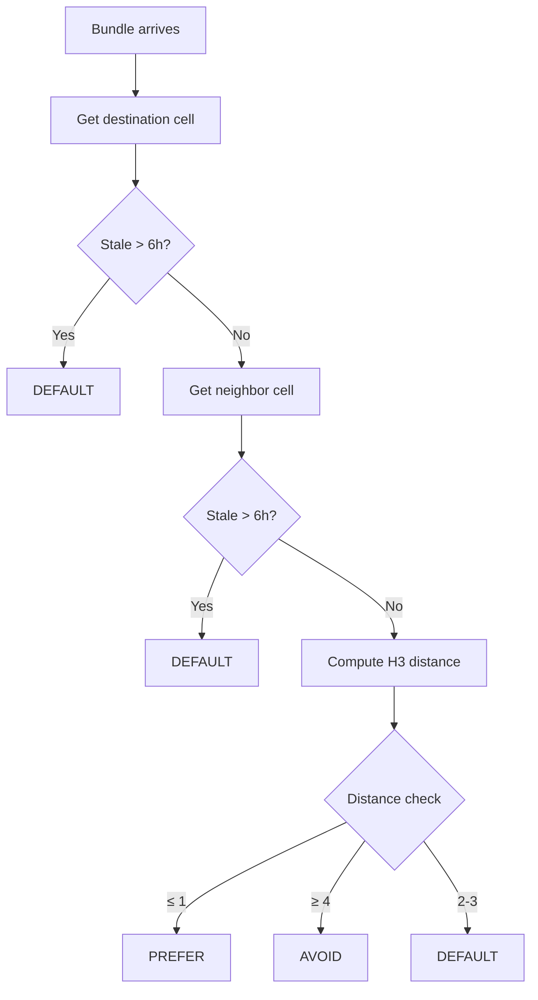

# H3 Geo Routing

Geographic routing uses Uber's H3 hexagonal spatial index to make location-aware forwarding decisions.

## Overview

| Property | Value |
|----------|-------|
| **Library** | H3CoreV3 (Uber) |
| **Stale Threshold** | 6 hours |
| **Decision Types** | PREFER, AVOID, DEFAULT |

## Distance-Based Decisions

| Distance | Action | Reason |
|----------|--------|--------|
| ≤ 1 | **PREFER** | Neighbor matches destination |
| ≥ 4 | **AVOID** | Neighbor far from destination |
| 2-3 | **DEFAULT** | Standard routing applies |

## GeoRoutingAction

| Action | Effect |
|--------|--------|
| `DEFAULT` | Use PRoPHET/Spray-Wait as normal |
| `PREFER` | Priority forwarding to this neighbor |
| `AVOID` | Skip this neighbor for this bundle |

## GeoRoutingDecision

Each decision contains:
- **action** - One of DEFAULT, PREFER, or AVOID
- **reason** - Human-readable explanation (optional)

## Stale Threshold

If location data is older than 6 hours, geo routing falls back to `DEFAULT`. This prevents routing decisions based on outdated position information.

## Evaluation Logic

The geo routing evaluation follows these steps:

1. **Get destination cell** - Look up the destination's H3 cell from the contact directory
2. **Check staleness** - If destination data is stale, return DEFAULT
3. **Get neighbor cell** - Look up the neighbor's H3 cell from the peer store
4. **Check staleness** - If neighbor data is stale, return DEFAULT
5. **Compute H3 distance** - Calculate the number of cells between neighbor and destination
6. **Make decision** - Apply distance-based rules

## Local Cell Optimization

Special case: When the local device is in the same cell as the destination, and a neighbor is far from both, the AVOID decision is applied more aggressively.

## Data Snapshots

### GeoNeighborSnapshot

Information about a neighbor's geographic location:
- **endpointId** - Nearby endpoint identifier
- **deviceIdHex** - Device public key (hex)
- **cell** - H3 cell index
- **updatedMs** - Last update timestamp

### GeoDestinationSnapshot

Information about a destination's geographic location:
- **uidHex** - User ID (hex)
- **cell** - H3 cell index
- **updatedMs** - Last update timestamp

## Resolver Interface

The geo routing resolver provides three operations:
- **localCell()** - Get the local device's H3 cell
- **neighborSnapshot(endpointId)** - Get a neighbor's location info
- **destinationSnapshot(uidHex)** - Get a destination's location info

The default resolver pulls data from:
- Local cell from GeoCellProvider
- Neighbor cells from PeerStore
- Destination cells from ContactDirectory

## H3 Distance Calculation

H3 distance is the number of hexagonal cells between two points at the same resolution. If the distance cannot be computed (e.g., different resolutions), the calculation returns null and DEFAULT is used.

## Integration with Routing

When geo routing is enabled (via feature flag), each routing decision checks the geo policy:
- If AVOID is returned, the bundle is not sent to that neighbor
- If PREFER is returned, the neighbor is prioritized
- If DEFAULT is returned, standard PRoPHET/Spray-Wait applies

## Feature Flag

Geo routing is controlled by a feature flag and can be enabled/disabled at runtime without app restart.

## JSON Events

| Event | When | Key Fields |
|-------|------|------------|
| `ROUTE.GEO` | Decision made | eid, action, reason, distance |
| `ROUTE.SKIP.GEO` | Bundle skipped | bundle, reason, dst_uid |

## Decision Flow

## H3 Resolution

The app uses "fine" resolution H3 cells for both neighbors and destinations. This provides neighborhood-level precision (~1-5km depending on resolution).

---

**Next:** [PRoPHET](prophet.md) | [ACK Learning](ack-learning.md)
