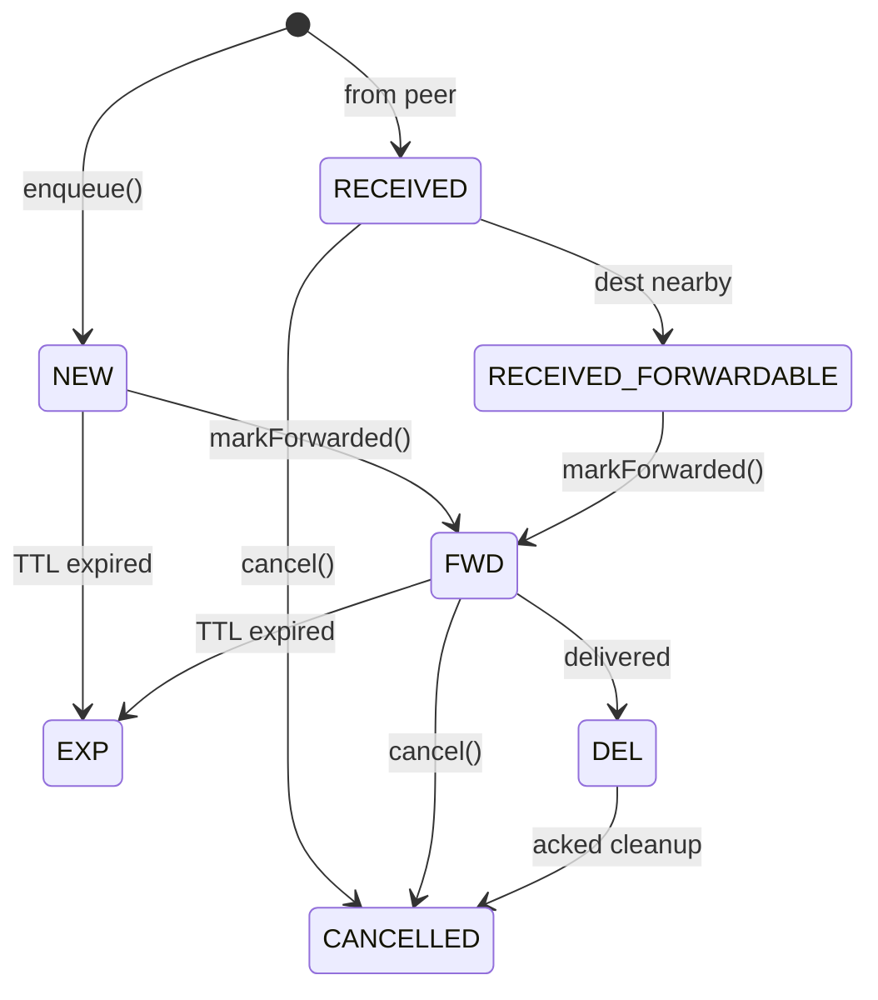

# Routing Overview

Mycel uses a hybrid routing strategy combining **PRoPHET** (probability-based forwarding) and **Spray-and-Wait** (controlled replication) to balance delivery success against network overhead.

## Routing Decision Tree


## Algorithm Summary

| Algorithm | Purpose | When Used |
|-----------|---------|-----------|
| **PRoPHET** | Probability-based forwarding | When peer has high P-value for destination |
| **Spray-and-Wait** | Controlled replication | When no good P-value exists |
| **ACK Learning** | Route improvement | When delivery confirmed |
| **Geo Routing** | H3 cell-based filtering | When geographic proximity known |

## Routing Facade

All routing decisions flow through `RoutingFacade`, which coordinates the algorithms.

**Source:** `core/nearby/src/main/kotlin/com/meshlablite/core/nearby/routing/RoutingFacade.kt`

### Key Methods

| Method | Purpose | Lines |
|--------|---------|-------|
| `shouldSend(bundle, peer)` | Master decision: should we send this bundle to this peer? | 180-255 |
| `updateProbabilities(peer)` | Update PRoPHET P-values on encounter | 359-389 |
| `makeCopyPlan(bundle)` | Create Spray-and-Wait copy plan | 514-567 |
| `onAckReceived(bundle)` | Process ACK, improve routing | 620-680 |

### Decision Flow

```kotlin
// Simplified from RoutingFacade.kt
fun shouldSend(bundle: Bundle, peer: PeerId): Boolean {
    // 1. Already delivered?
    if (bundle.status == DEL) return false

    // 2. Already sent to this peer?
    if (bundle.sentTo.contains(peer)) return false

    // 3. Is peer the destination?
    if (peer == bundle.destination) return true

    // 4. Does peer have high P-value?
    val pValue = routingTable.getProbability(peer, bundle.destination)
    if (pValue > FORWARD_THRESHOLD) return true

    // 5. Do we have copy budget?
    val plan = copyPlans[bundle.id]
    if (plan?.budgetRemaining > 0) {
        plan.budgetRemaining--
        return true
    }

    return false
}
```

## PRoPHET Algorithm

PRoPHET (Probabilistic Routing Protocol using History of Encounters and Transitivity) maintains delivery predictability scores.

**See:** [PRoPHET Details](prophet.md)

### Quick Reference

| Parameter | Value | Purpose |
|-----------|-------|---------|
| `P_init` | 0.7 | Initial probability on encounter |
| `alpha` | 0.25 | Transitivity dampening |
| `gamma` | 0.98/hour | Aging decay |
| `delta` | 0.05 | Minimum floor |

## Spray-and-Wait

Controls replication to prevent flooding.

### Copy Budget

| Message Type | Default Copies | Max Copies |
|--------------|----------------|------------|
| DM (Critical) | 3 | 8 |
| DM (Normal) | 3 | 8 |
| Group Message | 5 | 10 |
| Channel Broadcast | 8 | 15 |
| Control (ACK) | 2 | 4 |

### Budget Expansion

If no delivery after 60 seconds, the budget doubles (up to max):

```kotlin
// From RoutingFacade.kt:540-550
if (now - plan.createdAt > COPY_INCREASE_TIMEOUT_MS) {
    plan.budgetRemaining = min(plan.budgetRemaining * 2, MAX_COPIES)
}
```

## ACK-Based Path Learning

When a DeliveryAck is received, routing improves:

1. **Boost P-value** for the delivery path
2. **Record successful route** in history
3. **Skip redundant copies** via other transports

**Source:** `core/nearby/src/main/kotlin/com/meshlablite/core/nearby/routing/AckPathLearner.kt`

### Route Penalty

On ACK timeout, the P-value for that route is penalized:

```kotlin
// From RoutingTableStore.kt
fun applyRoutePenalty(destination: PeerId) {
    val current = getProbability(destination)
    setProbability(destination, current * 0.85) // 15% penalty
}
```

## Transport Selection

When multiple transports are available, selection is based on:

| Factor | Weight | Notes |
|--------|--------|-------|
| Peer availability | Required | Only use transports where peer is reachable |
| Previous success | High | Prefer transports that delivered ACKs |
| Latency | Medium | Nearby is faster than Nostr |
| Cost | Low | Nostr uses data, Nearby is free |

### Transport Priority

1. **Nearby** (if peer visible and session ready)
2. **Nostr** (if peer has known relays)
3. **Store** (wait for better opportunity)

## Geo Routing (H3)

H3 hexagonal cells provide geographic routing hints.

**Source:** `core/dtn/src/main/kotlin/com/meshlablite/core/dtn/identity/GeoCellProvider.kt`

### Resolution Levels

| Level | Cell Size | Use Case |
|-------|-----------|----------|
| R7 | ~5km | Fine-grained routing |
| R8 | ~1km | Village/neighborhood clustering |
| R5 | ~250km² | Regional routing |
| R3 | ~69km | Global hints |

### Geo Decision

```kotlin
fun shouldSendViaGeo(destCell: H3Index, neighborCell: H3Index): Boolean {
    return when {
        destCell == neighborCell -> true        // Same cell
        h3Distance(neighborCell, destCell) >= 4 -> false  // Too far
        isStaleHint(neighborCell) -> false      // Older than 6h
        else -> true
    }
}
```

## Bundle Lifecycle



### Bundle States

| State | Description |
|-------|-------------|
| `NEW` | Created locally, queued for forwarding |
| `RECEIVED` | Accepted from peer, stored locally |
| `RECEIVED_FORWARDABLE` | Promoted for relay to destination |
| `FWD` | Currently being forwarded |
| `DEL` | Delivered to destination |
| `EXP` | Expired (TTL exceeded) |
| `CANCELLED` | Explicitly removed |

**Source:** `core/dtn/src/main/kotlin/com/meshlablite/core/dtn/persistence/BundleEntity.kt:86-104`

## Source Files

| File | Purpose |
|------|---------|
| `core/nearby/src/.../RoutingFacade.kt` | Main routing logic |
| `core/nearby/src/.../RoutingTableStore.kt` | PRoPHET P-value storage |
| `core/nearby/src/.../AckPathLearner.kt` | ACK processing |
| `core/dtn/src/.../BundleRepository.kt` | Bundle state management |
| `core/dtn/src/.../identity/GeoCellProvider.kt` | H3 geo routing |

---

**Next:** [PRoPHET Algorithm](prophet.md) | [Nearby Transport](../transports/nearby.md)
