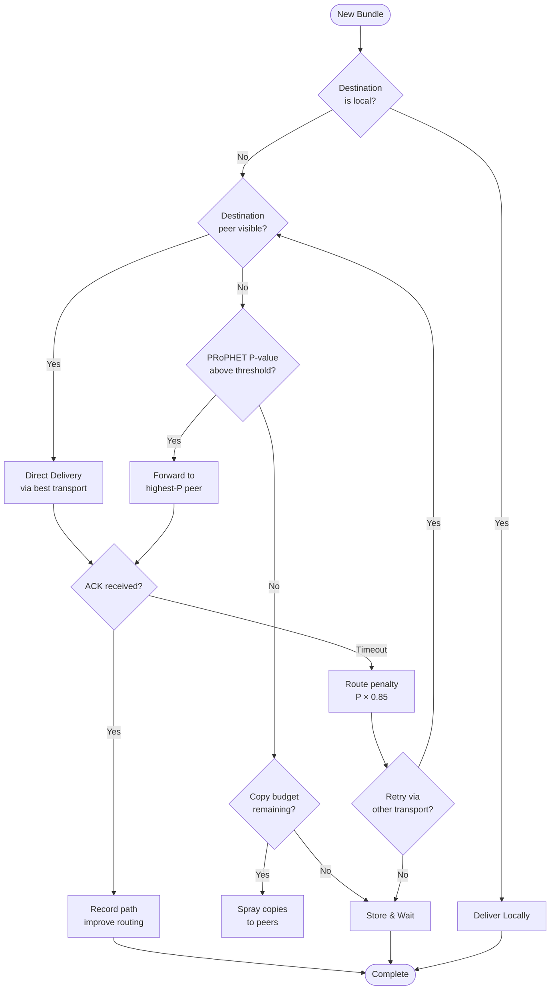
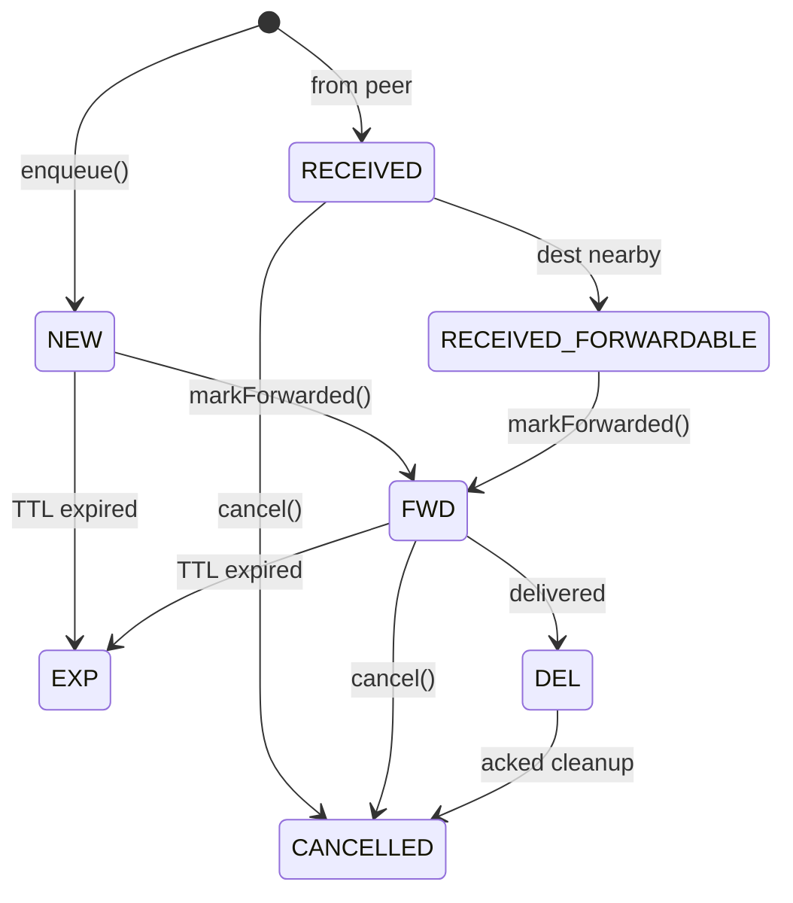

# Routing Overview

Mycel uses a hybrid routing strategy combining **PRoPHET** (probability-based forwarding) and **Spray-and-Wait** (controlled replication) to balance delivery success against network overhead.

## Routing Decision Tree

## Algorithm Summary

| Algorithm | Purpose | When Used |
|-----------|---------|-----------|
| **PRoPHET** | Probability-based forwarding | When peer has high P-value for destination |
| **Spray-and-Wait** | Controlled replication | When no good P-value exists |
| **ACK Learning** | Route improvement | When delivery confirmed |
| **Geo Routing** | H3 cell-based filtering | When geographic proximity known |

## Routing Facade

All routing decisions flow through the RoutingFacade, which coordinates the algorithms.

### Key Methods

| Method | Purpose |
|--------|---------|
| `shouldSend(bundle, peer)` | Master decision: should we send this bundle to this peer? |
| `updateProbabilities(peer)` | Update PRoPHET P-values on encounter |
| `makeCopyPlan(bundle)` | Create Spray-and-Wait copy plan |
| `onAckReceived(bundle)` | Process ACK, improve routing |

### Decision Flow

The routing decision follows this logic:

1. **Already delivered?** → Skip if bundle status is DEL
2. **Already sent to this peer?** → Skip duplicates
3. **Is peer the destination?** → Direct delivery
4. **Does peer have high P-value?** → Forward via PRoPHET
5. **Do we have copy budget?** → Spray copies to peers

## PRoPHET Algorithm

PRoPHET (Probabilistic Routing Protocol using History of Encounters and Transitivity) maintains delivery predictability scores.

**See:** [PRoPHET Details](prophet.md)

### Quick Reference

| Parameter | Value | Purpose |
|-----------|-------|---------|
| `P_init` | 0.7 | Initial probability on encounter |
| `alpha` | 0.25 | Transitivity dampening |
| `gamma` | 0.98/hour | Aging decay |
| `delta` | 0.05 | Minimum floor |

## Spray-and-Wait

Controls replication to prevent flooding.

### Copy Budget

| Message Type | Default Copies | Max Copies |
|--------------|----------------|------------|
| DM (Critical) | 3 | 8 |
| DM (Normal) | 3 | 8 |
| Group Message | 5 | 10 |
| Channel Broadcast | 8 | 15 |
| Control (ACK) | 2 | 4 |

### Budget Expansion

If no delivery after 60 seconds, the budget doubles (up to max).

## ACK-Based Path Learning

When a DeliveryAck is received, routing improves:

1. **Boost P-value** for the delivery path
2. **Record successful route** in history
3. **Skip redundant copies** via other transports

### Route Penalty

On ACK timeout, the P-value for that route is penalized by 15% (multiplied by 0.85).

## Transport Selection

When multiple transports are available, selection is based on:

| Factor | Weight | Notes |
|--------|--------|-------|
| Peer availability | Required | Only use transports where peer is reachable |
| Previous success | High | Prefer transports that delivered ACKs |
| Latency | Medium | Nearby is faster than Nostr |
| Cost | Low | Nostr uses data, Nearby is free |

### Transport Priority

1. **Nearby** (if peer visible and session ready)
2. **Nostr** (if peer has known relays)
3. **Store** (wait for better opportunity)

## Geo Routing (H3)

H3 hexagonal cells provide geographic routing hints.

### Resolution Levels

| Level | Cell Size | Use Case |
|-------|-----------|----------|
| R7 | ~5km | Fine-grained routing |
| R8 | ~1km | Village/neighborhood clustering |
| R5 | ~250km² | Regional routing |
| R3 | ~69km | Global hints |

### Geo Decision

Geo routing decisions are based on:
- Same cell → prefer this neighbor
- H3 distance ≥ 4 → too far, avoid
- Stale hint (> 6h) → ignore geo data
- Otherwise → use standard routing

## Bundle Lifecycle

### Bundle States

| State | Description |
|-------|-------------|
| `NEW` | Created locally, queued for forwarding |
| `RECEIVED` | Accepted from peer, stored locally |
| `RECEIVED_FORWARDABLE` | Promoted for relay to destination |
| `FWD` | Currently being forwarded |
| `DEL` | Delivered to destination |
| `EXP` | Expired (TTL exceeded) |
| `CANCELLED` | Explicitly removed |

---

**Next:** [PRoPHET Algorithm](prophet.md) | [Nearby Transport](../transports/nearby.md)
