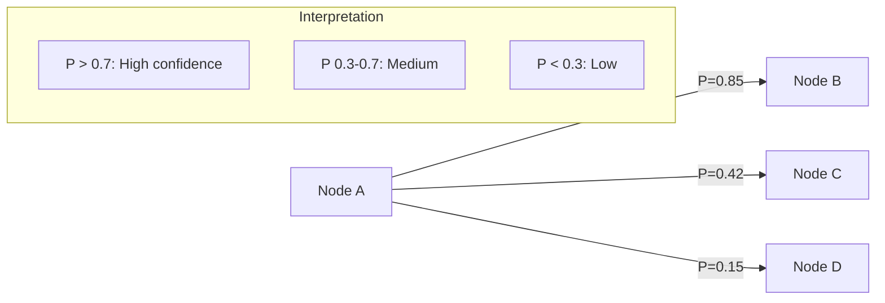
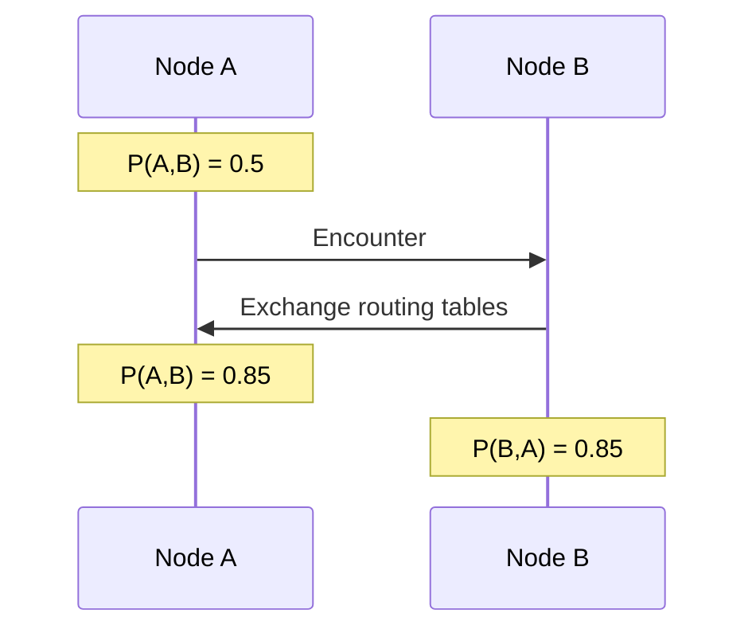
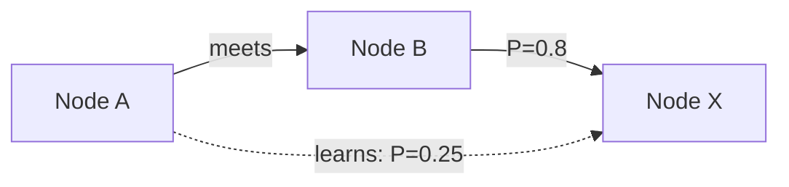

# PRoPHET Routing Algorithm

PRoPHET (Probabilistic Routing Protocol using History of Encounters and Transitivity) is a probabilistic routing protocol for DTN networks.

## Core Concept

Each node maintains a **delivery predictability** P(A,B) for every known destination B. This represents the probability that node A can successfully deliver a message to node B, based on past encounters.

## Parameters

| Parameter | Symbol | Value | Purpose |
|-----------|--------|-------|---------|
| Initial probability | $P_{init}$ | 0.7 | Starting P-value on first encounter |
| Transitivity weight | $\alpha$ | 0.25 | Dampening for transitive updates |
| Aging factor | $\gamma$ | 0.98/hour | Decay rate for stale contacts |
| Minimum floor | $\delta$ | 0.05 | P-value never goes below this |
| Max table size | - | 5,000 | LRU eviction when exceeded |

## Probability Updates

### 1. Direct Encounter

When two nodes meet, they update their probabilities for each other.

**Formula:**

$$P(A,B)_{new} = P(A,B)_{old} + (1 - P(A,B)_{old}) \times P_{init}$$

**Example:**

Given $P(A,B)_{old} = 0.5$ and $P_{init} = 0.7$:

$$P(A,B)_{new} = 0.5 + (1 - 0.5) \times 0.7 = 0.85$$

### 2. Transitive Update

When A meets B, A learns about B's contacts and updates transitively.

**Formula:**

$$P(A,X)_{new} = P(A,X)_{old} + (1 - P(A,X)_{old}) \times P(A,B) \times P(B,X) \times \alpha$$

**Example:**

When A meets B:

- $P(B,X) = 0.8$ (B often sees X)
- $P(A,B) = 0.85$ (after encounter)
- $P(A,X)_{old} = 0.1$
- $\alpha = 0.25$

$$P(A,X)_{new} = 0.1 + (1 - 0.1) \times 0.85 \times 0.8 \times 0.25 = 0.253$$

### 3. Aging

P-values decay over time if no encounters occur.

**Formula:**

$$P(A,B)_{aged} = P(A,B) \times \gamma^{hours}$$

**Example** with $\gamma = 0.98$:

| Hours | Calculation | P-value |
|-------|-------------|---------|
| 0 | - | 0.70 |
| 12 | $0.70 \times 0.98^{12}$ | 0.55 |
| 24 | $0.70 \times 0.98^{24}$ | 0.43 |
| 48 | $0.70 \times 0.98^{48}$ | 0.27 |
| 72 | $0.70 \times 0.98^{72}$ | 0.17 |

Aging is applied hourly. Each entry's probability is multiplied by $\gamma^{hours}$. Values never drop below the minimum floor $\delta$.

## Routing Table Storage

P-values are persisted and survive app restarts.

### Table Structure

Each entry contains:
- **destination** - UID hex of the target node
- **probability** - Current P-value (0.0 to 1.0)
- **lastUpdate** - Timestamp of last update
- **lastEncounter** - Timestamp of last encounter

### LRU Eviction

When the table exceeds 5,000 entries, the least-recently-updated entries are evicted.

## Forwarding Decision

When deciding whether to forward a bundle, the local device compares its own P-value for the destination with the peer's P-value. The bundle is forwarded if the peer has a significantly higher probability (by at least the FORWARD_MARGIN, typically 0.1).

This margin prevents oscillation where nodes keep passing bundles back and forth.

## Route Penalty

When a delivery attempt times out, the route is penalized:

$$P_{penalized} = P \times 0.85$$

This 15% penalty ensures that consistently failing routes are deprioritized.

## ACK-Based Learning

When a DeliveryAck is received, the successful path is boosted using the direct encounter formula:

$$P_{new} = P_{old} + (1 - P_{old}) \times P_{init}$$

## Comparison to Other Algorithms

| Algorithm | Approach | Pros | Cons |
|-----------|----------|------|------|
| **PRoPHET** | History-based | Adapts to patterns | Cold start problem |
| **Epidemic** | Flood everywhere | High delivery | High overhead |
| **Spray-and-Wait** | Limited copies | Low overhead | May miss opportunities |
| **Direct** | Only to destination | Zero overhead | Misses relay opportunities |

Mycel combines PRoPHET with Spray-and-Wait for optimal balance.

## Tuning Guidelines

### High-Mobility Networks
- Increase γ (slower decay) - contacts stay valid longer
- Increase P_init - trust new contacts more

### Low-Mobility Networks
- Decrease γ (faster decay) - quickly forget stale contacts
- Decrease α - rely less on transitive updates

### Dense Networks
- Lower FORWARD_MARGIN - forward more aggressively
- Increase max table size - track more peers

---

**Next:** [ACK Path Learning](ack-learning.md) | [Routing Overview](overview.md)
