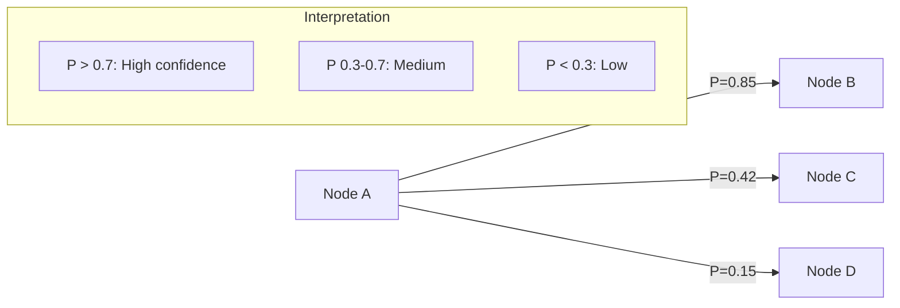
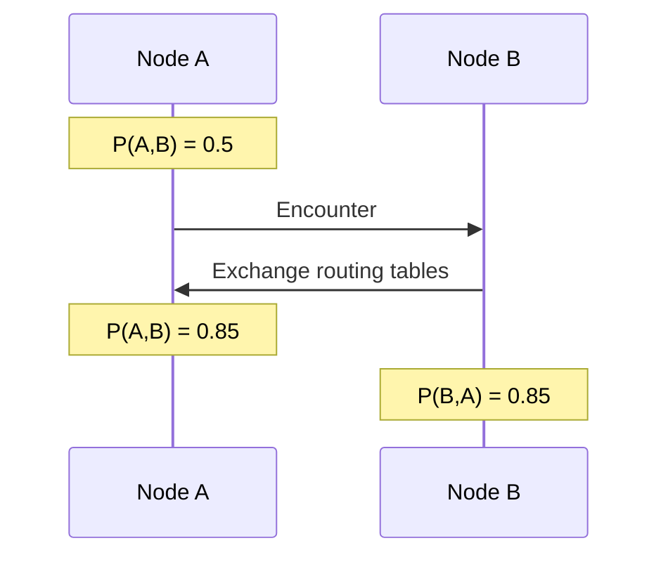
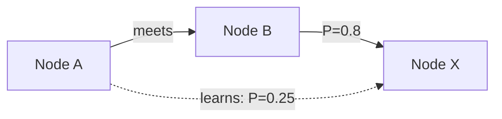

# PRoPHET Routing Algorithm

PRoPHET (Probabilistic Routing Protocol using History of Encounters and Transitivity) is a probabilistic routing protocol for DTN networks.

## Core Concept

Each node maintains a **delivery predictability** P(A,B) for every known destination B. This represents the probability that node A can successfully deliver a message to node B, based on past encounters.



## Parameters

**Source:** `core/nearby/src/main/kotlin/com/meshlablite/core/nearby/routing/RoutingFacade.kt:63-70`

| Parameter | Symbol | Value | Purpose |
|-----------|--------|-------|---------|
| Initial probability | P_init | 0.7 | Starting P-value on first encounter |
| Transitivity weight | α | 0.25 | Dampening for transitive updates |
| Aging factor | γ | 0.98/hour | Decay rate for stale contacts |
| Minimum floor | δ | 0.05 | P-value never goes below this |
| Max table size | - | 5,000 | LRU eviction when exceeded |

## Probability Updates

### 1. Direct Encounter

When two nodes meet, they update their probabilities for each other.

**Formula:**
```
P(A,B)_new = P(A,B)_old + (1 - P(A,B)_old) × P_init
```

**Example:**
- Previous P(A,B) = 0.5
- P_init = 0.7
- New P(A,B) = 0.5 + (1 - 0.5) × 0.7 = 0.85



### 2. Transitive Update

When A meets B, A learns about B's contacts and updates transitively.

**Formula:**
```
P(A,X)_new = P(A,X)_old + (1 - P(A,X)_old) × P(A,B) × P(B,X) × α
```

**Example:**
- A meets B
- B has P(B,X) = 0.8 (B often sees X)
- A's P(A,B) after encounter = 0.85
- A's current P(A,X) = 0.1
- Update: P(A,X) = 0.1 + (1 - 0.1) × 0.85 × 0.8 × 0.25 = 0.253



### 3. Aging

P-values decay over time if no encounters occur.

**Formula:**
```
P(A,B)_aged = P(A,B) × γ^hours_since_encounter
```

**Example (γ = 0.98/hour):**
| Hours | P-value |
|-------|---------|
| 0 | 0.70 |
| 12 | 0.55 |
| 24 | 0.43 |
| 48 | 0.27 |
| 72 | 0.17 |

**Source:** `core/nearby/src/main/kotlin/com/meshlablite/core/nearby/routing/RoutingFacade.kt:380-389`

```kotlin
fun ensureAging() {
    val hoursSince = (now - lastAgingTime) / 3600000
    if (hoursSince >= 1) {
        routingTable.ageAll(hoursSince)
        lastAgingTime = now
    }
}

fun ageAll(hours: Long) {
    for (entry in table.values) {
        entry.probability *= gamma.pow(hours.toDouble())
        if (entry.probability < delta) {
            entry.probability = delta
        }
    }
}
```

## Routing Table Storage

P-values are persisted to `routing.json` and survive app restarts.

**Source:** `core/nearby/src/main/kotlin/com/meshlablite/core/nearby/routing/RoutingTableStore.kt`

### Table Structure

```json
{
  "entries": [
    {
      "destination": "abc123...",
      "probability": 0.72,
      "lastUpdate": 1704067200000,
      "lastEncounter": 1704066000000
    }
  ],
  "version": 1
}
```

### LRU Eviction

When the table exceeds 5,000 entries, the least-recently-updated entries are evicted:

```kotlin
fun evictIfNeeded() {
    if (entries.size > MAX_SIZE) {
        val toRemove = entries.sortedBy { it.lastUpdate }
            .take(entries.size - MAX_SIZE)
        entries.removeAll(toRemove)
    }
}
```

## Forwarding Decision

When deciding whether to forward a bundle:

```kotlin
// Simplified from RoutingFacade.kt:200-220
fun shouldForward(bundle: Bundle, peer: PeerId): Boolean {
    val myP = routingTable.getProbability(self, bundle.destination)
    val peerP = routingTable.getProbability(peer, bundle.destination)

    // Forward if peer has better probability
    return peerP > myP + FORWARD_MARGIN
}
```

The `FORWARD_MARGIN` (typically 0.1) prevents oscillation where nodes keep passing bundles back and forth.

## Route Penalty

When a delivery attempt times out, the route is penalized:

**Source:** `core/nearby/src/main/kotlin/com/meshlablite/core/nearby/routing/RoutingTableStore.kt`

```kotlin
fun applyRoutePenalty(destination: PeerId) {
    val current = getProbability(destination)
    setProbability(destination, current * 0.85)  // 15% penalty
}
```

This ensures that consistently failing routes are deprioritized.

## ACK-Based Learning

When a DeliveryAck is received, the successful path is boosted:

```kotlin
// From AckPathLearner.kt
fun onAckReceived(ack: DeliveryAck) {
    // Boost P-value for the peer that delivered
    val current = routingTable.getProbability(ack.deliveredBy)
    routingTable.setProbability(
        ack.deliveredBy,
        current + (1 - current) * P_INIT
    )
}
```

## Comparison to Other Algorithms

| Algorithm | Approach | Pros | Cons |
|-----------|----------|------|------|
| **PRoPHET** | History-based | Adapts to patterns | Cold start problem |
| **Epidemic** | Flood everywhere | High delivery | High overhead |
| **Spray-and-Wait** | Limited copies | Low overhead | May miss opportunities |
| **Direct** | Only to destination | Zero overhead | Misses relay opportunities |

Mycel combines PRoPHET with Spray-and-Wait for optimal balance.

## Tuning Guidelines

### High-Mobility Networks
- Increase γ (slower decay) - contacts stay valid longer
- Increase P_init - trust new contacts more

### Low-Mobility Networks
- Decrease γ (faster decay) - quickly forget stale contacts
- Decrease α - rely less on transitive updates

### Dense Networks
- Lower FORWARD_MARGIN - forward more aggressively
- Increase max table size - track more peers

## Source Files

| File | Purpose | Key Lines |
|------|---------|-----------|
| `RoutingFacade.kt` | Core PRoPHET implementation | 359-389 |
| `RoutingTableStore.kt` | P-value persistence | Full file |
| `AckPathLearner.kt` | ACK-based improvements | 45-80 |

---

**Next:** [ACK Path Learning](ack-learning.md) | [Routing Overview](overview.md)
