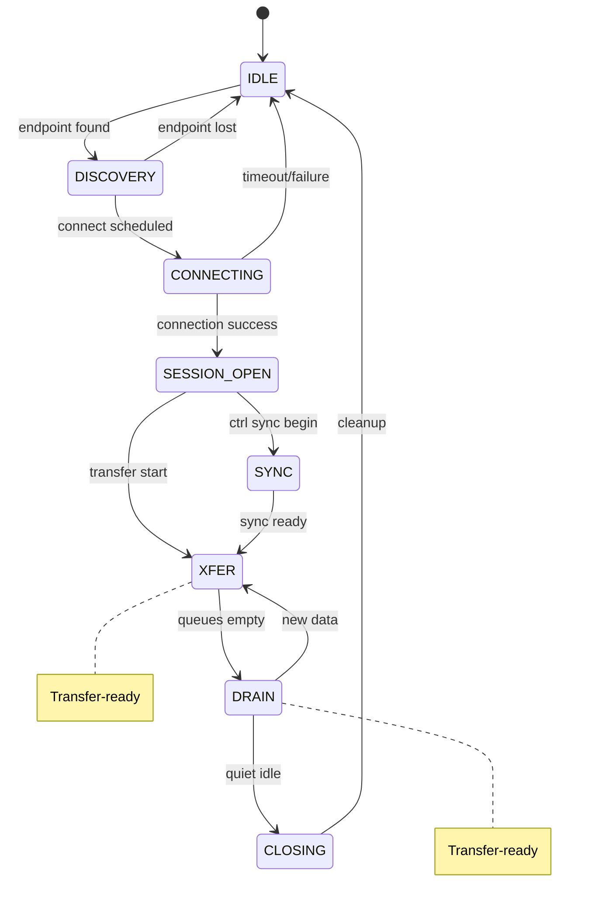
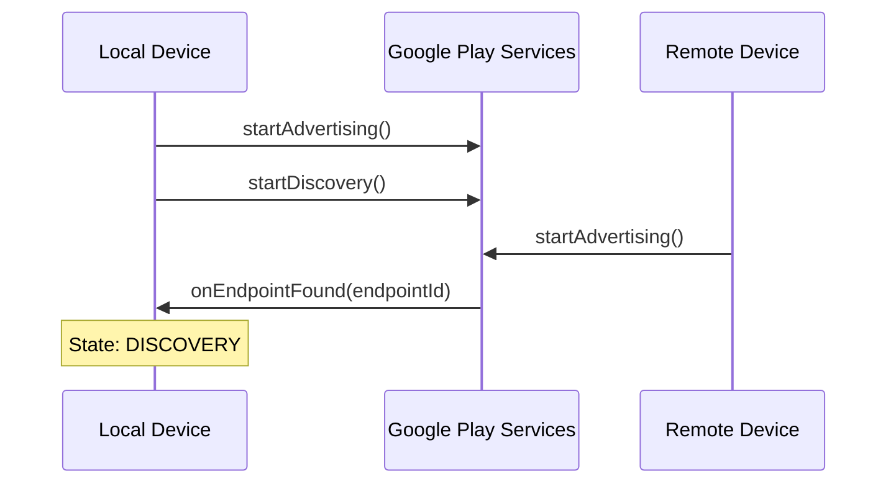
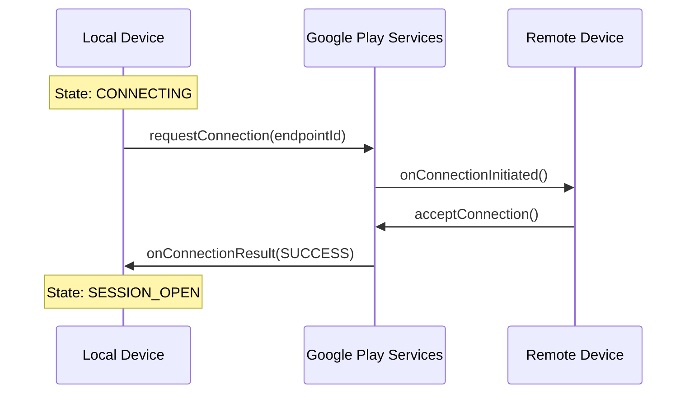
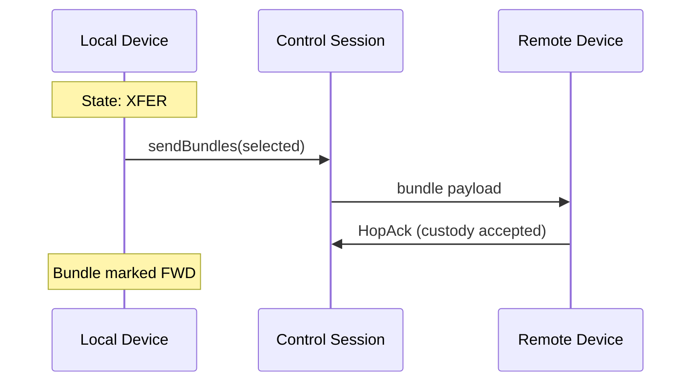

# Nearby Connections Transport

Nearby Connections is the primary short-range transport, using BLE for discovery and WiFi Direct for high-speed data transfer.

## Overview

| Property | Value |
|----------|-------|
| **Technology** | Google Play Services Nearby Connections API |
| **Discovery** | Bluetooth Low Energy (BLE) |
| **Transfer** | WiFi Direct (high bandwidth) or BLE (fallback) |
| **Range** | ~100m line-of-sight, ~30m typical indoor |
| **Bandwidth** | Up to 400+ Mbps (WiFi Direct) |

## Session State Machine

Each peer connection follows an 8-state finite state machine.

### State Reference

| State | Connected? | Can Transfer? | Description |
|-------|------------|---------------|-------------|
| `IDLE` | No | No | Default/disconnected. Set on disconnect, timeout, or endpoint unknown. |
| `DISCOVERY` | No | No | Endpoint discovered during BLE scan. |
| `CONNECTING` | No | No | Connection attempt in progress. |
| `SESSION_OPEN` | Yes | No | Nearby connection established, control session created. |
| `SYNC` | Yes | No | Control sync/handshake in progress. |
| `XFER` | Yes | **Yes** | Actively transferring data. |
| `DRAIN` | Yes | **Yes** | Queues drained, idle but connected. |
| `CLOSING` | No | No | Sending BYE, tearing down. |

**Critical:** Only `XFER` and `DRAIN` states can transfer bundles.

### State Transitions

| Transition | Trigger |
|------------|---------|
| IDLE → DISCOVERY | Endpoint found via BLE scan |
| DISCOVERY → CONNECTING | Connect attempt scheduled |
| CONNECTING → SESSION_OPEN | Connection success callback |
| SESSION_OPEN → SYNC | Control sync begins |
| SYNC → XFER | Sync complete, ready |
| XFER → DRAIN | All queued data sent |
| DRAIN → CLOSING | Quiet idle timeout |
| * → IDLE | Disconnect or timeout |

## Control Session Protocol

After Nearby connection is established, a control session is created for bundle exchange.

### Handshake

1. **Hello**: Exchange device identities (DeviceId, capabilities)
2. **HelloProof**: Verify identity via signature
3. **Sync**: Exchange routing tables (PRoPHET P-values)
4. **Ready**: Session is `XFER`-ready

### Transfer Types

| Type | Size | Method |
|------|------|--------|
| Small payloads | < 32KB | Inline in control messages |
| Large payloads | 32KB+ | Nearby `sendPayload()` stream |

### Bundle Selection

Before transfer, the routing layer selects bundles by filtering forwardable bundles, applying routing decisions, sorting by priority, and taking up to the maximum batch size.

## Connection Lifecycle

### Discovery

### Connection

### Transfer

## Watchdog

The Nearby stack includes a watchdog that monitors connection health.

### Monitored Conditions

| Condition | Detection | Recovery |
|-----------|-----------|----------|
| Stale XFER | No activity for 60s | Force transition to DRAIN |
| Zombie connection | Connected but no session | Disconnect |
| Failed handshake | Sync timeout | Disconnect and backoff |
| Lost endpoint | 8011 STATUS_ENDPOINT_UNKNOWN | Clean up session |

### Error Codes

| Code | Name | Meaning |
|------|------|---------|
| 8001 | STATUS_ALREADY_DISCOVERING | Discovery already active |
| 8003 | STATUS_CONNECTION_REJECTED | Peer rejected connection |
| 8010 | STATUS_ENDPOINT_IO_ERROR | Transport failure |
| 8011 | STATUS_ENDPOINT_UNKNOWN | Endpoint no longer valid |
| 8012 | STATUS_MISSING_PERMISSION_BLE | Bluetooth permission missing |
| 8013 | STATUS_MISSING_PERMISSION_WIFI | WiFi permission missing |

## Performance Characteristics

| Metric | Typical Value |
|--------|---------------|
| Discovery time | 2-10 seconds |
| Connection time | 1-3 seconds |
| Handshake time | 100-500ms |
| Transfer speed | 50-400 Mbps (WiFi Direct) |
| BLE fallback speed | 100-500 Kbps |

---

**Next:** [Nostr Transport](nostr.md) | [Routing Overview](../routing/overview.md)
