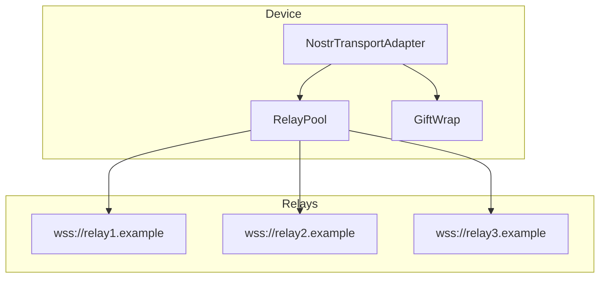
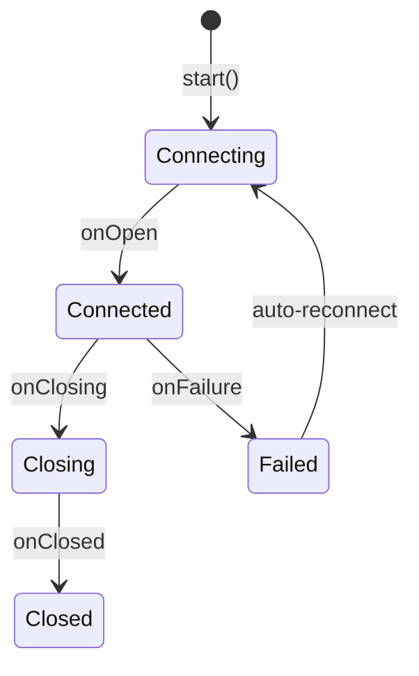
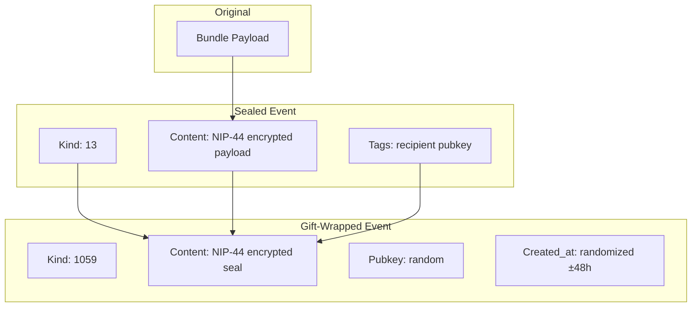
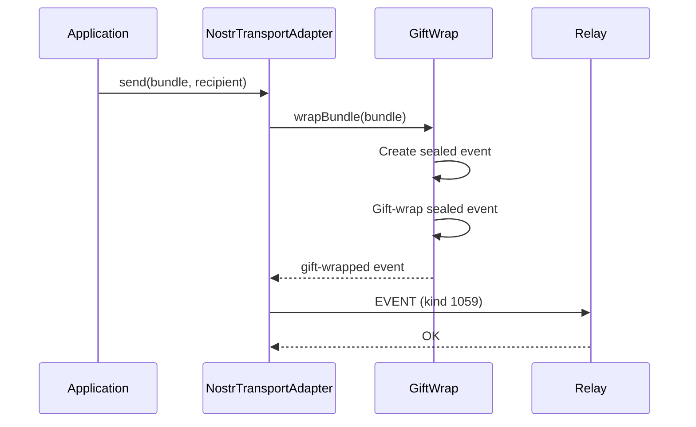
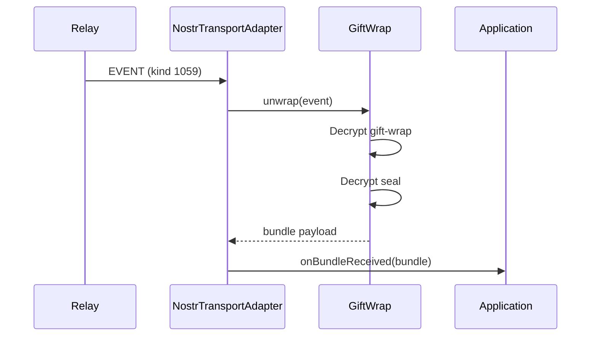

# Nostr Transport

Nostr is a secondary transport using WebSocket-connected relays for long-range message delivery.

## Overview

| Property | Value |
|----------|-------|
| **Protocol** | Nostr (NIP-01 base + NIP-17/44 encryption) |
| **Connection** | WebSocket to relay servers |
| **Range** | Global (internet required) |
| **Latency** | Seconds to minutes |
| **Bandwidth** | Limited by relay policies |

## Architecture



**Source:** `core/transport/src/main/kotlin/com/meshlablite/core/transport/nostr/`

## Relay Connection States

**Source:** `core/transport/src/main/kotlin/com/meshlablite/core/transport/nostr/diy/transport/RelayConnection.kt:31`



| State | Description |
|-------|-------------|
| `Connecting` | WebSocket being opened |
| `Connected` | WebSocket open, usable |
| `Closing` | Remote initiated close |
| `Closed` | Connection closed |
| `Failed` | Error, triggers reconnect |

## Default Relays

**Source:** `core/transport/src/main/kotlin/com/meshlablite/core/transport/nostr/NostrTransportConfig.kt`

```kotlin
val DEFAULT_RELAYS = listOf(
    "wss://relay.damus.io",
    "wss://nos.lol",
    "wss://relay.nostr.band"
)
```

Users can configure custom relays via MeshConfig.

## Gift-Wrap Encryption (NIP-17)

To hide sender/recipient from relays, messages are double-encrypted.

### Encryption Layers

1. **Inner (Seal):** Message encrypted to recipient using NIP-44
2. **Outer (Gift-Wrap):** Sealed event encrypted to recipient with random author



**Source:** `core/transport/src/main/kotlin/com/meshlablite/core/transport/nostr/GiftWrapModels.kt`

### Security Properties

| Property | How Achieved |
|----------|--------------|
| Sender hidden | Random pubkey as gift-wrap author |
| Recipient hidden | Encrypted to recipient, no plaintext tag |
| Timing hidden | Randomized timestamp ±48 hours |
| Content hidden | Double NIP-44 encryption |

## Event Flow

### Sending



### Receiving



## Subscription

The adapter subscribes to gift-wrapped events for the local device.

```kotlin
// Subscription filter
val filter = Filter(
    kinds = listOf(1059),  // Gift-wrap kind
    tags = mapOf("#p" to listOf(localPubkeyHex)),
    since = lastSyncTimestamp
)
```

## Transport Status

**Source:** `core/transport/src/main/kotlin/com/meshlablite/core/transport/TransportState.kt:14`

| Status | Meaning |
|--------|---------|
| `DOWN` | No relays connected |
| `UP` | At least one relay connected |
| `DEGRADED` | Some relays failing |

Status is computed from relay connection states:

```kotlin
fun computeStatus(): TransportStatus {
    val connected = relays.count { it.state == Connected }
    return when {
        connected == 0 -> DOWN
        connected < desiredRelays / 2 -> DEGRADED
        else -> UP
    }
}
```

## Backoff and Retry

Failed connections use exponential backoff.

```kotlin
// From RelayConnection.kt:93-107
fun scheduleReconnect() {
    val delayMs = min(
        baseDelayMs * 2.pow(attemptCount),
        maxDelayMs  // 5 minutes
    )
    handler.postDelayed({ connect() }, delayMs)
}
```

| Attempt | Delay |
|---------|-------|
| 1 | 1s |
| 2 | 2s |
| 3 | 4s |
| 4 | 8s |
| 5+ | 5min (max) |

## Configuration

```kotlin
// From MeshConfig.kt
data class Flags(
    val nostrTransportEnabled: Boolean = true,
    val nostrRelayUrls: List<String> = DEFAULT_RELAYS
)
```

Toggle via bridge:
```bash
meshctl config set nostr_enabled true
meshctl config set nostr_relays "wss://relay1.example,wss://relay2.example"
```

## Comparison to Nearby

| Aspect | Nearby | Nostr |
|--------|--------|-------|
| Range | ~100m | Global |
| Latency | <1s | Seconds-minutes |
| Privacy | Local only | Relay sees encrypted events |
| Power | Higher (radio) | Lower (WiFi) |
| Reliability | Varies by proximity | Varies by relay |
| Cost | Free | Free (public relays) |

## When Nostr is Used

1. **No Nearby peers:** Nostr is fallback when no local peers available
2. **ACK-based skip:** After ACK via Nearby, skip Nostr copies
3. **Parallel delivery:** Both transports may be used simultaneously

**Source:** `core/transport/src/main/kotlin/com/meshlablite/core/transport/nostr/NostrTransportManager.kt`

## Source Files

| File | Purpose |
|------|---------|
| `NostrTransportAdapter.kt` | Transport interface implementation |
| `RelayPool.kt` | Relay connection management |
| `RelayConnection.kt` | WebSocket handling |
| `GiftWrapModels.kt` | NIP-17 encryption |
| `NostrTransportManager.kt` | Send/receive coordination |

---

**Next:** [Nearby Transport](nearby.md) | [Routing Overview](../routing/overview.md)
