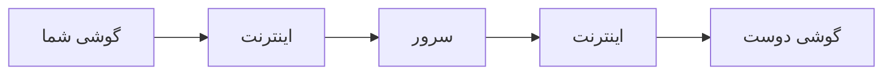
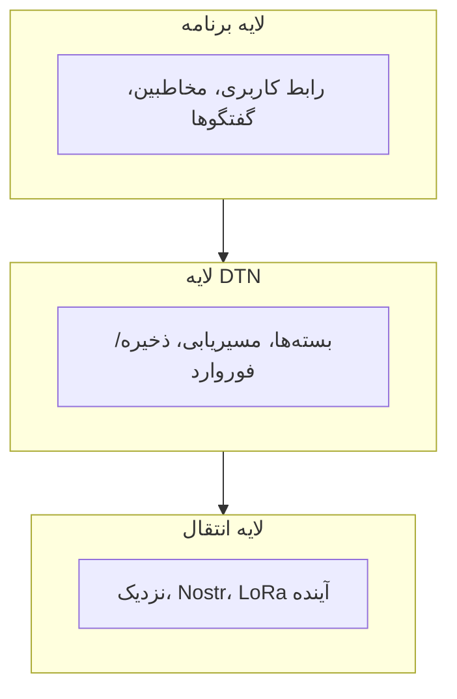
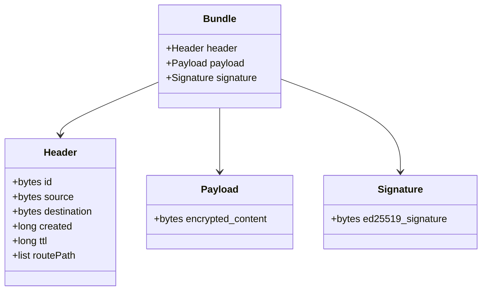

# نحوه کار Mycel

درک «چرایی» قبل از «چگونگی» کمک می‌کند همه چیز معنادار شود.

## مشکلی که Mycel حل می‌کند

پیام‌رسان‌های سنتی فرض می‌کنند اینترنت وجود دارد. آن‌ها این‌طور کار می‌کنند:

وقتی هر بخشی از این زنجیره قطع شود، ارتباط متوقف می‌شود.

**Mycel متفاوت کار می‌کند:**

پیام‌ها از طریق افراد سفر می‌کنند، نه زیرساخت.

## مدل ذهنی: تشبیه به پست

به Mycel مثل یک سرویس پستی فکر کنید که:

- **هر فرد یک پستچی است** - هرکسی که Mycel را اجرا می‌کند می‌تواند پیام‌ها را حمل کند
- **دفتر پست وجود ندارد** - هیچ مرکز مرتب‌سازی مرکزی نیست
- **تحویل هر چقدر طول بکشد، طول می‌کشد** - ساعت‌ها، روزها، یا بیشتر
- **نسخه‌های متعدد کمک می‌کنند** - اگر یک نامه گم شود، دیگری ممکن است برسد

این **شبکه با تحمل تأخیر (DTN)** نامیده می‌شود - پذیرش تأخیرها به جای نیاز به اتصال فوری.

## چرا این کار می‌کند

### ۱. پیام‌ها خودکفا هستند

هر پیام (که «بسته» نامیده می‌شود) همه چیز لازم برای تحویل را دارد:

- از کجا آمده
- برای کیست
- چقدر تلاش کند (مدت زمان حیات)
- محتوای رمزنگاری‌شده

نیازی به جستجوی خارجی یا هماهنگی سرور نیست.

### ۲. هر گوشی یک رله است

وقتی کاربران Mycel با هم مواجه می‌شوند، به طور خودکار پیام‌ها را تبادل می‌کنند. پیام شما ممکن است با سوار شدن روی مسافران در سراسر شهر سفر کند.

### ۳. مسیرهای متعدد بهتر است

Mycel به یک مسیر واحد تکیه نمی‌کند:

- کپی‌ها را از طریق بلوتوث/وای‌فای به گوشی‌های نزدیک ارسال می‌کند
- به طور اختیاری از طریق رله اینترنتی (Nostr) ارسال می‌کند اگر در دسترس باشد
- هر مسیری که اول موفق شود «برنده» می‌شود

## مصالحه‌هایی که می‌پذیریم

| پیام‌رسان سنتی | Mycel |
|---------------|-------|
| تحویل فوری | ثانیه تا روزها |
| تحویل تضمینی | بهترین تلاش |
| نیاز به اینترنت | آفلاین کار می‌کند |
| سرور مرکزی | بدون زیرساخت |
| نظارت آسان | حریم خصوصی قوی |

Mycel رضایت فوری را با تاب‌آوری مبادله می‌کند.

---

## معماری

سه لایه با هم کار می‌کنند:

### لایه برنامه

آنچه می‌بینید و با آن تعامل می‌کنید:

- لیست گفتگوها
- نوشتن پیام
- مدیریت مخاطبین
- تنظیمات

### لایه DTN

«مغز» که منطق پیام‌رسانی را مدیریت می‌کند:

- **بسته‌ها** - بسته‌بندی پیام با ابرداده مسیریابی
- **مسیریابی** - تصمیم‌گیری برای استفاده از کدام مسیرها
- **ذخیره-و-فوروارد** - نگه‌داشتن پیام‌ها تا بتوانند حرکت کنند
- **تأییدیه‌ها** - ردیابی تأیید تحویل

### لایه انتقال

مکانیزم‌های تحویل فیزیکی:

- **اتصالات نزدیک** - بلوتوث + Wi-Fi Direct (اصلی)
- **رله‌های Nostr** - جایگزین مبتنی بر اینترنت
- **آینده** - رادیوهای LoRa، لینک‌های ماهواره‌ای

## پروتکل بسته

هر پیام در یک **بسته** پیچیده می‌شود - یک بسته خودکفا.

**ویژگی‌های کلیدی:**

- **خود-شناسا** - شناسه بسته هش محتویات است
- **خود-احراز** - امضا ثابت می‌کند چه کسی فرستاده
- **خود-منقضی** - TTL تضمین می‌کند پیام‌های قدیمی برای همیشه گردش نکنند

> **عمیق‌تر:** [ساختار بسته](../deep-dive/bundles/structure.md) را برای مرجع کامل فیلدها ببینید.

## استراتژی‌های مسیریابی

Mycel مسیر «درست» را نمی‌داند - از استراتژی‌های احتمالاتی استفاده می‌کند:

### پاشش-و-صبر

تعداد محدودی کپی ارسال کن، سپس صبر کن:

۱. پیام با «بودجه کپی» (مثلاً ۳) شروع می‌شود
۲. هنگام ملاقات با همتای جدید، یک کپی تحویل بده و بودجه را کم کن
۳. وقتی بودجه به ۱ رسید، پاشش را متوقف کن و برای مواجهه مستقیم صبر کن

این سرعت تحویل را با جلوگیری از سیل شبکه متعادل می‌کند.

### PRoPHET (مسیریابی احتمالاتی)

از تاریخچه یاد بگیر:

- ردیابی کن کدام همتاها در نهایت به کدام مقصدها می‌رسند
- ترجیحاً از طریق همتاهایی با احتمال تحویل بالاتر ارسال کن
- احتمال با گذشت زمان کاهش می‌یابد اگر تحویلی رخ ندهد

### مسیریابی جغرافیایی

از اشاره‌های موقعیت استفاده کن:

- پیام‌ها شامل اشاره‌های سلول H3 اختیاری هستند
- رله‌هایی که از نظر جغرافیایی به مقصد نزدیک‌ترند ترجیح داده می‌شوند
- از مسیرهایی که در جهت اشتباه حرکت می‌کنند اجتناب کن

## مدل امنیتی

### رمزنگاری سرتاسری

فقط فرستنده و گیرنده می‌توانند پیام‌ها را بخوانند:

- توافق کلید **X25519** (دیفی-هلمن)
- رمزنگاری **AES-256-GCM**
- گره‌های رله فقط بلاب‌های رمزنگاری‌شده می‌بینند

### امضای پیام

هر بسته امضا می‌شود:

- امضاهای **Ed25519**
- هویت فرستنده را ثابت می‌کند
- از دستکاری جلوگیری می‌کند

### بدون اعتماد مرکزی

- هیچ سروری که بتواند به خطر بیفتد وجود ندارد
- هیچ گواهینامه‌ای که بتواند لغو شود وجود ندارد
- هویت فقط یک جفت کلید است که کنترل می‌کنید

## هویت

شما کلید عمومی خود هستید:

۱. اولین اجرا یک جفت کلید Ed25519 تولید می‌کند
۲. کلید خصوصی روی دستگاه می‌ماند (هرگز منتقل نمی‌شود)
۳. کلید عمومی = هویت شما
۴. «MycTag» = هش قابل خواندن توسط انسان از کلید شما

برای افزودن مخاطب، کلیدهای عمومی را مبادله می‌کنید (از طریق کد QR، NFC، یا تایپ).

## ذخیره‌سازی داده

همه داده‌ها روی دستگاه شما می‌ماند:

- **بسته‌ها** - پیام‌های در انتظار تحویل یا دریافت‌شده
- **جداول مسیریابی** - تخمین‌های احتمال تحویل
- **مخاطبین** - کلیدهای عمومی افرادی که می‌شناسید
- **گروه‌ها** - عضویت و کلیدهای اشتراکی

هیچ چیز به هیچ سروری آپلود نمی‌شود.

---

**بعدی:** [انتقال‌ها](transports.md) - نحوه جابجایی فیزیکی پیام‌ها بین دستگاه‌ها

> **عمیق‌تر:** [عمق فنی](../deep-dive/index.md) - مستندات فنی کامل
