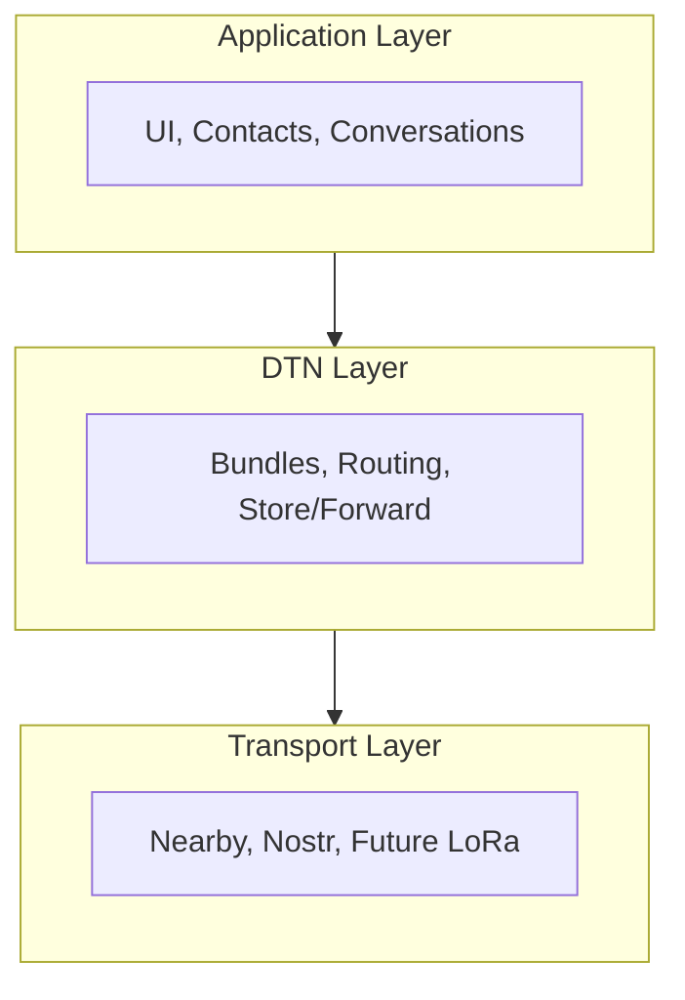
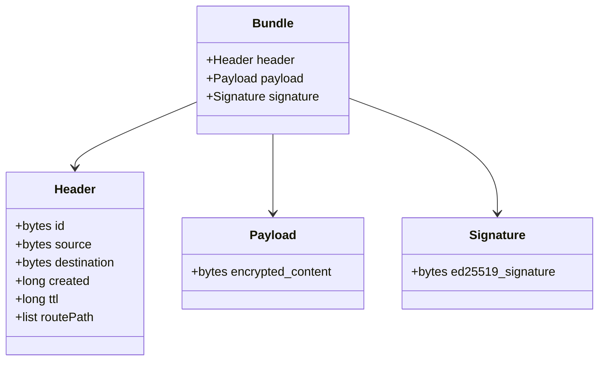

# How Mycel Works

Understanding the "why" before the "how" helps everything else make sense.

## The Problem Mycel Solves

Traditional messengers assume the internet exists. They work like this:

```
Your Phone → Internet → Server → Internet → Friend's Phone
```

When any part of that chain breaks, communication stops.

**Mycel works differently:**

```
Your Phone → Nearby Phones → ... → Friend's Phone
```

Messages travel through people, not infrastructure.

## Mental Model: The Postal Service Analogy

Think of Mycel like a postal service where:

- **Every person is a mail carrier** - Anyone running Mycel can carry messages
- **No post offices exist** - There's no central sorting facility
- **Delivery takes as long as it takes** - Hours, days, or longer
- **Multiple copies help** - If one letter gets lost, another might arrive

This is called **Delay-Tolerant Networking (DTN)** - embracing delays rather than requiring instant connectivity.

## Why This Works

### 1. Messages Are Self-Contained

Each message (called a "bundle") contains everything needed for delivery:

- Who it's from
- Who it's for
- How long to try (time-to-live)
- The encrypted content

No external lookup or server coordination required.

### 2. Every Phone Is a Relay

When Mycel users encounter each other, they automatically exchange messages. Your message might travel across a city by riding along with commuters.

### 3. Multiple Paths Are Better

Mycel doesn't rely on a single route. It:

- Sends copies via Bluetooth/Wi-Fi to nearby phones
- Optionally sends via internet relay (Nostr) if available
- Whichever path succeeds first "wins"

## Trade-offs We Accept

| Traditional Messenger | Mycel |
|----------------------|-------|
| Instant delivery | Seconds to days |
| Guaranteed delivery | Best-effort |
| Requires internet | Works offline |
| Central server | No infrastructure |
| Easy surveillance | Strong privacy |

Mycel trades instant gratification for resilience.

---

## Architecture

Three layers work together:



### Application Layer

What you see and interact with:

- Conversation list
- Message composer
- Contact management
- Settings

### DTN Layer

The "brain" that handles message logistics:

- **Bundles** - Message packaging with routing metadata
- **Routing** - Deciding which paths to use
- **Store-and-Forward** - Holding messages until they can move
- **Acknowledgments** - Tracking delivery confirmation

### Transport Layer

The physical delivery mechanisms:

- **Nearby Connections** - Bluetooth + Wi-Fi Direct (primary)
- **Nostr Relays** - Internet-based fallback
- **Future** - LoRa radios, satellite links

## The Bundle Protocol

Every message is wrapped in a **bundle** - a self-contained packet.



**Key properties:**

- **Self-identifying** - Bundle ID is a hash of contents
- **Self-authenticating** - Signature proves who sent it
- **Self-expiring** - TTL ensures old messages don't circulate forever

> **Deep Dive:** See [Bundle Structure](../deep-dive/bundles/structure.md) for complete field reference.

## Routing Strategies

Mycel doesn't know the "right" path - it uses probabilistic strategies:

### Spray-and-Wait

Send limited copies, then wait:

1. Message starts with a "copy budget" (e.g., 3)
2. When meeting a new peer, hand off a copy and decrement budget
3. When budget reaches 1, stop spraying and wait for direct encounter

This balances delivery speed against network flooding.

### PRoPHET (Probabilistic Routing)

Learn from history:

- Track which peers eventually reach which destinations
- Preferentially send via peers with higher delivery probability
- Probability decays over time if no deliveries occur

### Geographic Routing

Use location hints:

- Messages include optional H3 cell hints
- Prefer relays that are geographically closer to destination
- Avoid routes that move in the wrong direction

## Security Model

### End-to-End Encryption

Only sender and recipient can read messages:

- **X25519** key agreement (Diffie-Hellman)
- **AES-256-GCM** encryption
- Relay nodes only see encrypted blobs

### Message Signing

Every bundle is signed:

- **Ed25519** signatures
- Proves sender identity
- Prevents tampering

### No Central Trust

- No servers that could be compromised
- No certificates that could be revoked
- Identity is just a key pair you control

## Identity

You are your public key:

1. First launch generates an Ed25519 keypair
2. Private key stays on device (never transmitted)
3. Public key = your identity
4. "MycTag" = human-readable hash of your key

To add a contact, you exchange public keys (via QR code, NFC, or typing).

## Data Storage

All data stays on your device:

- **Bundles** - Messages waiting for delivery or received
- **Routing tables** - Delivery probability estimates
- **Contacts** - Public keys of people you know
- **Groups** - Membership and shared keys

Nothing is uploaded to any server.

---

**Next:** [Transports](transports.md) - How messages physically move between devices

> **Go Deeper:** [Deep Dive](../deep-dive/index.md) - Full technical documentation
