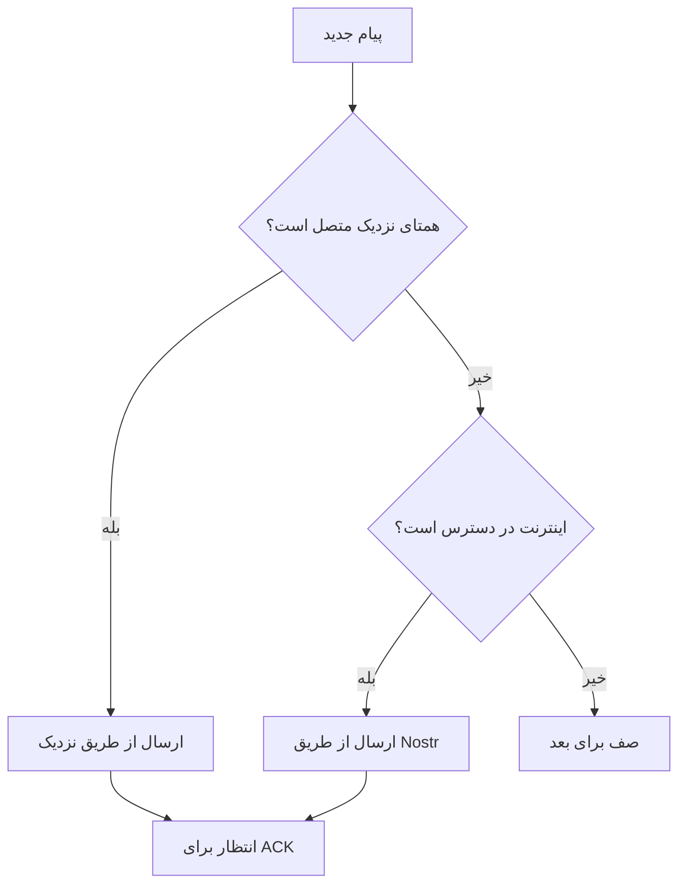

# انتقال‌ها

Mycel از چندین انتقال برای تحویل پیام‌ها استفاده می‌کند. همه انتقال‌ها به یک سیستم مسیریابی یکپارچه تغذیه می‌شوند.

## نزدیک (اصلی)

**Google Nearby Connections API** - انتقال اصلی برای ارتباط مش محلی.

### نحوه کار

- از **بلوتوث کم‌مصرف (BLE)** برای کشف استفاده می‌کند
- از **Wi-Fi Direct** یا **BLE L2CAP** برای انتقال داده استفاده می‌کند
- به طور خودکار بین انواع رادیو برای سرعت بهینه سوئیچ می‌کند

### مشخصات

| ویژگی | مقدار |
|-------|-------|
| برد | ~۱۰۰ متر (بسته به محیط متفاوت است) |
| سرعت | تا ۱ Mbps |
| تأخیر | کم (اتصال مستقیم) |
| نیاز به اینترنت | خیر |

### کشف

Mycel به طور مداوم:

۱. **اعلان می‌کند** - حضور را به دستگاه‌های نزدیک اعلام می‌کند
۲. **کشف می‌کند** - دستگاه‌های Mycel دیگر را اسکن می‌کند
۳. **متصل می‌شود** - وقتی دستگاه‌ها مواجه می‌شوند اتصال برقرار می‌کند
۴. **تبادل می‌کند** - پیام‌ها را دوطرفه همگام می‌کند

## Nostr (رله اینترنتی)

**پروتکل Nostr** - رله اختیاری مبتنی بر اینترنت برای تحویل سریع‌تر وقتی در دسترس است.

### نحوه کار

- به رله‌های عمومی Nostr متصل می‌شود
- پیام‌ها به عنوان رویدادهای Nostr بسته‌بندی می‌شوند
- دستگاه گیرنده رله‌ها را برای پیام‌ها پول می‌کند

### مشخصات

| ویژگی | مقدار |
|-------|-------|
| برد | جهانی (اینترنت) |
| سرعت | سریع وقتی آنلاین |
| تأخیر | ثانیه‌ها |
| نیاز به اینترنت | بله |

### چه زمانی استفاده می‌شود

Nostr استفاده می‌شود وقتی:

- اینترنت در دسترس است
- مسیر مستقیم نزدیک موفق نشده
- تحویل سریع‌تر ترجیح داده می‌شود

### ملاحظات حریم خصوصی

رله‌های Nostr می‌توانند ابرداده پیام رمزنگاری‌شده را ببینند (نه محتوا). پیام‌ها همچنان سرتاسری رمزنگاری‌شده باقی می‌مانند.

## انتخاب انتقال

لایه مسیریابی Mycel تصمیم می‌گیرد از کدام انتقال(ها) استفاده کند:

### تحویل چند مسیره

پیام‌ها می‌توانند از طریق **چندین انتقال همزمان** ارسال شوند:

- اولین تحویل موفق «برنده» می‌شود
- نسخه‌های تکراری به طور خودکار فیلتر می‌شوند
- ACK از هر مسیری تحویل را تأیید می‌کند

## انتقال‌های آینده

برنامه‌های اضافه شده:

- **LoRa** - رادیو برد بلند (برد کیلومتری)
- **رادیو آماتور** - برای اپراتورهای دارای مجوز
- **رادیوهای سفارشی** - لایه انتقال قابل گسترش

## مقایسه

| انتقال | برد | سرعت | آفلاین | حریم خصوصی |
|--------|-----|------|--------|------------|
| نزدیک | ~۱۰۰ متر | سریع | بله | بالا |
| Nostr | جهانی | سریع | خیر | متوسط |
| LoRa (آینده) | ~۱۰ کیلومتر | آهسته | بله | بالا |
