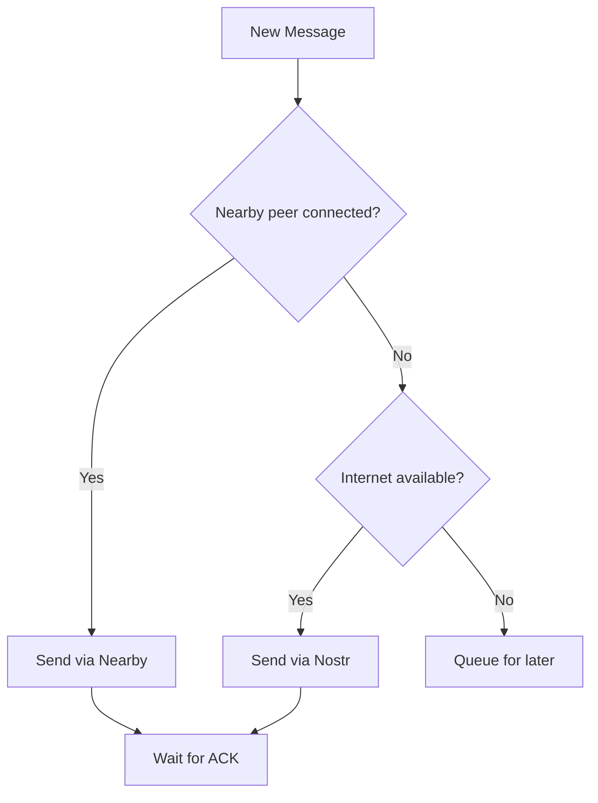

# Transports

Mycel uses multiple transports to deliver messages. All transports feed into a unified routing system.

## Nearby (Primary)

**Google Nearby Connections API** - The main transport for local mesh communication.

### How It Works

- Uses **Bluetooth Low Energy (BLE)** for discovery
- Uses **Wi-Fi Direct** or **BLE L2CAP** for data transfer
- Automatically switches between radio types for optimal speed

### Characteristics

| Property | Value |
|----------|-------|
| Range | ~100m (varies by environment) |
| Speed | Up to 1 Mbps |
| Latency | Low (direct connection) |
| Internet required | No |

### Discovery

Mycel continuously:

1. **Advertises** - Announces presence to nearby devices
2. **Discovers** - Scans for other Mycel devices
3. **Connects** - Establishes connections when devices meet
4. **Exchanges** - Syncs messages bidirectionally

## Nostr (Internet Relay)

**Nostr protocol** - Optional internet-based relay for faster delivery when available.

### How It Works

- Connects to public Nostr relays
- Messages wrapped as Nostr events
- Recipient's device polls relays for messages

### Characteristics

| Property | Value |
|----------|-------|
| Range | Global (internet) |
| Speed | Fast when online |
| Latency | Seconds |
| Internet required | Yes |

### When Used

Nostr is used when:

- Internet is available
- Direct Nearby path hasn't succeeded
- Faster delivery is preferred

### Privacy Consideration

Nostr relays can see encrypted message metadata (not content). Messages remain end-to-end encrypted.

## Transport Selection

Mycel's routing layer decides which transport(s) to use:

### Multi-Path Delivery

Messages can be sent via **multiple transports simultaneously**:

- First successful delivery "wins"
- Duplicates are automatically filtered
- ACK from any path confirms delivery

## Future Transports

Planned additions:

- **LoRa** - Long-range radio (km range)
- **Amateur Radio** - For licensed operators
- **Custom radios** - Extensible transport layer

## Comparison

| Transport | Range | Speed | Offline | Privacy |
|-----------|-------|-------|---------|---------|
| Nearby | ~100m | Fast | Yes | High |
| Nostr | Global | Fast | No | Medium |
| LoRa (future) | ~10km | Slow | Yes | High |
