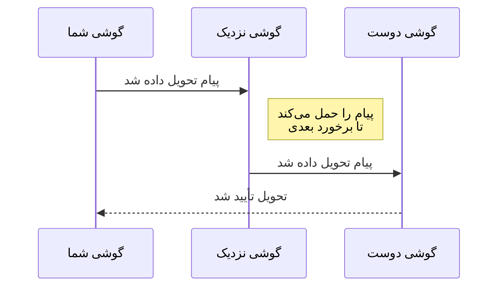

# Mycel

**پیام‌رسانی که بدون اینترنت کار می‌کند.**

Mycel یک پیام‌رسان مش با تحمل تأخیر برای اندروید است. پیام‌ها را با انتقال بین گوشی‌های نزدیک ارسال می‌کند تا به مقصد برسند - بدون نیاز به دکل موبایل، Wi-Fi یا سرور.

---

## به کجا می‌خواهید بروید؟

| می‌خواهم... | از اینجا شروع کنید |
|------------|---------------------|
| **از Mycel استفاده کنم** | [شروع کار](getting-started/install.md) - نصب، راه‌اندازی، ارسال پیام |
| **نحوه کار را بفهمم** | [نحوه کار](how-it-works/overview.md) - شبکه مش، تحویل، انتقال‌ها |
| **جزئیات فنی را ببینم** | [عمیق‌تر](deep-dive/index.md) - پروتکل‌ها، الگوریتم‌ها، معماری |
| **درباره امنیت بدانم** | [امنیت](security/privacy.md) - رمزنگاری، حریم خصوصی، مدل تهدید |

---

## چرا Mycel؟

پیام‌رسان‌های معمولی برای کار به اینترنت نیاز دارند. وقتی شبکه قطع می‌شود - در مواقع اضطراری، مناطق دورافتاده، یا وقتی زیرساخت مسدود شده - ارتباط متوقف می‌شود.

Mycel با تبدیل هر گوشی به یک رله، شما را متصل نگه می‌دارد. پیام شما از دستگاهی به دستگاه دیگر می‌پرد، توسط افرادی که در دنیا حرکت می‌کنند حمل می‌شود، تا به دوست شما برسد.

**مناسب برای:**

- **مواقع اضطراری** - در ارتباط بمانید وقتی شبکه‌ها قطع هستند
- **مناطق دورافتاده** - بدون پوشش موبایل ارتباط برقرار کنید
- **رویدادها و جشن‌ها** - به دوستان در مکان‌های شلوغ با شبکه‌های بیش از حد بارگذاری شده پیام دهید
- **کاربران حساس به حریم خصوصی** - بدون سرور برای ذخیره متادیتای شما

---

## نحوه کار (۳۰ ثانیه)

1. **پیام ارسال می‌کنید** - گوشی شما کاربران Mycel نزدیک را جستجو می‌کند
2. **پیام از مش عبور می‌کند** - هر گوشی پیام شما را ذخیره و فوروارد می‌کند
3. **تحویل انجام می‌شود** - وقتی زنجیره‌ای از اتصالات به دوست شما برسد، پیام می‌رسد
4. **تأییدیه دریافت می‌کنید** - یک تأییدیه برای اطمینان از تحویل برمی‌گردد

!!! info "انتظارات زمان تحویل"
    پیام‌ها می‌توانند در **ثانیه** (اگر نزدیک باشید) یا **ساعت‌ها/روزها** (اگر دور باشید) برسند. این عادی است - Mycel تحویل فوری را با توانایی کار در هر جا معاوضه می‌کند.

---

## ویژگی‌های کلیدی

| ویژگی | توضیحات |
|-------|---------|
| **آفلاین-اول** | بدون هیچ اتصال اینترنتی کار می‌کند |
| **رمزنگاری سرتاسر** | فقط شما و گیرنده می‌توانید پیام‌ها را بخوانید |
| **بدون سرور مرکزی** | پیام‌ها به صورت همتا-به-همتا سفر می‌کنند، بدون شرکت واسط |
| **چند-انتقالی** | از بلوتوث، Wi-Fi Direct و رله اینترنتی اختیاری استفاده می‌کند |
| **ذخیره-و-فوروارد** | پیام‌ها تا تحویل باقی می‌مانند، حتی اگر روزها طول بکشد |

---

## شروع سریع

1. **[دانلود APK](https://github.com/ethene/mycel-releases/releases/latest)** از GitHub Releases
2. **[نصب و راه‌اندازی](getting-started/install.md)** روی دستگاه اندروید (نیاز به نصب دستی دارد)
3. **[ارسال اولین پیام](getting-started/first-steps.md)**

!!! tip "به‌روز بمانید"
    برای به‌روزرسانی خودکار، از [Obtainium](getting-started/updates.md) استفاده کنید - GitHub را برای نسخه‌های جدید بررسی می‌کند و آن‌ها را برای شما نصب می‌کند.

---

## مسیرهای یادگیری

### برای کاربران

1. [نصب برنامه](getting-started/install.md)
2. [اعطای مجوزها](getting-started/permissions.md)
3. [ارسال اولین پیام](getting-started/first-steps.md)
4. [درک زمان‌های تحویل](user-guide/delivery.md)
5. [نکات باتری و پس‌زمینه](user-guide/battery.md)

### برای توسعه‌دهندگان

1. [نمای کلی معماری](deep-dive/architecture/overview.md)
2. [جریان پیام](deep-dive/architecture/data-flow.md)
3. [الگوریتم‌های مسیریابی](deep-dive/routing/overview.md)
4. [انتزاع‌های انتقال](deep-dive/transports/nearby.md)

---

## متن‌باز

Mycel نرم‌افزار متن‌باز است. منبع مستندات: [github.com/ethene/mycel-docs](https://github.com/ethene/mycel-docs).

---

<small>Mycel v2.1.1</small>
