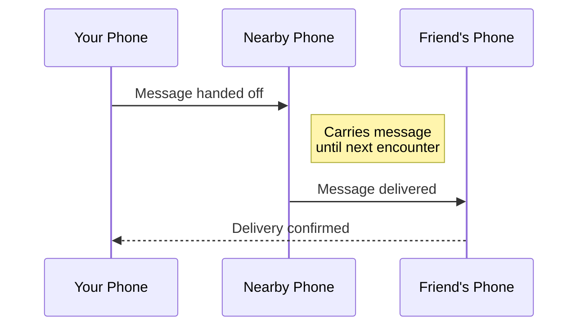

# Mycel

**A messenger that works without the internet.**

Mycel is a delay-tolerant mesh messenger for Android. It sends messages by passing them between nearby phones until they reach their destination - no cell towers, no Wi-Fi, no servers required.

---

## Where Do You Want to Go?

| I want to... | Start here |
|--------------|------------|
| **Use Mycel** | [Getting Started](getting-started/install.md) - Install, set up, send messages |
| **Understand how it works** | [How It Works](how-it-works/overview.md) - Mesh networking, delivery, transports |
| **Dive into technical details** | [Deep Dive](deep-dive/index.md) - Protocols, algorithms, architecture |
| **Learn about security** | [Security](security/privacy.md) - Encryption, privacy, threat model |

---

## Why Mycel?

Traditional messengers need the internet to work. When the network goes down - during emergencies, in remote areas, or when infrastructure is blocked - communication stops.

Mycel keeps you connected by turning every phone into a relay. Your message hops from device to device, carried by people moving through the world, until it reaches your friend.

**Perfect for:**

- **Emergencies** - Stay in touch when networks are down
- **Remote areas** - Communicate without cell coverage
- **Events & festivals** - Message friends in crowded areas with overloaded networks
- **Privacy-conscious users** - No servers storing your metadata

---

## How It Works (30 Seconds)

1. **You send a message** - Your phone looks for nearby Mycel users
2. **Message hops through the mesh** - Each phone stores and forwards your message
3. **Delivery happens** - When a chain of connections reaches your friend, the message arrives
4. **You get confirmation** - An acknowledgment travels back to confirm delivery

!!! info "Delivery Time Expectations"
    Messages can arrive in **seconds** (if nearby) or **hours/days** (if far away). This is normal - Mycel trades instant delivery for the ability to work anywhere.

---

## Key Features

| Feature | Description |
|---------|-------------|
| **Offline-First** | Works without any internet connection |
| **End-to-End Encrypted** | Only you and your recipient can read messages |
| **No Central Server** | Messages travel peer-to-peer, no company in the middle |
| **Multi-Transport** | Uses Bluetooth, Wi-Fi Direct, and optional internet relay |
| **Store-and-Forward** | Messages persist until delivered, even if it takes days |

---

## Quick Start

1. **[Download the APK](https://github.com/ethene/mycel-releases/releases/latest)** from GitHub Releases
2. **[Install and set up](getting-started/install.md)** on your Android device (requires sideloading)
3. **[Send your first message](getting-started/first-steps.md)**

!!! tip "Keep Updated"
    For automatic updates, use [Obtainium](getting-started/updates.md) - it checks GitHub for new releases and installs them for you.

---

## Learning Paths

### For Users

1. [Install the app](getting-started/install.md)
2. [Grant permissions](getting-started/permissions.md)
3. [Send your first message](getting-started/first-steps.md)
4. [Understand delivery times](user-guide/delivery.md)
5. [Battery & background tips](user-guide/battery.md)

### For Developers

1. [Architecture overview](deep-dive/architecture/overview.md)
2. [Message flow](deep-dive/architecture/data-flow.md)
3. [Routing algorithms](deep-dive/routing/overview.md)
4. [Transport abstractions](deep-dive/transports/nearby.md)

---

## Open Source

Mycel is open source software. Documentation source: [github.com/ethene/mycel-docs](https://github.com/ethene/mycel-docs).

---

<small>Mycel v2.1.1</small>
