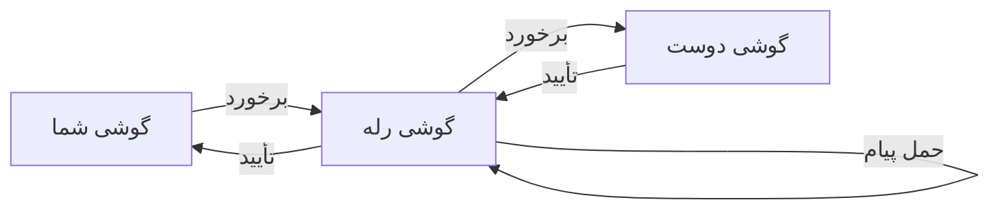

# نحوه تحویل

درک مدل تحویل Mycel به تنظیم انتظارات درست کمک می‌کند.

## مدل ذخیره-و-فوروارد

Mycel از **شبکه با تحمل تأخیر (DTN)** استفاده می‌کند - پیام‌ها روی دستگاه‌ها ذخیره و وقتی فرصت‌ها پیش می‌آیند فوروارد می‌شوند.

1. **ذخیره** - پیام شما روی دستگاهتان ذخیره می‌شود
2. **فوروارد** - وقتی با کاربر Mycel دیگری مواجه می‌شوید، پیام تحویل داده می‌شود
3. **تکرار** - آن دستگاه ذخیره و به دیگران فوروارد می‌کند
4. **تحویل** - در نهایت پیام به دوستتان می‌رسد
5. **تأیید** - یک تأییدیه به شما برمی‌گردد

## زمان‌های تحویل

| سناریو | زمان معمول |
|--------|------------|
| یک اتاق/ساختمان | ثانیه تا دقیقه |
| یک محله | دقیقه تا ساعت |
| یک شهر | ساعت‌ها |
| شهرهای مختلف | ساعت‌ها تا روزها |
| مناطق دورافتاده/پراکنده | روزها یا بیشتر |

!!! warning "بدون تضمین"
    اگر زنجیره‌ای از کاربران Mycel بین شما و گیرنده نباشد، پیام به طور نامحدود منتظر می‌ماند. این یک ویژگی اساسی شبکه مش است.

## چه چیزی بر زمان تحویل تأثیر می‌گذارد؟

### فاصله

فاصله فیزیکی بیشتر = پرش‌های بیشتر = تحویل طولانی‌تر.

### تراکم کاربران

کاربران Mycel بیشتر در یک منطقه = فرصت‌های رله بیشتر = تحویل سریع‌تر.

### حرکت

افرادی که در حال حرکت هستند برخوردهای بیشتری ایجاد می‌کنند. یک پیام ممکن است با سوار شدن روی مسافران در سراسر شهر سفر کند.

### زمان روز

ساعات فعال‌تر (روز، ساعت اوج) = برخوردهای بیشتر.

## تحویل چند مسیره

Mycel پیام شما را از چند مسیر همزمان ارسال می‌کند:

- **نزدیک (بلوتوث/وای‌فای)** - مستقیم دستگاه به دستگاه
- **Nostr (رله اینترنتی)** - اگر هم شما و هم گیرنده اینترنت داشته باشید

اولین مسیری که موفق شود «برنده» می‌شود - نسخه‌های تکراری به طور خودکار فیلتر می‌شوند.

## انقضای پیام

پیام‌ها **مدت زمان حیات (TTL)** دارند. اگر در TTL تحویل داده نشوند، پیام منقضی شده و از شبکه حذف می‌شود.

| نوع پیام | TTL پیش‌فرض |
|----------|-------------|
| پیام‌های مستقیم | ۲۴ ساعت |
| دعوت‌های گروه | ۷ روز |
| به‌روزرسانی‌های گروه | ۲۴ ساعت |
| پیام‌های کانال | ۴ ساعت |

پیام‌های منقضی شده وضعیت `EXP` را در برنامه نشان می‌دهند.

## تأییدیه‌ها (ACK)

وقتی پیام شما تحویل می‌شود:

1. دستگاه گیرنده یک ACK تولید می‌کند
2. ACK از طریق مش (یا اینترنت) برمی‌گردد
3. برنامه شما وضعیت پیام را به «تحویل شده» به‌روز می‌کند

ACKها به Mycel کمک می‌کنند یاد بگیرد کدام مسیرها برای پیام‌های آینده بهتر کار می‌کنند.

## نکاتی برای تحویل قابل اعتماد

1. **برنامه را در حال اجرا نگه دارید** - عملیات پس‌زمینه ضروری است
2. **همه مجوزها را اعطا کنید** - به خصوص موقعیت پس‌زمینه
3. **برنامه را به زور متوقف نکنید** - بگذارید اجرا شود
4. **صبور باشید** - تحویل مش زمان می‌برد
5. **دوستان را به استفاده از Mycel تشویق کنید** - کاربران بیشتر = مش بهتر

## مقایسه با پیام‌رسان‌های سنتی

| ویژگی | سنتی (واتس‌اپ و غیره) | Mycel |
|-------|----------------------|-------|
| نیاز به اینترنت | بله | خیر |
| زمان تحویل | فوری | ثانیه تا روزها |
| سرور مرکزی | بله | خیر |
| کار آفلاین | خیر | بله |
| تحویل تضمینی | بله (وقتی آنلاین) | بهترین تلاش |
