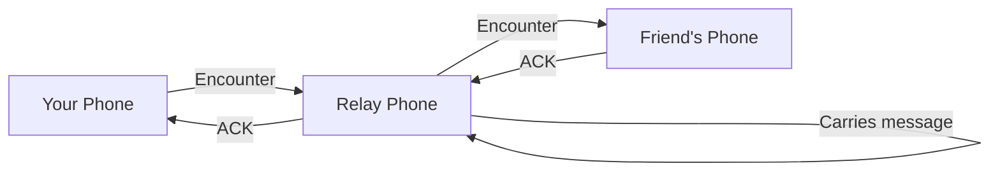

# How Delivery Works

Understanding Mycel's delivery model helps set the right expectations.

## The Store-and-Forward Model

Mycel uses **Delay-Tolerant Networking (DTN)** - messages are stored on devices and forwarded when opportunities arise.

1. **Store** - Your message is stored on your device
2. **Forward** - When you encounter another Mycel user, the message is handed off
3. **Repeat** - That device stores and forwards to others
4. **Deliver** - Eventually the message reaches your friend
5. **Acknowledge** - A confirmation travels back to you

## Delivery Times

| Scenario | Typical Time |
|----------|--------------|
| Same room/building | Seconds to minutes |
| Same neighborhood | Minutes to hours |
| Same city | Hours |
| Different cities | Hours to days |
| Remote/sparse areas | Days or longer |

!!! warning "No guarantees"
    If there's no chain of Mycel users between you and your recipient, the message will wait indefinitely. This is a fundamental property of mesh networking.

## What Affects Delivery Time?

### Distance

More physical distance = more hops needed = longer delivery.

### User Density

More Mycel users in an area = more relay opportunities = faster delivery.

### Movement

People moving around create more encounters. A message might travel across a city by riding along with commuters.

### Time of Day

More active hours (daytime, rush hour) = more encounters.

## Multi-Path Delivery

Mycel sends your message via multiple paths simultaneously:

- **Nearby (Bluetooth/Wi-Fi)** - Direct device-to-device
- **Nostr (Internet relay)** - If both you and recipient have internet

The first path to succeed "wins" - duplicates are automatically filtered.

## Message Expiration

Messages have a **time-to-live (TTL)**. If not delivered within the TTL, the message expires and is removed from the network.

| Message Type | Default TTL |
|--------------|-------------|
| Direct Messages | 24 hours |
| Group Invites | 7 days |
| Group Updates | 24 hours |
| Channel Messages | 4 hours |

Expired messages show status `EXP` in the app.

## Acknowledgments (ACKs)

When your message is delivered:

1. Recipient's device generates an ACK
2. ACK travels back through the mesh (or via internet)
3. Your app updates the message status to "Delivered"

ACKs help Mycel learn which routes work best for future messages.

## Tips for Reliable Delivery

1. **Keep the app running** - Background operation is essential
2. **Grant all permissions** - Especially background location
3. **Don't force-stop the app** - Let it run
4. **Be patient** - Mesh delivery takes time
5. **Encourage friends to use Mycel** - More users = better mesh

## Comparison with Traditional Messaging

| Feature | Traditional (WhatsApp, etc.) | Mycel |
|---------|------------------------------|-------|
| Requires internet | Yes | No |
| Delivery time | Instant | Seconds to days |
| Central server | Yes | No |
| Works offline | No | Yes |
| Guaranteed delivery | Yes (when online) | Best-effort |
