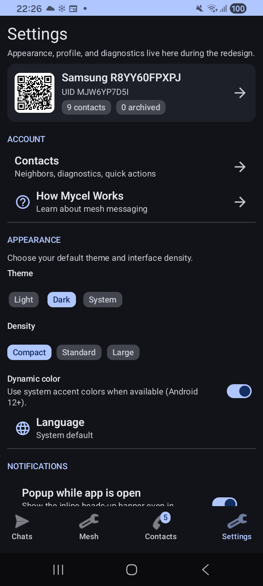

# Settings

Complete reference for all Mycel settings and configuration options.

  

    
  

## Accessing Settings

1. Open Mycel
2. Tap the **Settings** tab (gear icon)
3. Browse settings sections

---

## Profile

Your public identity settings.

### Display Name

The name others see when you message them.

- Tap to edit
- Changes propagate to nearby contacts
- Keep it recognizable to your friends

### Full Name (Optional)

An additional name field.

- Optional - can leave blank
- Shown in detailed profile views
- Max 48 characters

### Your Identity

View your cryptographic identity:

| Field | Description |
|-------|-------------|
| **QR Code** | Scannable code containing your identity |
| **Device UID** | Unique identifier (short and full) |
| **Public Key** | Your Ed25519 public key |
| **Fingerprint** | 12-character SHA-256 hash |
| **Nostr ID** | Your Nostr public key (if enabled) |

### Actions

- **Copy UID** - Copy to clipboard
- **Copy Key** - Copy public key
- **Share** - Share via other apps
- **Scan** - Scan another person's QR code

---

## Appearance

Customize how the app looks.

### Theme Mode

| Option | Description |
|--------|-------------|
| **Light** | Light background, dark text |
| **Dark** | Dark background, light text |
| **System** | Follow device setting (default) |

### Interface Density

Controls spacing and sizing:

| Option | Description |
|--------|-------------|
| **Compact** | Smaller elements, more on screen |
| **Standard** | Balanced layout (default) |
| **Large** | Bigger elements, easier to tap |

### Dynamic Color

- **On** - Uses Android 12+ Material You colors from your wallpaper
- **Off** - Uses default Mycel colors

!!! note "Android 12+ only"
    Dynamic color requires Android 12 or newer. On older versions, this option has no effect.

---

## Notifications

Control how Mycel alerts you.

### Popup Notifications

| Setting | Description |
|---------|-------------|
| **Enable popups** | Show floating notification previews |
| **Auto-dismiss** | Popups disappear automatically |
| **Repeat alerts** | Re-alert for missed notifications |

### Sound & Vibration

| Setting | Description |
|---------|-------------|
| **Sound** | Play notification sound |
| **Vibration** | Vibrate on notification |

### Mesh Group Notifications

Separate toggle for [Mesh Broadcast](mesh-broadcast.md) alerts:

- **On** - Get notified of Mesh Group messages
- **Off** - Messages arrive silently

### Default Mute Duration

When you mute a conversation, how long:

| Option | Duration |
|--------|----------|
| 1 hour | Short break |
| 8 hours | Workday/sleep |
| 1 day | Full day |
| Forever | Until manually unmuted |

---

## Account

Quick access to account-related screens.

### Contacts

Opens the Contacts screen for managing your contact list.

---

## Diagnostics & Admin

Advanced features for troubleshooting and monitoring.

### Network Details

Opens the [Network Screen](#network-screen) showing:

- Device identity
- H3 geo-tag
- Neighbor count
- Connection status

### Bundle Queue

Opens the [Queue Screen](#queue-screen) showing:

- Pending messages
- Delivery status
- Failed/expired messages

### System Logs

Opens the [Logs Screen](#logs-screen) for:

- Real-time event logs
- Filter by severity
- Debugging issues

---

## Network Screen

Detailed view of your mesh network status.

### Device Identity

| Field | Description |
|-------|-------------|
| **Device ID** | Your unique mesh identifier |
| **H3 Geo-Tag** | Geographic cell for routing |
| **Neighbor Count** | Currently connected peers |

### Location

- **Permission status** - Whether location is granted
- **Refresh** - Update geo-tag manually

### Capabilities

Shows detected device features:

- Nearby Connections support
- Nostr transport
- BLE support

---

## Queue Screen

Monitor your message queue.

### Outbox Tab

Messages you've sent, grouped by status:

| Status | Meaning |
|--------|---------|
| **NEW** | Just created |
| **FWD** | Being forwarded |
| **RECEIVED** | Peer acknowledged |
| **DELIVERED** | Fully delivered |
| **ERROR** | Failed |
| **EXPIRED** | TTL exceeded |
| **CANCELLED** | User cancelled |

### Inbox Tab

Messages you've received.

### Actions

- Tap a message to view details
- **Delete** - Remove from queue
- **Retry** - Re-attempt delivery

---

## Logs Screen

Real-time system logs for troubleshooting.

### Log Levels

Filter by severity:

| Level | Color | Use |
|-------|-------|-----|
| **Debug** | Gray | Detailed technical info |
| **Info** | Blue | Normal operations |
| **Warning** | Yellow | Potential issues |
| **Error** | Red | Problems |

### Log Entry Format

Each entry shows:

- Timestamp
- Level
- Tag (component)
- Message

### Using Logs

Logs help diagnose:

- Connection issues
- Message delivery problems
- App crashes
- Unexpected behavior

---

## Mesh Lab

The **Mesh Lab** tab (separate from Settings) provides detailed network diagnostics.

### Nearby Tab

Bluetooth/Wi-Fi mesh status:

| Field | Description |
|-------|-------------|
| **Neighbors** | List of connected peers |
| **Sessions** | Active connection sessions |
| **Discovery** | Recent device discoveries |
| **Errors** | Connection problems |

### Queue Tab

Same as Diagnostics > Bundle Queue.

### Nostr Tab

Internet relay status:

| Field | Description |
|-------|-------------|
| **Connected relays** | Active Nostr connections |
| **Relay health** | Connection status per relay |
| **Sync progress** | Message synchronization |

### Logs Tab

Same as Diagnostics > System Logs.

---

## Battery & Background

Critical for mesh operation.

### Why Background Matters

Mycel needs to run in the background to:

- Discover nearby devices
- Relay messages for others
- Receive incoming messages
- Maintain mesh connectivity

### Battery Optimization Warning

If battery optimization is enabled for Mycel:

- The app may be killed in background
- Mesh connectivity suffers
- Message delivery is delayed

### Fixing Battery Issues

1. **Check status** - Look for warning in Settings
2. **Open battery settings** - Tap the warning
3. **Exclude Mycel** - Set to "Don't optimize" or "Unrestricted"

### OEM-Specific Issues

Some manufacturers (Samsung, Xiaomi, Oppo, etc.) have aggressive battery management:

| Severity | Manufacturers |
|----------|---------------|
| **High** | Samsung, Oppo, Vivo, OnePlus, Xiaomi |
| **Medium** | Huawei, Honor |
| **Low** | Google Pixel, stock Android |

The app detects your device and provides specific instructions.

**More details:** [Battery & Background](battery.md)

---

## Recommended Settings

### For Best Connectivity

| Setting | Recommendation |
|---------|----------------|
| Battery optimization | Disabled for Mycel |
| Location permission | Always allow |
| Bluetooth | On |
| Wi-Fi | On |
| Background activity | Unrestricted |

### For Battery Saving

If battery is a concern:

| Setting | Recommendation |
|---------|----------------|
| Mesh Group notifications | Off |
| Popup notifications | Off |
| Interface density | Compact |

Note: Some battery saving measures reduce mesh effectiveness.

### For Privacy

| Setting | Recommendation |
|---------|----------------|
| Display name | Use a nickname |
| Full name | Leave blank |

---

## Data Storage

All settings are stored locally on your device.

### Settings Files

| File | Contents |
|------|----------|
| `settings_prefs.json` | Theme, density, colors |
| `identity_prefs.json` | Name, profile |
| `notification_prefs.json` | Notification settings |
| `chat_prefs.json` | Pins, archives |

### No Cloud Sync

- Settings don't sync to any server
- Reinstalling = fresh start
- Each device has independent settings

---

## Troubleshooting Settings

### "Settings don't save"

- Ensure the app has storage permission
- Try restarting the app
- Check available storage space

### "Theme doesn't change"

- On some devices, requires app restart
- Check if system theme override is active

### "Notifications don't work"

1. Check Mycel notification permission in Android settings
2. Check notification channel settings
3. Verify Mycel isn't in "Do Not Disturb" block list
4. Check battery optimization isn't killing the app

### "Can't access Mesh Lab"

- Mesh Lab is a separate tab, not in Settings
- Look for it in the bottom navigation bar
- May be labeled differently on some versions

---

**Next:** [Messaging](messaging.md) | [Contacts](contacts.md) | [Battery & Background](battery.md)
